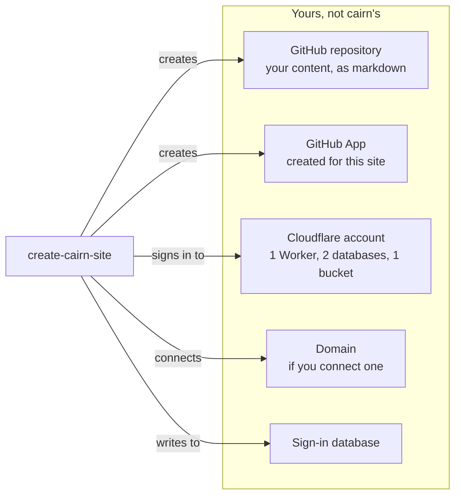

# Before you start

What you are getting into, what it costs, and what stays yours.

## What you end up owning

*`create-cairn-site` creates or connects five assets and owns none of them: a GitHub repository
holding your content, a GitHub App scoped to this one site, the Cloudflare account it signs in
to rather than creates, a domain if you connect one, and the database of who can sign in.*

`create-cairn-site` builds and connects five things, and every one of them belongs to you, not
to cairn:

- **A private GitHub repository**, where your content lives on GitHub, holding your site's code
  and everything anyone writes.
- **A GitHub App** that publishes on your writers' behalf, so nobody needs a GitHub account of
  their own.
- **A Cloudflare account of your own**, running one Worker, two databases, and a storage bucket
  for images.
- **A domain**, if you connect one.
- **A database of who can sign in**, yours to control.

Nothing here is rented from cairn. If you stopped using cairn tomorrow, your repository still
holds every word anyone wrote, in plain markdown a text editor can open. Cloning that repository
is enough to leave with everything.

## What it costs

Building and running a cairn site is free, and stays free, for as long as you are the only
person who ever signs in. Three things stand between you and a finished setup, and only one of
them is money.

1. **Cloudflare's Workers Paid plan, $5 a month, once a second person needs to sign in.** Sending
   a real sign-in email needs it; running the site does not. It's billed once per Cloudflare
   account, not once per site, so a second site on the same account adds nothing
   ([Workers pricing](https://developers.cloudflare.com/workers/platform/pricing/), as of
   2026-08-11). See [the free-until boundary](#the-free-until-boundary) below for exactly when
   this bill starts.
2. **A payment method, only if you connect your own domain.** A domain name costs roughly $10 to
   $15 a year for the common endings, paid to whichever registrar you buy it from. Cloudflare
   sells domains at cost and shows the exact price before you pay
   ([Cloudflare Registrar](https://www.cloudflare.com/products/registrar/), as of 2026-08-11); if
   you already own a domain, there is nothing new to buy.
3. **A Cloudflare API token you create yourself, at no cost, but read every row before you save
   it.** You aren't asked for one during your first run; it's the domain step,
   [Own your domain](./own-your-domain.md), that first opens Cloudflare's own "create token" page
   with the permissions it needs already selected, and asks you to paste the finished token back.
   If you later connect to [Workers Builds](./own-your-domain.md#connect-to-workers-builds), that
   step asks for a second, wider token of its own. Either time, Cloudflare's page can render one
   of those permission rows as an empty, unselected control instead of an error when something
   goes wrong on its end, and a token missing a permission still gets accepted here: it only fails
   later, at the specific step that needed the missing permission. Before you click Create Token,
   glance down the list and confirm every row it asked for is actually filled in.

All in, a small site on its own domain runs about $6 a month: the $5 Workers Paid plan once a
second person signs in, plus roughly $1 a month averaged over a year's domain renewal. The tool
prints this same figure before it asks you anything.

## The free-until boundary

Setting up your own site, running it, writing on it, and publishing to it: none of that costs
anything, for as long as you are the only person signing in. The moment a second person needs
their own sign-in, an editor, a co-owner, anyone, your site needs to send that person a real
email, and sending email is what the $5-a-month Workers Paid plan buys. It also needs a domain of
your own connected: sign-in mail sends from that domain, so a site still living only at its
`workers.dev` address has nowhere to send it from yet. Until both are in place, skip them: your
site works exactly the same either way, you just stay the only one who can sign in.
[Own your domain](./own-your-domain.md) is where you connect a domain and turn sign-in email on
together, when you're ready. [Invite your editors](./invite-editors.md) restates this boundary
right before you add anyone.

## What needs a developer

Everything above, you do yourself, with no code. A few things genuinely need someone who can
write and ship code:

- **Rotating the GitHub App's private key.** This is a terminal-and-`wrangler` task; see
  [Rotate the GitHub App key](../extend/rotate-the-github-app-key.md).
- **Updating the cairn engine itself** to pick up a new release. See
  [Upgrade cairn](../extend/upgrade-cairn.md).
- **Adding functionality beyond what cairn ships**: custom admin screens, a second kind of
  sign-in, anything specific to your organization. That whole world is
  [the extend track](../extend/README.md); hand a developer that link.

[Is it working?](./is-it-working.md) routes several more conditions to "Ask a developer." Most of
those only show up on a site someone has customized or built by hand, not on the default site
`create-cairn-site` gives you; that page says which is which as it covers each one.

Everything else in this track, from first setup through day-to-day running, is yours to do
alone.

## Handing this off, or leaving with your content

Two accounts hold everything: GitHub and Cloudflare. Add a successor as a collaborator on the
GitHub repository directly through GitHub, and add them to your Cloudflare account the same way.
Add them as an editor on the site itself through [Invite your editors](./invite-editors.md), so
they can sign in and write once they have access to both.

Because every entry is a plain markdown file in a git repository, with no database that only
cairn can read, leaving is never more complicated than cloning that repository. Nothing about
your content depends on cairn continuing to run it.
