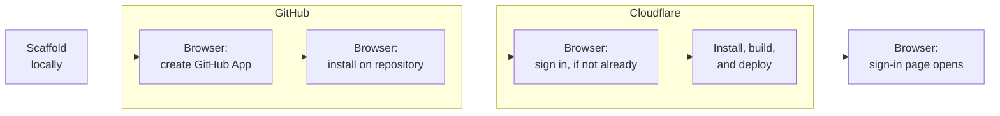

# Create your site

From nothing to signed in, and how to sign in again.

## Before you run it

You need a Mac or a Linux computer with [Node.js](https://nodejs.org) 22 or later installed, a
terminal, a [GitHub account](https://github.com/signup) and a
[Cloudflare account](https://dash.cloudflare.com/sign-up), both free to open if you don't have
them yet. The tool signs in to accounts you already have; it doesn't create either one for you.
It also checks your Node version itself and tells you if it's too old, before it asks you
anything.

Windows isn't supported yet, and that includes Git Bash and PowerShell. A run on Windows gets
partway through and then fails with an unclear error, so use a Mac, a Linux computer, or
[Windows Subsystem for Linux](https://learn.microsoft.com/windows/wsl/install) instead. If none
of those is available to you, a developer can set the site up from
[the extend track](../extend/README.md) and hand it over.

## Run the command

Open a terminal and run:

```
npx create-cairn-site
```

Every terminal excerpt on this page comes from a real setup of a site named
`cairn-capture-scratch` on the GitHub account `glw907`. Your own site's name, account, and the
address built from both appear in their place.

The tool opens with what this costs to run, the same facts as
[Before you start](./before-you-start.md):

<!-- transcript: packages/create-cairn-site/test/fixtures/transcripts/01-create-cairn-site.txt -->
```
Before you start, the honest cost picture.

Building and running this site is free, and stays free.
[...]
```

Then it asks four short questions: your site's name, an optional one-line description, an
optional brand color, and the folder to create it in. Press Enter on the name or the folder to
accept the value shown; press Enter on the description or brand color to leave it blank.

The tool scaffolds your site locally, then keeps going: it walks you through putting that site on
GitHub, and then onto Cloudflare, in the same run. Both stages ask before they do anything, so you
can stop and pick this back up later if you'd rather not finish it in one sitting.

## Getting your site onto GitHub

The tool explains what it's about to do, then asks:

<!-- transcript: packages/create-cairn-site/test/fixtures/transcripts/01-create-cairn-site.txt -->
```
Confirm the GitHub App and repository
This step creates a GitHub App named cairn-cairn-capture-scratch that only this site uses, a private repository named cairn-capture-scratch, and needs two trips to your browser.

The App will be able to write this site's content and manage the repository's settings, including deleting it. GitHub does not allow an App's permissions to be reduced later, so this stays for as long as the App exists. This is what lets the tool create and publish to the repository for you.
│
◇  Create the GitHub App and repository now?
│  Yes
```

Saying yes creates a private GitHub repository for your content, and a GitHub App that exists
only for this site. That App is what lets the tool, and your writers, publish to your repository
without anyone needing a GitHub account of their own. That access, once granted, stays for as
long as the App exists, since GitHub gives no way to walk it back later. The two browser trips are
separate: the first creates the App, the second installs it on your new repository and signs you
in to GitHub. The tool opens each page for you and waits.

If you're creating the App under an organization rather than your personal account, GitHub may
require an organization owner to approve the install before it continues. If that happens, the
tool tells you so and stops cleanly; nothing is lost, and re-running the same command later picks
up right where it left off, once someone with owner access approves it.

## Getting your site onto Cloudflare

Once your repository exists, the tool asks again: **Install, build, and deploy your site now?**
("Deploy" means putting your site live, answering requests the moment anyone visits it.) Say yes,
and it installs your site's dependencies, signs in to Cloudflare (a third browser trip, only if you
aren't signed in already), and deploys. This creates, on your own Cloudflare account:

- One Worker running your site.
- Two databases: one for who's allowed to sign in, one that's yours for whatever a developer
  builds on your site later.
- One storage bucket for images.

All of this runs on Cloudflare's free plan; nothing in this step costs money. Your content itself
isn't in either database: it's the markdown files already sitting in the GitHub repository the
previous step created. The tool then moves
your GitHub App's private key off your machine and into a Cloudflare Worker secret, where it
stays, and asks for the email address you'll sign in with. Once you answer, it writes your owner
record straight into your new site's database and opens a sign-in page in your browser. This is
the setup's last browser moment. Click **Sign in there**. You land in your own site's admin,
already signed in as its owner.



*Three browser moments punctuate this path, or four if you aren't already signed in to
Cloudflare.*

## You know it worked when

The tool finishes by printing this:

<!-- transcript: packages/create-cairn-site/test/fixtures/transcripts/01d-resume.txt -->
```
Your site is live on GitHub: https://github.com/glw907/cairn-capture-scratch
The App that publishes for you: https://github.com/apps/cairn-cairn-capture-scratch

Your site is live at: https://cairn-capture-scratch.glw907.workers.dev
Sign in at: https://cairn-capture-scratch.glw907.workers.dev/admin

What exists now: one Worker, two databases, one storage bucket, and the GitHub App's private key, stored as a Worker secret.
```

Open your own site's admin address: if you land there already signed in, from the link the tool
just opened, setup finished. See
[the free-until boundary](./before-you-start.md#the-free-until-boundary) for what changes once a
second person needs their own sign-in.

Your site is now live on a Cloudflare-provided `workers.dev` address, which keeps working even
after you connect a domain of your own, covered next in
[Own your domain](./own-your-domain.md).

## Getting back in

The sign-in link the tool opens for you works for ten minutes. If you close that tab, wait too
long, or the link stops working for any other reason, run:

```
npx create-cairn-site --dir <the-folder-you-created> --sign-in
```

from the same machine that created the site, and the tool writes a fresh link straight into your
site's database and opens it, with no email involved. This works at any point after your site
first goes live, not only in the minutes right after setup. Once you're signed in through it, that
session lasts 30 days on its own, so this is a rare thing to need. If a step earlier than this one
failed or got interrupted before your site ever went live, see
[Setup recovery](./setup-recovery.md) instead.
