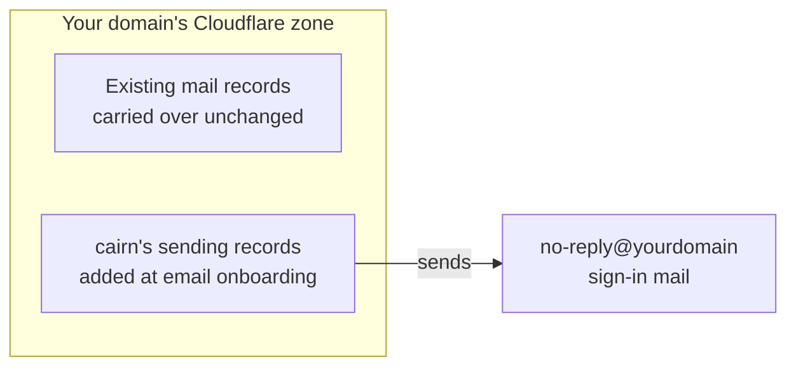

# Own your domain

Move the site onto a domain you own.

**Only want your site to redeploy itself on every push, with no domain of your own involved?**
Nothing on this page is required for that. Skip straight to
[Connect to Workers Builds](#connect-to-workers-builds) below.

Everything else here takes two Cloudflare API tokens. Connecting your domain and turning on
sign-in email share the first token; connecting to Workers Builds at the end needs a second,
wider one. The first two run from the same command:

```
npx create-cairn-site --dir <your-site-directory>
```

running it again picks up wherever you left off; see [Setup recovery](./setup-recovery.md) if a
step here fails or gets interrupted.

## Connect your domain

You need a domain already registered, at any registrar, before you start; this step connects one
you already own, it doesn't sell you one. Connecting it costs nothing on its own: creating the
Cloudflare zone, Cloudflare's own name for the settings and records it holds on your domain's
behalf, and the connection both run on the free plan, separately from what the Worker itself
needs (see [Getting your site onto Cloudflare](./create-your-site.md#getting-your-site-onto-cloudflare)).

The tool asks: **Connect a domain you own to this site now?** Say yes and name your domain, and
it opens Cloudflare's own "create token" page with five permissions already selected: Zone, DNS,
Workers Scripts, SSL and Certificates, and Email Sending. Read every row before you paste the
finished token back, the same warning [Before you start](./before-you-start.md) opens with. One
browser trip covers this whole step.

### Switching your domain's nameservers

Cloudflare creates the zone and gives you a pair of nameservers. Your domain still points at
whatever nameservers it used before, until you go to your registrar (wherever you bought the
domain, not Cloudflare) and change them to the pair Cloudflare gave you. That change spreads
across the internet gradually, which is called propagation, and can take anywhere from a few
minutes to 48 hours to reach everywhere. Nothing is broken while you wait: your site keeps
answering at its `workers.dev` address the whole time, and re-running the command above just
checks again.

### If this domain already has DNS records

DNS records are the entries that tell the internet where your domain's mail and web traffic go.
Before your domain switches over, the tool reads whatever it currently has, at
whichever nameservers it points to today, and shows them to you before copying anything. This
matters because your domain probably already carries records that have nothing to do with cairn:
mail records, most commonly. Confirm the copy, and those records move into the new Cloudflare
zone unchanged, so nothing that already worked stops working once the switch takes effect. If the
domain was already active in this Cloudflare account, there's nothing to copy: whatever the zone
already serves is your existing setup, and it stays untouched.



*After the switch, one Cloudflare zone holds both groups of records at once. They stay separate,
and nothing cairn adds touches the mail your organization already sends.*

**Two different things share this one domain, and it's easy to conflate them:**

- **The address your site sends sign-in mail from** is `no-reply@yourdomain`, using Cloudflare's
  own sending infrastructure, added only once you turn on email sign-in below.
- **Your organization's existing mail on this domain**, whatever you already use today, carries
  over unchanged and has nothing to do with cairn's own sign-in mail.

**If you don't personally control this domain's DNS,** stop here and talk to whoever does, an
agency, a previous developer, an IT contact, before going further. A domain already set up under
someone else's Cloudflare account can't be connected here at all; the tool tells you exactly that,
and names the one fix, asking that person to release it. Guessing or forcing past this only risks
your organization's existing mail.

### You know it worked when

The tool confirms your domain answers over HTTPS, switches your site's own address over to it,
and redeploys once. From here your site answers at both `https://yourdomain` and its original
`workers.dev` address; sign in at `https://yourdomain/admin`.

## Turn on sign-in email

This is the free-until boundary from [Before you start](./before-you-start.md): free for as long
as you're the only one signing in, and this is the step that changes that. Turn Workers Paid on
first, at Cloudflare's own
[Workers & Pages overview](https://dash.cloudflare.com/?to=/:account/workers-and-pages) for your
account. Saying yes to the question below doesn't subscribe you to anything by itself; it only
tells the tool to go ahead and onboard your domain for email, and if your account isn't on Workers
Paid yet, the run stops there and tells you so. The tool restates the price the moment it asks, so
you never meet it as a surprise: **Turn on Cloudflare's Workers Paid plan now, so anyone besides
you can sign in?** That's $5 US a month, billed once per Cloudflare account rather than once per
site, and it is not a scaling upgrade tied to how much traffic your site gets. Say no, and nothing
changes: your site keeps serving, and you keep signing in as its owner through
[`--sign-in`](./create-your-site.md#getting-back-in). You can turn this on later any time you run
the command again.

Say yes, and the tool onboards `yourdomain` for Cloudflare's Email Sending, then sends a real test
message to your own sign-in address to prove it works before it hands the feature to
anyone else.

A domain this new has no sending history yet, so mail providers can take a while to trust it
enough to deliver its first messages; that trust builds on its own as the domain keeps sending. If
someone's first sign-in link doesn't arrive right away, this warm-up period is the usual reason,
not a sign that anything is broken.

Onboarding also writes a DMARC policy at `_dmarc.yourdomain`. It tells receivers to reject any
mail claiming to be from your domain that your domain hasn't authenticated, regardless of where it
came from. That record stays in place even if you turn Email Sending off again later. So if you
add a newsletter tool or a mailing list to this domain afterward, follow that tool's own
instructions for adding itself to your domain's mail records before you send anything through it,
or its mail gets rejected. The record Cloudflare wrote only sets that policy; it carries no list
of which senders your domain allows.

### You know it worked when

Cloudflare accepts a real test message sent from your own site, to your own sign-in address. From
here, [Invite your editors](./invite-editors.md) is what gets other people signed in.

## Connect to Workers Builds

This is optional, and separate from everything above: it means every future push to your
repository's default branch builds and deploys your site by itself, with no laptop and no
`create-cairn-site` needed for routine updates. Run:

```
npx create-cairn-site --dir <your-site-directory> --connect
```

This works as soon as your site is live, whether or not you've connected a domain yet. The tool
explains the three things this step needs. You authorize Cloudflare's own "Workers and Pages"
GitHub App on your account once, create a fresh Cloudflare API token, and click a sign-in link
later in the run. That token is a second, separate one: a fresh one, prefilled with eight
permissions rather than the domain half's five (the same five, plus three Workers Builds needs).
It becomes your Workers Builds build token, kept by Cloudflare and handed to every build your
repository runs. It's scoped across every Cloudflare account and zone you own, so treat anyone
who can push to your default branch as able to read a token that reaches all of them. This costs
nothing on Workers Builds' free tier, which covers 3,000 build minutes a month and one build
running at a time
([Workers pricing](https://developers.cloudflare.com/workers/platform/pricing/), as of
2026-08-12).

Two browser moments cover this step once Cloudflare's "Workers and Pages" GitHub App is already
authorized on your account: the fresh token's create-token page, and, later in the same run, a
sign-in click when the tool commits its own deploy-config changes back to your repository under
your name. If that App isn't authorized yet, the run stops first and tells you where to do that;
re-run with `--connect` afterward, and it picks up without asking for a fresh token.

### You know it worked when

The tool watches your first Workers Builds deploy to completion and confirms your site answers
there. From here, every commit to your default branch deploys itself. A cairn engine update is
different: that's still a developer's job (see
[What needs a developer](./before-you-start.md#what-needs-a-developer)), covered in
[Upgrade cairn](../extend/upgrade-cairn.md).
