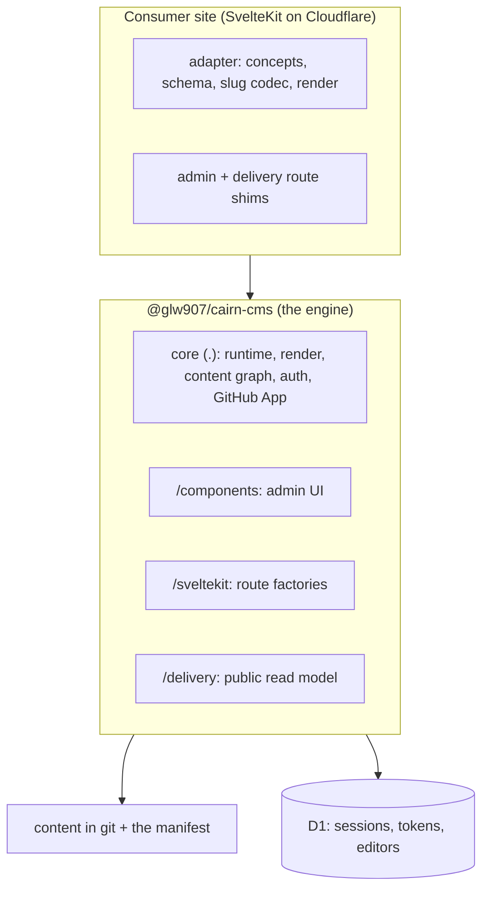
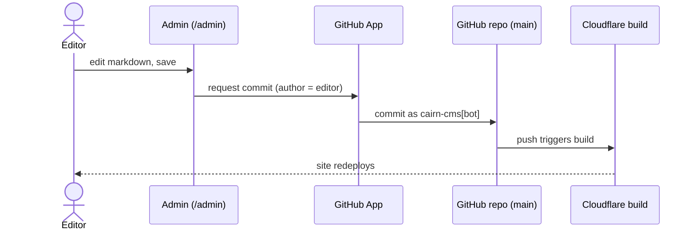

# Architecture

cairn is an embedded, magic-link, GitHub-committing CMS for SvelteKit sites on Cloudflare. A
non-technical author logs in by email, edits raw markdown in a CodeMirror editor with a live
preview, and saving commits the file to `main` through a GitHub App. cairn is design-agnostic. The
engine ships the machinery, and each site supplies an adapter that declares its content concepts,
its frontmatter schema, its slug codec, and its `render` method. Two sites can run the same engine
version and look nothing alike.

## The layered model

Three things sit in the picture. The engine is the `@glw907/cairn-cms` npm package, and it exposes
its surface through subpath exports: the root `.`, `/components`, `/sveltekit`, `/delivery`, and a
few narrower entries. The consumer site is a full SvelteKit app on Cloudflare that owns its code,
imports the engine, supplies the adapter, and mounts the route shims SvelteKit requires. The engine
provides two surfaces to that site. The admin surface is the `/admin` editing app, and the delivery
surface is the public read model the site's own pages call.

The engine is fat and the site is thin. Security-critical and fix-prone logic (auth, the commit
path, the admin shell, the render machinery) lives in the engine, so a fix is a version bump that
the site picks up. What the site owns is presentation: the adapter, the component registry data, the
CSS, and the thin route shims.

## The engine and site line

The engine owns the runtime. That covers the magic-link auth on D1, the `/admin` guard, the
GitHub-App commit path, the admin shell and components, the SvelteKit route factories, and the
render pipeline machinery. The site owns the adapter and the presentation.

The seams are the points where a site plugs into the engine:

- The adapter contract, the single `CairnAdapter` object the engine consumes.
- The slug codec, which maps a content id to a public URL and back.
- The frontmatter schema, one `defineFields` declaration per concept that drives the editor form,
  the validator, and the inferred frontmatter type at once.
- The `render` method, the site's one markdown-to-HTML function that the editor preview and every
  public page call.
- The `CairnExtension` seam, the typed, build-time-composed way a site adds nav entries, admin
  routes, components, field types, or commit hooks without forking the engine.

See [the content model](./content-model.md) for the schema and concept detail, and
[the core reference](../reference/core.md) for the seam signatures.

## The commit and publish flow

A save is a commit. The admin app sends the edited file to the GitHub App, which commits it to
`main`. The committer is `cairn-cms[bot]` and the author is the editor, so the git history records
who wrote each change while the machine identity does the writing. The push to `main` triggers the
site's existing Cloudflare build, which redeploys. Commit is publish, with no separate publish step
and no review queue.

The GitHub App holds a machine identity that is separate from the editor's magic-link session. See
[the security model](./security-model.md) for the commit trust model and how the two identities
relate.

## The render pipeline shape

Author markdown runs through one render pipeline. The pipeline parses the markdown with the unified
toolchain, dispatches any directive components through the site's component registry, and passes the
result through a sanitize floor before emitting HTML. The site delivers that HTML with `{@html}`.
The same `render` runs in the editor preview and on the public page, so the author sees the live
design while editing.

The sanitize floor is the primary XSS control, and it runs on every render by default. A second
post-dispatch guard covers a component's `build()` output, which the floor runs too early to see. See
[the security model](./security-model.md) for the floor, the allowlist extension point, and the guard.

## Distribution and versioning

The engine ships to public npm as `@glw907/cairn-cms` under MIT. It is in `0.x`, where a minor bump
can carry a breaking change, so a consumer pins a version range and reads the changelog before
upgrading. The subpath exports (`.`, `/components`, `/sveltekit`, `/delivery`, and the narrower
entries) are the supported surface, and importing from a deep path inside `dist` is not. A site
tracks the engine by semver and regenerates its lockfile, so an engine fix propagates on the next
bump.

See [the core reference](../reference/core.md) for the engine API and the
[reference index](../reference/README.md) for one page per export subpath.
