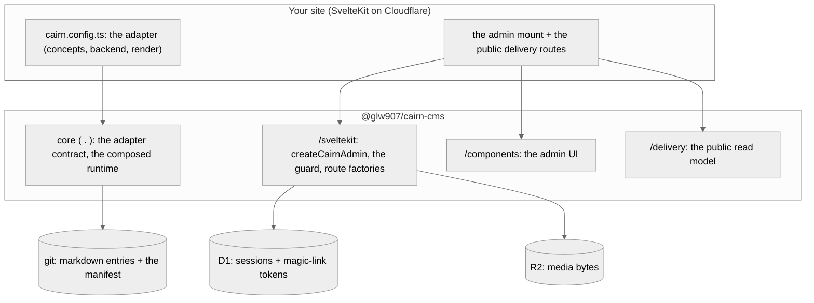
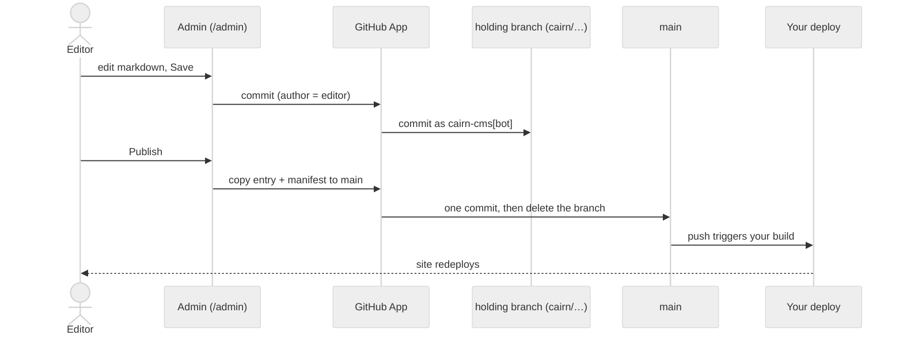

# Architecture

cairn lives inside your SvelteKit site and commits to your GitHub repo. An editor signs in
from an emailed link, writes markdown with a live preview a tab away, and hits Save. The save
becomes a commit on the entry's own holding branch, and a deliberate Publish copies it to
`main`, where your existing deploy takes over. cairn is design-agnostic: the engine ships the
machinery, and your site supplies an adapter declaring its content concepts, their frontmatter
schemas, and its own `render`, so two sites on the same engine version can look nothing alike.

## The layered model

Your site is a full SvelteKit app on Cloudflare. You own the code and import the engine. You
declare the adapter, then mount the admin and the public routes. The engine is the
`@glw907/cairn-cms` npm package, split into subpath exports so a site imports only what a
given file needs. The root `.` carries the adapter and schema constructors plus the composed
runtime. The admin lives under `/sveltekit` (the admin facade, the auth guard, the per-route
factories) and `/components` (its UI). A site's own public routes read from `/delivery`. A few
narrower subpaths back specific jobs: `/render` and `/islands` for component authoring and
client hydration, `/media` for the R2-backed asset resolver, and `/vite` for the build-time
manifest plugin.

`composeRuntime` is where these two halves meet. It folds your adapter together with your
site's git-committed `site.config.yaml` into one `CairnRuntime`, the shape every admin route
and the health check read from. `parseSiteConfig` enforces the split rather than trusting
convention: it throws if a key that belongs on the adapter (`content`, `backend`, `email`,
`rendering`, `media`, `editor`) turns up in the YAML instead, and the reverse. Your concepts
and their render are code, so they live in `cairn.config.ts`. Nav menus and the tag vocabulary
change without a deploy, so they live in the YAML that your editors' own admin screens commit
back to git.

Your adapter can also declare what your own site calls its people. The engine hard-codes three
capability levels, owner, editor, and none, but leaves the role names open. `defineRoles` maps
each of your role names onto one of those three levels, and can name the `/admin` route a role
lands on after sign-in. A site that declares no `roles` keeps the implicit `owner`/`editor` pair
the engine has always had, so this changes nothing for a zero-config site. See
[roles](../reference/core.md#roles) in the core reference for the full mapping rules and the
typed read-side a site augments so its own routes see its declared role names on
`locals.editor.role`.

## The admin mount

A site mounts the whole `/admin` surface with one catch-all route pair and one server
composer, not a route per view. `createCairnAdmin` serves every admin URL through a single
`load` and a single `actions` record: the list, the entry editor, login, the media library,
the vocabulary editor, and the rest all dispatch from the same two exports, parsed off
`event.url.pathname`. A shared shell layout wraps the whole subtree in cairn's chrome (the
sidebar, the top bar, the theme), so a site's own custom screen, dropped in as a concrete
route under `/admin/`, renders inside the same shell the engine's views do. The mount itself
does no access control. A separate auth guard, wired once in `hooks.server.ts`, gates every
`/admin/**` path before any load runs and sets `event.locals.editor`, the signed-in identity a
site's own routes can read the same way. See [the canonical admin
mount](../reference/admin-routes.md) for the exact files to copy.

## The commit pipeline: holding branch to publish

Saving and publishing are both commits, made through a GitHub App whose machine identity is
separate from the editor's own session. A save writes to a branch named
`cairn/<concept>/<id>`, cut lazily from `main`'s head the first time an editor touches that
entry. The branch's mere existence is the entry's whole pending state, and there is no
metadata file and no database row tracking it. Publish is a content copy, not a merge: it takes the branch's
current markdown, upserts that entry's row into the content manifest, and lands both in one
atomic commit to `main`, with the editor as author and `cairn-cms[bot]` as committer. Publish
is publish-what-you-see, so text typed since the last save goes live too, and the branch
deletes only if its head still matches the commit publish just made. A save that lands in the
same instant leaves the entry pending instead of losing it. That commit to `main` is what
triggers your site's existing deploy.

Because a branch differs from `main` only at its one entry's path, how far `main` has moved
since the branch was cut never matters; there is nothing to rebase. See [the security
model](./security-model.md) for how the GitHub App's identity and the editor's magic-link
session relate, and what each one is trusted to do.

## One renderer for preview and public

Your adapter declares exactly one `render` function, and it is the only renderer cairn ever
calls: the same call, with the same markdown body, runs behind the live-editing preview and
behind every public page. There is no separate preview renderer to drift from the real one.
`render` takes the entry's markdown body plus a `resolve` and a `resolveMedia` callback, which
rewrite a `cairn:` content link and a `media:` asset reference to their live URLs, and it
returns the HTML your site serves. A component your registry marks for client hydration
renders its static, no-JS markup through this same call; the live Svelte version mounts over
it in the browser afterward, from the `/islands` runtime, only where the page actually needs
it.

The public side of this seam is not a live read from GitHub. `/delivery`'s route loader
resolves a request path against a site resolver built at build time from globbed content
files, so a deployed page renders from a build-time projection of the manifest, never a
request-time API call to your repo. The admin side does read live: every admin view goes
through the connected GitHub backend on each request, since an editor is looking at branches a
build has never seen. What the render call keeps constant across both is the sanitizing floor
between an author's markdown and the HTML a visitor's browser executes. See [the render
sanitize floor](./render-safety.md) for exactly what it strips and what it guarantees.

## Where state lives

cairn keeps state in three places, each matched to what its data needs. Content markdown, the
content manifest, the media manifest, and the site's YAML config all live in git, because that
is what a small site's content actually needs: versions, attribution, and a commit that is
itself the deploy trigger. Auth state, an editor's session and a magic-link token's single use,
lives in a self-owned D1 database (bound as `AUTH_DB`), because a login has to be checked and
invalidated in milliseconds and git has no such operation. Media bytes, when a site turns them
on, live in an R2 bucket (bound as `MEDIA_BUCKET`). Only a stable `media:<slug>.<hash>`
reference to them ever reaches git, so a file rename leaves every link intact and keeps binary
weight out of the repository. See [where each kind of state lives](./data-tiers.md) for the rule
this split follows and [media storage](./media-storage.md) for the reference scheme in full.

## Distribution and versioning

The engine ships to public npm as `@glw907/cairn-cms` under the MIT license, in `0.x`, where a
minor version can carry a breaking change. Pin a version range and read `CHANGELOG.md`'s
`Consumers must:` lines between the version you're on and the one you're moving to before you
bump. Treat the subpath exports this page names as the supported surface. A path that reaches
inside `dist` directly is unsupported and can break on any version bump. An engine fix or a new
admin feature reaches your site through the
version bump alone, so there is no per-site route table or action list to keep in sync by hand.
See [the core reference](../reference/core.md) for the adapter contract and [the reference
index](../reference/README.md) for one page per export subpath.
