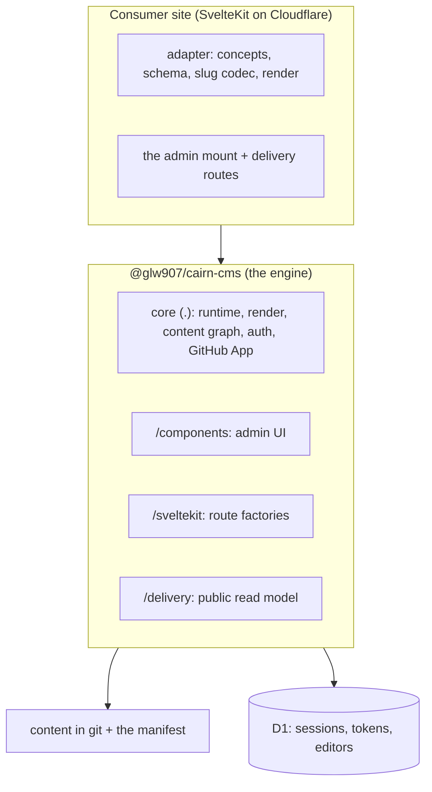
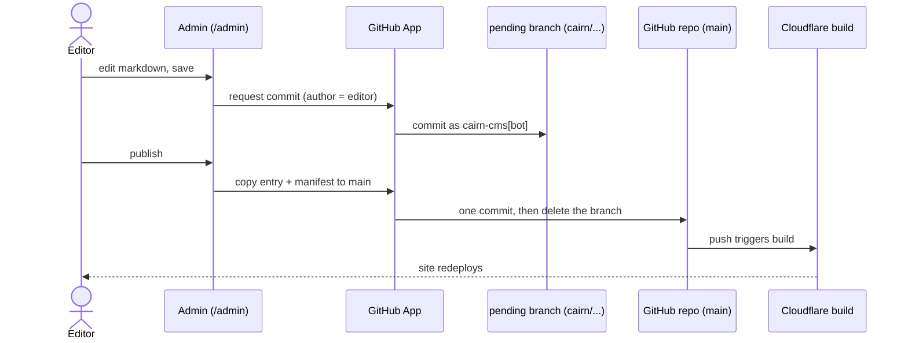

# Architecture

cairn is a CMS that lives inside your SvelteKit site and commits to git. An editor logs in by
email, writes markdown with a live preview a tab away, and hits Save; the save becomes a commit on the
entry's pending branch, and a deliberate Publish copies it to `main`, where your deploy does the
rest. cairn is design-agnostic. The engine ships the
machinery; your site supplies an adapter declaring its content concepts, its frontmatter
schema, its slug codec, and its `render` method. Two sites can run the same engine version
and look nothing alike.

This page draws the picture: what the engine owns, what your site owns, and what happens
between Save and the redeployed page.

## The layered model

Three things sit in the picture. The engine is the `@glw907/cairn-cms` npm package, exposing
its surface through subpath exports: the root `.`, `/components`, `/sveltekit`, `/delivery`,
and a few narrower entries. Your site is a full SvelteKit app on Cloudflare: you own the
code, you import the engine, you supply the adapter, and you mount the whole admin with one
catch-all route. In return the engine hands you two surfaces: `/admin`, the editing app, and
the delivery surface, the public read model your own pages call.

The engine is fat and your site is thin. That's deliberate: anything security-critical or
fix-prone (auth, the commit path, the admin route table, the admin shell, the render machinery)
lives in the engine, so when something needs fixing you bump a version instead of patching
sites. What you own is presentation: the adapter, the component registry data, the CSS, and a
handful of thin routes that hand the engine the request.

## The engine and site line

The engine owns the runtime: the magic-link auth on D1, the `/admin` guard, the GitHub-App
commit path, the admin shell and components, the SvelteKit route factories, and the render
pipeline machinery. You own the adapter and the presentation.

The seams are where your code plugs in:

- The adapter contract, the single `CairnAdapter` object the engine consumes.
- The slug codec, which maps a content id to a public URL and back.
- The frontmatter schema, one `fieldset` declaration per concept that drives the editor
  form, the validator, and the inferred frontmatter type at once.
- The `render` method, your one markdown-to-HTML function, which the editor preview and every
  public page call.
- The `CairnExtension` seam, the typed, build-time-composed way you add nav entries, admin
  routes, components, field types, or commit hooks without forking the engine.

See [the content model](./content-model.md) for the schema and concept detail, and
[the core reference](../reference/core.md) for the seam signatures.

## The commit and publish flow

A save is a commit, held back from the live site. When an editor hits Save, the admin app sends
the edited file to the GitHub App, which commits it to the entry's pending branch,
`cairn/<concept>/<id>`, cut from `main`'s head on the first save. The committer is
`cairn-cms[bot]` and the author is the editor, so the git history records who wrote each change
while the machine identity does the writing. The live site does not change and no deploy fires.

Publish is the deliberate step. The per-page Publish rides the edit form, so it first holds the
posted content like a save (publish-what-you-see), then commits that markdown to `main`, with its
manifest row upserted, in one commit, and deletes the branch. The delete is sha-guarded: it runs
only when the branch head still matches the commit publish made, so a save landing mid-publish
leaves the entry pending instead of vanishing. That push triggers your existing Cloudflare build,
which redeploys. A site-wide publish-all ships every pending entry's last saved version the same
way in one atomic commit. Discard deletes the branch, so a published entry returns to its live
version and a never-published one disappears.

The ref's existence is the only pending state. There is no metadata file and no database row, so
deleting a stray branch by hand in GitHub leaves nothing to reconcile. Publish is a content copy,
never a git merge: the branch differs from `main` only at the entry's path, so branch base
staleness is irrelevant, no matter how far `main` has advanced since the branch was cut.

The GitHub App holds a machine identity separate from the editor's magic-link session. See
[the security model](./security-model.md) for the commit trust model and how the two
identities relate.

## The render pipeline shape

Author markdown runs through one render pipeline. It parses the markdown with the unified
toolchain, dispatches any directive components through your component registry, and passes
the result through a sanitize floor before emitting HTML, which your site delivers with
`{@html}`. The same `render` runs in the editor preview and on the public page, so the author
sees the live design while editing.

The sanitize floor is the primary XSS control. It runs on every render by default. A second
post-dispatch guard covers a component's `build()` output, which the floor runs too early to
see. See [the security model](./security-model.md) for the floor, the allowlist
extension point, and the guard.

## Distribution and versioning

The engine ships to public npm as `@glw907/cairn-cms` under MIT. It is in `0.x`, where a
minor bump can carry a breaking change, so pin a version range and read the changelog before
upgrading. The subpath exports (`.`, `/components`, `/sveltekit`, `/delivery`, and the
narrower entries) are the supported surface; importing from a deep path inside `dist` is not.
Your site tracks the engine by semver and regenerates its lockfile, so an engine fix
propagates on your next bump.

See [the core reference](../reference/core.md) for the engine API and the
[reference index](../reference/README.md) for one page per export subpath.
