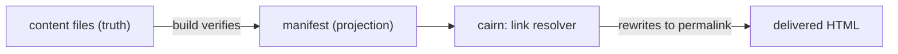

# The content model

cairn holds a site's content as markdown files in git. How those files are named, validated,
addressed, and linked is the content model. Four design choices shape it. Content is a fixed set of
named concepts. A URL is assembled from a stable id and a date. One schema declaration is the source
of truth for a concept's fields. A committed manifest projects the corpus into a link graph. This
page explains why each choice was made, and names the alternative each one rejected.

The exact export names and signatures behind these ideas live in [`core.md`](../reference/core.md).
Why the manifest lives where it does is covered in [data tiers](./data-tiers.md). The engine and site
boundary the content model sits inside is the subject of [architecture](./architecture.md).

## Fixed concepts, not generic collections

A site's content is a curated set of first-class concepts. Posts and Pages are the two that ship.
Each concept is its own thing with its own name, its own URL shape, and its own schema. A site gets
more of one kind of content by having more of that concept's files, never by reaching for a generic
container.

An earlier design carried an open-ended `collections[]` array, where a site declared any number of
named collections and the engine treated them uniformly. That was dropped. An open array pushes every
site to invent its own taxonomy, and it forces the engine to stay generic about something the engine
should have an opinion on. A Post and a Page differ in real ways, including whether the URL carries a
date, so the engine models them as distinct named concepts and gives each one its own behavior.
Multiplicity comes from distinct concepts, never from a duplicate one.

A site declares its concepts through `defineAdapter`, and the engine reads them through
`normalizeConcepts`. Both live in [`core.md`](../reference/core.md#defineadapter).

## URL identity

A dated entry's filename stem is its permanent id, and its URL is derived from that id. The split has
four parts.

The **id** is the full filename stem, including any leading date. A post saved as
`2026-01-04-waxing-guide.md` has the id `2026-01-04-waxing-guide`. The id never changes for the life
of the entry, which is what makes a link to it rot-proof.

The **slug** is the id with the leading date stripped. The same post has the slug `waxing-guide`. A
non-dated concept has a slug equal to its id, since there is no date to remove.

The **date** is canonical in frontmatter. The leading date on the filename is a convenience for
sorting files in a directory, and the frontmatter `date` field is what the site reads and renders.

The **datePrefix** is per-concept. A concept declares whether its dates run to the year, the month,
or the day, and that granularity decides how much of the leading date the slug strips.

The URL itself is not built from the id alone. The URL policy lives in the YAML site config, so the
site owner controls the permalink shape without touching code, and a site-level catch-all
`byPermalink` route serves the resolved URL. One URL therefore spreads across three places: the
frontmatter date, the per-concept `datePrefix`, and the YAML url policy that the catch-all route
reads. That spread is real complexity, and it is the reason this section earns a diagram in the
reference rather than a one-liner. The id helpers and `permalink` are documented in
[`core.md`](../reference/core.md#id-helpers).

## Schema as the source of truth

A concept's frontmatter shape is declared once, with `defineFields`. That single declaration drives
three things at once. It generates the editor form the author fills in. It is the validator that
checks a save. It is the type the rest of the engine infers a concept's frontmatter from. There is no
second place to keep in sync, so a field cannot exist in the form but be missing from the type, or be
validated one way and typed another.

The declaration conforms to Standard Schema, the shared validation interface, so a site can hand a
cairn field set to any Standard-Schema-aware tool and a site can validate with a familiar contract.
cairn owns the primitive rather than wrapping a third-party schema library, which keeps the editor
form, the validator, and the inferred type reading from one declaration the engine fully controls.

`defineFields` is documented in [`core.md`](../reference/core.md#definefields). The rule that follows
from this design: every frontmatter key a site reads must be declared in the schema, because the
schema is the only source the form and the type come from.

## The content graph

The markdown files are the truth. The manifest is a build-verified projection of those files, a
single committed JSON for the whole corpus that request-time admin code can read without crawling
GitHub file by file. Every production build regenerates the manifest from the actual files and fails
the build if the committed copy has drifted, so the projection can never silently go stale. The files
win, always.

The manifest is the link graph. An internal link is a standard CommonMark link whose href is a
`cairn:<concept>/<id>` token, keyed to the target's permanent id. Because the id is permanent, the
link survives any change to the target's slug, date, or permalink pattern, and the resolver rewrites
the token to the live URL on every build. This is a stable-id token, not a wikilink. The
`[[wikilink]]` form was weighed and set aside as the stored form, because it is not a portable
standard and it is keyed by name, so it rots on a rename unless the tool rewrites every reference.
The `[[` typing gesture survives as an editor trigger that opens the picker and inserts a resolved id
token, so the author keeps the ergonomic without the name-based rot.

The editor offers a picker over the manifest's entries, so a freshly inserted link cannot dangle. The
delete and rename paths stay safe by reading the manifest's edge list to find inbound links, then
committing the content change and the updated manifest in one atomic commit. A rename rewrites every
inbound `cairn:` link in that same commit. The build is the final backstop: a dangling token fails the
build, so a broken internal link never reaches production.

### Why the manifest lives in git, not D1

cairn already runs a per-site D1 for the magic-link auth store, so D1 was the obvious place to ask
about. The deciding reason is that the sites are statically generated. Internal links resolve at
build time, in CI, and a D1 binding is a runtime Worker resource the build cannot reach. D1 cannot
serve the resolver or the build-fail backstop, which are the correctness core, so a file-derived
graph would be needed at build regardless. Putting the graph in D1 would create a second copy with no
reconciliation point, since the build never sees D1 to catch drift from a raw-git edit. A committed
manifest is one artifact the build regenerates and verifies, and it stays version-controlled,
diffable in a pull request, and recoverable by a revert. The full placement rule lives in
[data tiers](./data-tiers.md). The manifest helpers and the `cairn:` link helpers are documented in
[`core.md`](../reference/core.md#manifest-parse-serialize-verify-and-diff).
