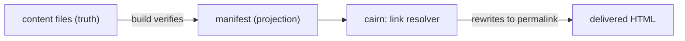

# The content model

cairn holds your site's content as markdown files in git. How those files are named, validated,
addressed, and linked is the content model. Four design choices shape it. Content is a fixed set of
named concepts. A URL is assembled from a stable id and a date. One schema declaration drives a
concept's form, validator, and type at once, and a committed manifest projects the whole corpus into
a link graph. This page walks through each choice, why it went that way, and the alternative it
rejected.

The exact export names and signatures behind these ideas live in [`core.md`](../reference/core.md).
The question of where the manifest lives gets its full treatment in [data tiers](./data-tiers.md),
and [architecture](./architecture.md) draws the engine and site boundary the content model sits
inside.

## Fixed concepts, not generic collections

Your site's content is a curated set of first-class concepts. Posts and Pages are the two that ship.
Each concept is its own thing, with its own name, its own URL shape, and its own schema. When you
want more of one kind of content, you add more of that concept's files. You never reach for a
generic container.

An earlier design carried an open-ended `collections[]` array, where a site declared any number of
named collections and the engine treated them all uniformly. We dropped it. An open array pushes
every site to invent its own taxonomy, and it forces the engine to stay generic about something it
should have an opinion on. A Post and a Page differ in real ways (whether the URL carries a date,
for one), so the engine models them as distinct named concepts and gives each its own behavior.
Multiplicity comes from distinct concepts, never from a duplicate one.

You declare your concepts through `defineAdapter`, and the engine reads them through
`normalizeConcepts`. Both live in [`core.md`](../reference/core.md#defineadapter).

## URL identity

A dated entry's filename stem is its permanent id, and its URL is derived from that id. The split
has four parts.

The **id** is the full filename stem, including any leading date. Save a post as
`2026-01-04-waxing-guide.md` and its id is `2026-01-04-waxing-guide`. The id never changes for the
life of the entry, which is what makes a link to it rot-proof.

Strip the leading date and you have the **slug**, `waxing-guide` for the same post. A non-dated
concept's slug equals its id (there is no date to remove).

The **date** is canonical in frontmatter. The leading date on the filename is a sorting convenience
for anyone browsing the directory; what your site reads and renders is the frontmatter `date` field.

Each concept sets its own **datePrefix**, declaring whether its dates run to the year, the month, or
the day. That granularity decides how much of the leading date the slug strips.

The URL itself is not built from the id alone. The URL policy lives in your YAML site config (so you
control the permalink shape without touching code), and a site-level catch-all `byPermalink` route
serves the resolved URL. A single URL therefore draws on the frontmatter date, the per-concept
`datePrefix`, and the YAML url policy the catch-all route reads, three places for one address. That
spread is real complexity, and it is why this section earns a diagram in the reference rather than a
one-liner. The id helpers and `permalink` are documented in
[`core.md`](../reference/core.md#id-helpers).

cairn validates the URL policy at build, so a wrong shape fails the build instead of emitting a
defaulted URL. A permalink pattern must be root-relative (it starts with `/`) and may use only the
tokens `:slug`, `:year`, `:month`, and `:day`. A date token is valid only on a dated concept, and a
`datePrefix` must be `year`, `month`, or `day`. Key a URL policy to a concept your site does not
declare under `content` and that fails the build too. A malformed policy throws a named error at
build, never a wrong or silently defaulted URL.

## Schema as the source of truth

You declare a concept's frontmatter shape once, with `defineFields`. That single declaration does
three jobs. It generates the editor form your author fills in, it validates each save, and the rest
of the engine infers the concept's frontmatter type from it. There is no second place to keep in
sync, so a field cannot exist in the form yet be missing from the type, or be validated one way and
typed another.

The declaration conforms to Standard Schema (the shared validation interface), so you can hand a
cairn field set to any Standard-Schema-aware tool and validate with a familiar contract. cairn owns
the primitive rather than wrapping a third-party schema library, which keeps the form, the
validator, and the inferred type reading from one declaration the engine fully controls.

`defineFields` is documented in [`core.md`](../reference/core.md#definefields). Every frontmatter
key your site reads must therefore be declared in the schema, because the schema is the only source
the form and the type come from.

## The content graph

The markdown files are the truth. The manifest is a build-verified projection of them, a single
committed JSON for the whole corpus that request-time admin code can read without crawling GitHub
file by file. Every production build regenerates the manifest from the actual files and fails the
build if the committed copy has drifted, so the projection can never silently go stale. The files
win, always.

The manifest is the link graph. An internal link is a standard CommonMark link whose href is a
`cairn:<concept>/<id>` token, keyed to the target's permanent id. Because the id is permanent, the
link survives any change to the target's slug, date, or permalink pattern, and the resolver rewrites
the token to the live URL on every build. The stored form is a stable-id token rather than a
wikilink. We weighed `[[wikilink]]` as the stored form and set it aside, because it is not a
portable standard and its key is the target's name, so it rots on a rename unless the tool rewrites
every reference. The `[[` typing gesture survives as an editor trigger (it opens the picker and inserts a
resolved id token), so the author keeps the ergonomic without the name-based rot.

The editor offers a picker over the manifest's entries, so a freshly inserted link cannot dangle.
Delete and rename stay safe by reading the manifest's edge list to find inbound links, then
committing the content change and the updated manifest in one atomic commit. A rename rewrites every
inbound `cairn:` link in that same commit. The build is the final backstop. A dangling token fails
it, so a broken internal link never reaches production.

### Why the manifest lives in git, not D1

cairn already runs a per-site D1 for the magic-link auth store, so D1 was the obvious place to ask
about. The deciding reason is that the sites are statically generated. Internal links resolve at
build time, in CI, and a D1 binding is a runtime Worker resource the build cannot reach. D1 cannot
serve the resolver or the build-fail backstop (the correctness core), so you would need a
file-derived graph at build regardless. Putting the graph in D1 would create a second copy with no
reconciliation point, since the build never sees D1 to catch drift from a raw-git edit. A committed
manifest is one artifact the build regenerates and verifies, and it stays version-controlled,
diffable in a pull request, and recoverable by a revert. The full placement rule lives in
[data tiers](./data-tiers.md). The manifest helpers and the `cairn:` link helpers are documented in
[`core.md`](../reference/core.md#manifest-parse-serialize-verify-and-diff).
