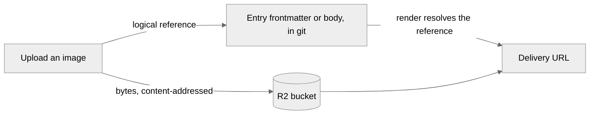

# Media storage

Cairn keeps content as markdown in git, and that's the right home for text but the wrong one for
an image or a PDF. So media takes a different path: the bytes live in Cloudflare R2, and the
content commits only a small logical reference that resolves to a real URL when a page renders.
The exact reference grammar and resolver API are in the
[media reference](../reference/media.md); the admin's day-to-day library workflow is in
[Manage the media library](../guides/manage-the-media-library.md).

## Why bytes don't belong in git

A binary file doesn't diff. Every re-save of an image stores a full new copy rather than a small
patch, so a repo that keeps its media in git grows without bound, and every clone and every CI run
gets slower as a result. It's a well-known failure mode, and one every git-based CMS that stores
binaries in the repo runs into eventually. Cairn avoids it by never putting the bytes there at all.
Because cairn is Cloudflare-native already, the natural home for them is R2, a bucket bound to the
same Worker that serves the rest of the site.

## What content commits

Content never holds a real media URL, and that's deliberate. It holds a logical handle instead,
keyed to a hash of the file's own bytes, and a render step resolves that handle to a delivery URL
at the moment a page is built or served:

Content-addressing does two things. Because the handle is keyed to the bytes and not a filename,
the same image uploaded twice collapses to one stored object, and renaming its display name breaks
nothing that points at it. It also decouples storage from content: the reference is stable, so a
site can change how it stores or serves media without rewriting a single committed entry.
