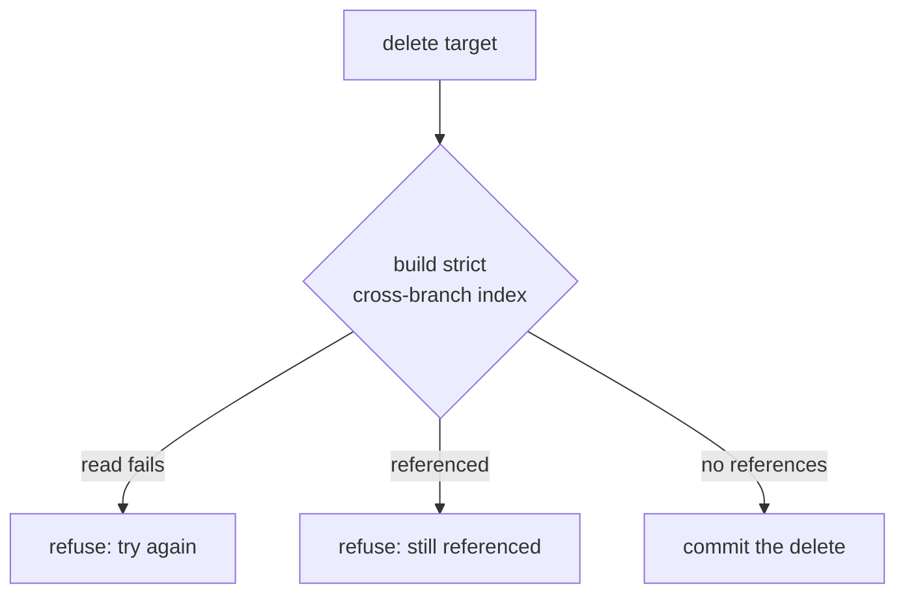

# Reference integrity

A reference field lifts cairn's content graph from body links into typed frontmatter. A post declares
`author: jane-doe` and `related: [a-post, b-post]`, and cairn treats each value as an edge to another entry,
not as an opaque string. This page explains how cairn keeps those edges correct across renames, deletes, and
the build, and why the design refuses rather than guesses.

The model rests on one decision: the stored value is the target's permanent id, never its title or its URL.
Everything else follows from it.

## The stored value is the permanent id

An entry's id is its filename stem, fixed for the life of the entry. A reference stores that id, so the edge
is independent of the target's title, its slug, its date, and its permalink pattern. A page can change its
title from "Jane Doe" to "J. Doe" and every post that references it keeps pointing at the same entry, because
the title was never part of the link.

This is the same choice the `cairn:` body-link scheme makes, for the same reason. A name-keyed link, such as a
`[[wikilink]]`, rots on a rename unless the tool rewrites every reference. An id-keyed edge survives a rename
of everything except the id itself, and cairn rewrites the id when it changes.

## Build-verified: the only integrity authority

The build is where cairn enforces reference integrity. `verifyReferences` walks every entry's recorded reference
edges and fails the build when an edge points at a target absent from the corpus, naming the source entry, the
field, and the missing target. A dangling reference never reaches production.

This gate runs inside the generated manifest build, beside `verifyManifest`, where the freshly built manifest
is in scope. It runs in the build, not the request path, because the manifest the build regenerates from the
actual files is the authoritative graph.

References differ from body links in one structural way: they have no prerender backstop. A dangling `cairn:`
body link fails the prerender when the link resolver throws, so the page build catches it. A reference is
frontmatter, not rendered markup, so no prerender pass touches it. `verifyReferences` is therefore the only
integrity authority for references, which is why the build gate is non-optional and the save-time check is
advisory. A save warns on a reference to a draft or absent target and holds the edit anyway; the build is what
refuses to ship a broken graph.

## Rename-safe: rewrite, then refuse the unsafe case

Renaming a target changes its id, so every edge that points at the old id would dangle. Cairn keeps the edges
correct in two moves.

First, it repoints. A surgical YAML-value rewriter finds each inbound reference on `main` and rewrites the old
id to the new one in place, byte for byte, preserving the rest of the frontmatter. The rewriter operates only
inside the named field's value range and re-quotes a new id that would otherwise reparse as a non-string. An id
such as `true`, `123`, or a date-shaped `2026-01-02` is a valid id token but a YAML keyword, number, or date,
so an unquoted substitution would reparse as a boolean, a number, or a `Date`, and the edge's id guard would
silently drop it. The rewriter quotes any such id so it reparses as the string it is. The same pass rewrites
the moved entry's own self-references on the moved file, since the inbound set excludes a self-edge.

Second, it refuses the case it cannot safely rewrite. The cross-branch reference index unions `main` and every
open `cairn/*` editing branch. A rename refuses when a third-party open branch holds an inbound reference,
because rewriting that branch's frontmatter would commit onto another author's edit. This mirrors the existing
pending-edit guard: a rename already refuses when another branch is editing the target, and an inbound
reference on another branch is the same class of conflict. Cairn repoints published inbound references on
`main`, and only a third-party branch reference refuses.

## Delete-protected: fail closed across branches

Deleting a target that something still references would strand a live edge. The delete gate builds the same
strict cross-branch reference index and refuses when any entry on `main` or any open branch references the
target, listing the referencing entries.

The gate fails closed. Building the index reads open branches over the network, and a read can fail. When the
index build throws, the delete refuses rather than proceeding, on the principle that an unverifiable delete is
an unsafe delete. The refusal returns a try-again error, never a silent allow. This is stricter than the
body-link delete guard, which stays main-only this phase and degrades to allow when the manifest is absent.
References don't degrade: an unverified reference graph blocks the delete.

## Why refuse instead of guess

Each gate refuses rather than picking a likely outcome. A rename onto a conflicting branch could merge,
a delete with an unreadable branch could assume no reference, and a build with a dangling edge could drop it.
Cairn refuses all three, because a content graph that silently loses an edge is worse than one that asks the
author to resolve the conflict. The author sees a named refusal and acts on it; a silent guess corrupts the
graph with no signal.

The reference field's surface is documented in [the core reference](../reference/core.md#field-types), the
build gate in [`verifyReferences`](../reference/core.md#manifest-serialize-and-verify), and the
read-model resolver in [`resolveReferences`](../reference/delivery-data.md#resolvereferences). For the wider
content graph the references join, see [the content model](./content-model.md#the-content-graph).
