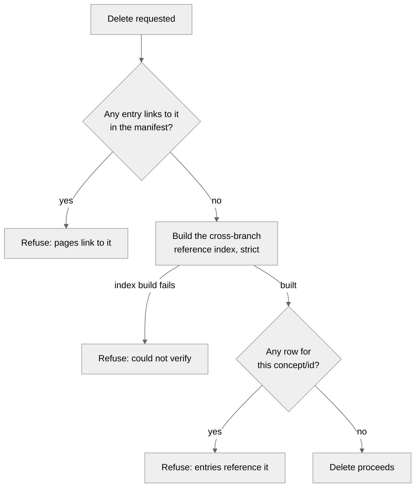

# Reference integrity

A `fields.reference` edge is a promise: this entry points at that one, forever, no matter what
either entry is later called. The developer-facing how-to, with the field declaration and the
resolver call, is [Link content with references](../guides/link-content-with-references.md).

## A reference stores only the id

A reference field stores the target's permanent id and nothing else. `extractReferenceEdges` reads
that id straight off the frontmatter value, but it takes the edge's target *concept* from the
field's own descriptor, never from whatever the frontmatter happens to say. A `posts` entry's
`author` field always targets `pages`, because the schema says so, regardless of what a hand-edited
file claims. That closes off the one way a raw edit outside the editor could misdirect an edge:
there is no `concept` string for it to tamper with.

Storing only the id is also what lets a rename work at all. A title or a permalink is a snapshot,
good until the target changes; an id is the one thing a rename explicitly does not touch. Every
downstream piece of reference integrity, the reverse index, the delete refusal, the rename
repoint, follows from this one choice: an edge stores a pointer, so the target's current title and
permalink are always looked up fresh.

## Who points at this, cheaply

Deleting or renaming an entry means first answering "who references this one?" Crawling every file
in the corpus to answer that on every delete would work but doesn't scale, so cairn keeps the
answer pre-computed: the content manifest already records each entry's outbound reference edges
(`manifestEntryFromFile` extracts them at the same pass that builds the rest of the row), and
`buildReferenceIndex` reverses that into a map keyed by *target*, so the delete and rename gates
get an O(1) lookup instead of a crawl.

The key is the pair `concept/id`. Ids are unique only within a concept:
`pages/about` and `posts/about` are different entries that happen to share a filename stem, and a
reverse index keyed on id alone would confuse a delete of one for a reference to the other. The
index and both gates key on the pair for this reason.

## The gap only an open branch can hide

The manifest is authoritative for what's published on `main`, but a save never touches `main`; it
lands on that entry's own `cairn/<concept>/<id>` branch and waits there until publish. An editor
partway through drafting a new post can add a `related` reference to some target entry days before
publishing it, and for those days that reference exists nowhere the main-only manifest can see. If
the delete and rename gates checked only `main`, that unpublished edge would look like no edge at
all, and deleting or renaming the target would strand it: a real reference, about to go dangling,
with nobody protected against it.

So the index unions two arms. The main arm is the free one: it reads the manifest's already-
extracted edges, no file reads required. The branch arm has no manifest to read from, since the
manifest is never committed to a branch, so for every open `cairn/*` branch it reconstructs the
one file the branch edited from the branch's own name, reads that single file, and re-runs the
same edge extractor directly against its frontmatter. It reads exactly one file per branch, never
the whole tree, because the branch name already encodes which entry it edited. Both arms feed the
same map, and a target with no row in it is not referenced anywhere cairn can currently read, main
or any open draft.

## Delete refuses; rename repoints

Given that index, delete and rename make different calls, because they're different kinds of
change to make to someone else's edge.

Deleting the target leaves an inbound edge nowhere to point, so delete simply refuses whenever the
index holds any row for it, naming every referencing entry, published or still on a branch. There
is no repair available: the target is gone, so the edge has to go too, and cairn leaves that to
the author.

Renaming doesn't have that problem, because the target still exists at a new id, so rename fixes
the edges instead of blocking on them. Every inbound reference on `main` gets repointed in the same
commit as the move, using `rewriteFrontmatterReference`, a byte-preserving splice that touches only
the matched id token in one frontmatter value and leaves the rest of the file, and the rest of the
YAML, untouched. The moved entry rewrites its own self-references the same way, so an entry whose
`related` field lists its own old id doesn't ship a dangling self-edge at the new one. Rename only
refuses when a *different, still-open* branch holds an inbound edge: that editor's draft would
otherwise repoint out from under them without their say, so cairn asks them to publish or discard
first instead.

Save, by contrast, never refuses over a reference at all. A body `cairn:` link to a missing page
hard-blocks the save, because publishing that page before its target exists would fail the build
outright. A reference field gets only a warning under the same condition, because pointing at a
page that's still a draft, not yet published, is exactly what an `author` or `related` field does
most of the time; refusing that save would make drafting in dependency order impossible. The
warning checks against the same manifest the link check uses, and that manifest can be stale, so
it is advisory rather than authoritative.

## The build is the only gate that can't be fooled

Every check so far runs at request time, against the manifest as cairn currently sees it, and none
of them are unconditionally trustworthy: the manifest can be stale, a branch read can fail
transiently, and nothing stops a raw git edit made outside the editor entirely. So the delete and
rename gates run `buildReferenceIndex` in strict mode, which turns a branch-read failure from
"treat as unreferenced" into a thrown error the route turns into a 503 or 409, rather than letting
a delete proceed on a read that never completed.

Even a strict index, correctly built, only covers what a request handler can see. The actual
backstop runs later and reads differently: `verifyReferences` re-derives the whole reference graph
straight from the manifest that's about to ship and throws if any edge's target is absent from it,
naming the source entry, the field, and the missing target. It runs inside the production build,
alongside `verifyManifest`, with no request-time shortcuts and no branches to degrade. A body
`cairn:` link gets its own version of this backstop: the build's link resolver throws on a miss, so
a dangling token fails the prerender of whatever page contains it. A reference has no equivalent
moment, since `resolveReferences` drops a dangling id quietly rather than throwing, on the
reasoning that `verifyReferences` already refused to ship one. That gate is therefore the one
authority in the whole system that a bypassed editor, a stale manifest, or an unlucky race can't
talk around.

The diagram is the delete path. Rename runs the same reference lookup but repoints main-side
inbound links and references, refusing only when a third-party open branch holds one.

This is a correctness guarantee about the content graph, not a security boundary. It assumes a
cooperating author; a hostile one with raw git access is a different problem, covered in
[the security model](./security-model.md).
