# The security model

cairn draws three trust boundaries around a site: who may open the admin, what a save may write
to the repo, and what an author's markdown may render in a visitor's browser. Each boundary below
states the guarantee, the risk it leaves uncovered, and where the full mechanics live when a
sibling page owns them.

## The boundary table

| Boundary | cairn handles | Your site handles |
| --- | --- | --- |
| Who may edit | Magic-link delivery, single-use tokens, session rows, CSRF on every unsafe request | The allowlist itself (who holds which of your declared roles), and swapping in a different identity provider if you want one |
| What a save can write | Author/committer separation, branch confinement, path confinement to your declared concepts | Which repo the GitHub App installs on, branch protection on `main`, who reviews what lands there |
| What an author's markdown can render | The sanitize floor (scripts, event handlers, dangerous URL schemes stripped before delivery) | Your own `render()` function and any component registry you add to it |

## Who may edit

An editor never has a GitHub account, a password, or anything cairn has to store and hash.
Signing in means clicking a link in email, and everything the boundary needs to enforce sits
behind that one action.

Requesting a link looks an email up against the D1 allowlist. A match mints a random 256-bit
token, hashes it before it ever touches storage, and stores only the hash with a 10-minute
expiry. Confirming the link consumes the token in one atomic D1 statement: the row is deleted
and the email returned in the same query, so a token that's already been used or has expired
simply isn't there to consume, and two confirms racing the same link can't both succeed. A
confirmed token creates a session row (30-day expiry) and sets a session cookie, `__Host-`
prefixed on HTTPS, `HttpOnly`, and scoped so no script on the page can read it. Every admin
request resolves that cookie against the live session row, joined to the editor's current
role, and maps it to one of the engine's three capability levels (owner, editor, or none).
Because that happens on every request, a role change or a removed editor takes effect on the
very next one rather than waiting for a stale session to expire. A role your config no longer
declares still authenticates; it just resolves to no content access, and never locks the person
out of signing in.

The request path never confirms or denies whether an email is on the allowlist: an unknown
address gets the identical response as a known one, so the login form can't be used to probe
who's an editor. The one exception is a deliberate trade the design accepts: a repeated request
within a minute returns a distinct throttled response, which does reveal membership, in exchange
for not flooding a real editor's inbox.

CSRF sits at the same boundary, because a stolen session cookie is not the whole attack. An
attacker still has to get the editor's browser to submit a request it never meant to send. cairn
owns CSRF for every unsafe request under `/admin`, verified before any route handler runs: a form
post carries a double-submit token that has to match a session-scoped, `HttpOnly`,
`SameSite=Strict` cookie, and a raw-body request (the media upload, which can't spare a form
field) proves the same token through a custom request header instead, which a cross-origin page
can't set without triggering
a CORS preflight it would fail. The admin guard also serves as the one place that decides an
unauthenticated visitor doesn't get past `/admin/login`, refuses a deployed request served over
plain HTTP (a magic link only works if the session cookie can be set), and refuses outright if
the auth database binding is missing, rather than rendering a login form that can never resolve.
Every response the guard lets through carries a baseline of hardening headers regardless: no
framing, no sniffing, no referrer, HSTS.

**Residual risk.** The email account is now the credential. Anyone who reads an editor's inbox
in the ten minutes after a request can claim their session, which is the trade every magic-link
system makes in exchange for never asking a non-technical editor to manage a password.

## What a save can write

A save is a Git commit, made through a GitHub App rather than a stored personal token. The
commit's author is the signed-in editor (read from their verified session, never from request
input), and the committer is left to the App, so `git log` shows exactly who wrote a line and
that cairn is the tool that landed it. Cairn confines every write it makes to the concept
directories your adapter declares, and every save lands on the entry's own holding branch
(`cairn/<concept>/<id>`) rather than `main`, so nothing an editor writes reaches a reader until a
deliberate publish copies it across. The engine's connection to GitHub only ever reads files,
commits changes, and manages branches; there's no query surface for it to leak through.

A related guarantee covers the content graph a save writes into: a `reference` field's target
has to actually exist, and the build refuses outright rather than silently linking to nothing.
[Reference integrity](./reference-integrity.md) owns how a rename rewrites every pointing field
and why a delete is blocked while anything still references the entry.

**Residual risk.** The GitHub App's installation token can write to any path in the repo it's
installed on; the confinement to your concept directories is enforced by cairn's own code at the
call site, not by GitHub's permission model. Installing the App on a repo that also holds things
you don't want cairn touching widens that risk more than installing it on a dedicated content
repo would.

## What an author's markdown can render

Every path from a markdown file to a byte a browser executes runs through the same rendering
pipeline, whether it's the editor's live preview or a visitor's page. That pipeline applies a
sanitize floor built from the same allowlist GitHub uses to render markdown safely: scripts,
inline event handlers, and `javascript:`/`data:` URLs are stripped regardless of what a site
adds on top, and a site's own extensions can only add to that allowlist, never weaken it.
[The render sanitize floor](./render-safety.md) documents that guarantee block by block,
including how a site's own renderer inherits it.

**Residual risk.** The floor stops an author's markdown from executing script in a visitor's
browser. It says nothing about what an author is allowed to write in the first place, since any
role with editor capability is trusted by cairn's design, per [who may edit](#who-may-edit); a
site that needs to defend against a malicious editor, rather than an accidental one, needs its own
review step before publish.

## What the operational logs can reveal

cairn emits a structured log record for most events worth diagnosing (a failed send, a rejected
guard request, a commit that didn't land), and every one of them is written to be safe to paste
into an incident channel. A record carries an editor's email for attribution, and never a
magic-link token, a session id, or the contents of the link, even when the record is logging a
failure and the temptation is to log everything about it. [The log events
reference](../reference/log-events.md) is the exhaustive table of what each event fires on and
carries.

## Trust boundaries, end to end

```mermaid
%%{init: {"theme": "neutral"}}%%
flowchart LR
    editor["Editor's browser"] -- magic link, session cookie --> guard["Admin guard (session + CSRF + origin + HTTPS)"]
    guard -- verified editor --> commit["Commit pipeline (author = editor, committer = the App)"]
    commit -- installation token --> repo["Repo: main + cairn/&lt;concept&gt;/&lt;id&gt; branches"]
    repo -- publish copies to main --> deploy["Your site's deploy"]
    deploy --> render["Render pipeline (sanitize floor)"]
    visitor["Visitor's browser"] -- requests a page --> render
    render -- sanitized HTML --> visitor
```

Two browsers cross into cairn here, and neither is trusted by default. The editor's browser is
gated by the admin guard and writes only to a holding branch; the visitor's browser never reaches
the admin and receives only what the render pipeline already sanitized.

## Reporting a vulnerability

Found something this page doesn't account for? See [`SECURITY.md`](../../SECURITY.md) for how to
report it privately.
