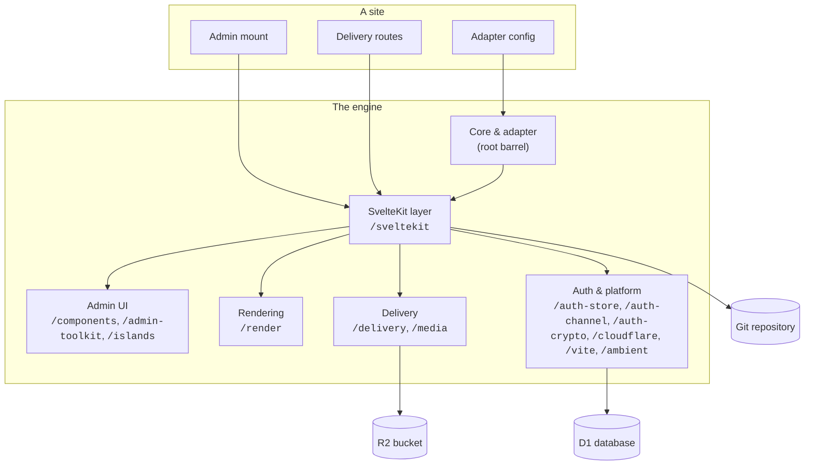
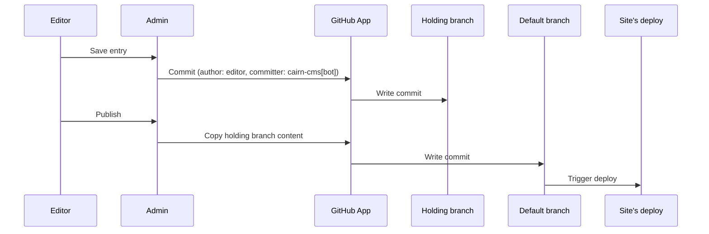

# Architecture

The engine's shape: what cairn owns, what a site's adapter owns, and the seams between them.

*The engine boxes group the package's export subpaths by function; the [reference
index](../reference/README.md) documents each subpath individually.*

## The adapter is the one contract

A site declares a single `CairnAdapter` object, typically at `src/lib/cairn.config.ts`: which
content concepts exist, the GitHub repository commits land on, the magic-link sender, the render
function, and the optional extension points (roles, an access map, a nav layout, media). The engine
never hard-codes a concept, a directory, or a field. Every route factory, every admin screen, and
every delivery helper reads its behavior from this one object. Left at the scaffold's defaults,
the adapter yields an owner/editor CMS. Adding concepts, roles, or screens is an edit to this
object, not a fork of the engine.

The root barrel and `/sveltekit` are the split the preceding diagram draws as core/adapter and
the SvelteKit layer. Nothing on the root barrel imports SvelteKit, and nothing on `/sveltekit` is a
`.svelte` file; a Svelte admin component lives on `/components`. That three-way split is
deliberate: the content model has to stay usable from a build script with no server request in
scope, and the route layer has to stay substitutable without dragging Svelte's client runtime
into it.

## The seams a site extends through

Each of these is a typed contract the engine consumes and a site supplies, not an internal detail a
site reaches into:

- **The adapter's `content` map**, one `ConceptConfig` per concept, each with its own `fieldset`.
  See [Content model](./content-model.md) and [Declare your own concept](./declare-your-own-concept.md).
- **`render`**, a function built with `createRenderer` and a site's own `ComponentRegistry`. The
  same function renders the admin's live preview and every public page, so authoring and delivery
  never see two different results for the same markdown. See [Configure
  rendering](./configure-rendering.md).
- **The access map and role vocabulary** (`defineAccess`, `defineRoles`), which gate both a
  route's server-side authorization and a nav entry's visibility from the same declaration. See
  [Restrict admin access](./restrict-admin-access.md).
- **`navLayout`**, one ordered tree arranging the whole admin sidebar, mixing the engine's own
  screens with a site's custom ones. See [Organize your admin nav](./organize-your-admin-nav.md).
- **The Backend**, the read-and-commit interface over the content repository. The packaged
  `githubApp` provider is the only shipped implementation; the interface exists so the commit path
  is a typed contract rather than a hard-coded GitHub call threaded through every route. See
  [Core](../reference/core.md).
- **`AssetConfig`**, a site's optional media declaration, resolved into the R2 bucket binding and
  upload limits a site's own routes and the admin's media library both read. See
  [Data tiers](./data-tiers.md).

## The write path

An editor's save never touches the default branch directly.

*The holding branch is per entry, named `cairn/<concept>/<id>`.*

A holding branch lets an editor iterate on a draft across multiple saves, and lets the admin show
what is pending without it being live. The commit author is the editor; the committer is
`cairn-cms[bot]`, so git history attributes each change to the editor who made it, and every
commit still traces to the App's own identity. [Security model](./security-model.md) covers the authentication
that gates who can reach this path at all; [Content model](./content-model.md) covers what a
commit actually contains.

## The read path

The engine reads content two ways. A request that needs one entry's full body
(a public page render, an edit-form load) reads that file directly through the Backend's content
API. A request that needs to know what exists across the whole corpus, an index page, a tag list, a
sitemap, a link-integrity check, reads the committed content manifest instead: a JSON projection of
every entry's identity, routing, and outbound edges, rebuilt at build time and patched in the same
commit as a save. The manifest exists specifically so the admin and the delivery layer never crawl
the whole repository through the GitHub API to answer "what links here" or "what's tagged this."
See [Data tiers](./data-tiers.md) for where the manifest sits relative to the two data stores the
engine also owns directly (D1 for auth, R2 for media bytes).

## What stays engine-internal

The directive-stamping and dispatch machinery inside the render pipeline, the exact shape of a
commit's tree operations against the GitHub API, and the guard's internal CSRF and session
resolution are not seams a site is meant to reach into. Each is covered by a stability-tiered
public surface instead ([Render](../reference/render.md), [SvelteKit](../reference/sveltekit.md),
[Auth crypto](../reference/auth-crypto.md)), so an upgrade can change the internals freely as long
as the contract holds. If a task seems to require importing something the reference doesn't
document, that task usually belongs in the site's own code. cairn manages content and the editor
and admin frame; a site's own actors, auth, data, and domain logic belong to the site and reach
the engine through a seam.
