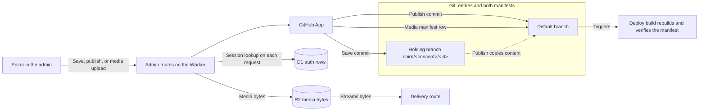

# Architecture

The engine manages a site's markdown content and its admin frame, while a site's features, actors, auth, data, and domain logic belong to the developer, who reaches the engine through a short list of seams that form a narrow, versioned public surface. The boundary between the two decides which code a site writes and which engine contracts it relies on across releases.

The boundary between the engine and a site has the following parts:

- The export subpaths a site imports
- The seams a site extends through
- The path an edit takes from a save to the deploy, and how the admin reads content back
- The stores that hold each kind of state
- The dependencies the engine never abstracts, and the contract the swappable content store keeps
- The promise each export carries across versions

Working with the seams takes knowledge of SvelteKit routing, load functions, and form actions, and of Cloudflare Worker bindings, because the engine builds on both platforms and abstracts neither. Separate pages cover the security properties of each piece in [Security model](security-model.md), declaring the adapter field by field in [Define an adapter and schema](define-an-adapter-and-schema.md), concepts and fieldsets in depth in [Content model](content-model.md), each export's signature in the [export reference](../reference/README.md), and the upgrade procedure in [Upgrade cairn](upgrade-cairn.md).

A cairn site declares one adapter, a single `CairnAdapter` object, and every route factory, admin screen, and delivery helper reads its behavior from that object. The engine hard-codes no concept, directory, or field.

## Entry points

A site touches the engine in three places, and each place reaches a different subpath. The following list names each place and what it imports.

- The adapter module imports `defineAdapter` from the root barrel, and `composeRuntime` folds that adapter into the runtime that `createCairnAdmin` from `/sveltekit` closes over.
- The admin mount renders `CairnAdmin` and `CairnAdminShell` from `/admin` over that factory's `load`, `shellLoad`, and `actions`.
- The public routes call `createPublicRoutes` and the feed, sitemap, and robots responders from `/delivery`.

Behind those calls, the `/sveltekit` layer reads and writes the content repository through the `Backend`, renders through the render pipeline, and reads and writes the media store and the auth store. The admin's Svelte components sit on `/admin` and receive the data that layer loads as props.

The directive stamping and dispatch inside the render pipeline, the commit tree shape sent to the GitHub API, and the guard's CSRF and session resolution are engine-internal. Each sits behind a stability-tiered subpath, `/render`, `/sveltekit`, or `/auth-crypto`, and none of them is a seam a site reaches into.

## Export map

Most of the export map falls into six functional groups, each a set of subpaths with one job. The following table names the subpaths in each group.

| Group | Subpaths |
|---|---|
| Core and adapter | The root barrel |
| SvelteKit layer | `/sveltekit` |
| UI | `/admin`, `/public`, `/admin-toolkit`, and `/islands` |
| Rendering | `/render` |
| Delivery | `/delivery` and `/media` |
| Auth and platform | `/auth-store`, `/auth-channel`, `/auth-crypto`, `/cloudflare`, `/vite`, and `/ambient` |

In the UI group, `/islands` is the separate client runtime that mounts a site's live components. The map also carries `/delivery/head`, `/delivery/data`, `/reproductions`, `/reproductions/manifest`, and `/log` outside the six groups, along with the style sheets `/admin-sources.css` and `/cairn-public.css`. The [reference index](../reference/README.md) documents every subpath.

The map follows three placement rules.

- Nothing on the root barrel imports SvelteKit.
- Nothing on `/sveltekit` is a `.svelte` file.
- Admin Svelte components live on `/admin`, built-in public components live on `/public`, and no `/components` subpath exists.

The root barrel carries no server route, no Svelte component, and no per-request framework binding, so a build script can import it outside any request, as the [`cairnManifest`](../reference/vite.md#cairnmanifest) plugin does inside the app's Vite graph. A `/sveltekit` export bundled with plain esbuild outside Vite, such as `createD1AuditSink` in a Cron Worker, needs no alias for `$app/environment`, because [`loadPreview`](../reference/sveltekit.md#loadpreview) on the same subpath imports that module dynamically at call time.

## Seams

A site adds a concept, a role, or an admin screen through a seam, and none of the three forks the engine. A seam is a documented point where a site supplies code or data the engine reads. The following table names each seam, what a site supplies through it, and the page that documents it.

| Seam | What the site supplies | Documented in |
|---|---|---|
| The `content` map | A `ConceptConfig` with a `fieldset` for each concept | [Content model](content-model.md) |
| `render` | A renderer built with `createRenderer` | [Configure rendering](configure-rendering.md) |
| Roles and the access map | A role vocabulary that maps each role name the site defines to one capability, `none`, `editor`, or `owner`, and an access map that only narrows what a capability already permits | [Restrict admin access](restrict-admin-access.md) |
| The `identity` option on `createAuthGuard` | A proven email from an external identity gate, in place of the built-in sign-in path, which the guard still looks up against the roster | [Replace magic links with Cloudflare Access](replace-magic-links-with-cloudflare-access.md) |
| Custom admin routes | A route file under `src/routes/admin/`, which SvelteKit resolves ahead of the `[...path]` catch-all and which renders inside the chrome of `CairnAdminShell` through the shared admin layout, with no registration | [Add a custom admin screen](add-a-custom-admin-screen.md) |
| `navLayout` | A site entry under `editor.navLayout` that lists a custom admin screen in the sidebar | [Arrange the admin sidebar](arrange-the-admin-sidebar.md) |
| The `media` member | An `AssetConfig` for the media store | [Configure media](configure-media.md) |
| `BackendProvider` | A content backend other than GitHub, where `createGithubApp` is the one provider the engine ships | [The core reference's types table](../reference/core.md#types) |

## Write path

An edit to any entry, whatever concept it belongs to, reaches the live site through a save onto a holding branch, a publish that copies the branch onto the default branch, and the deploy that the publish commit triggers. The path crosses three stores. Git holds the edit and the two manifests, committed JSON indexes in which the content manifest carries a metadata row for each entry and the media manifest describes each uploaded file. D1 holds the session the guard checks on each admin request, and R2 holds the media bytes.

```mermaid
flowchart LR
  accTitle: Diagram of the write path and the three data tiers, showing which admin action reaches git, D1, or R2
  accDescr: An editor's save, publish, or media upload reaches the admin routes on the Worker, whose guard looks up the session row in D1 on each request. The routes commit through the GitHub App, a save to the holding branch cairn/concept/id and a publish or a media manifest row to the default branch, a publish copying the holding branch's content. A media upload also stores its bytes in R2. The publish commit triggers the deploy, whose build rebuilds and verifies the content manifest, and the delivery route streams media bytes from R2.
  editor[Editor in the admin]
  worker[Admin routes on the Worker]
  app[GitHub App]
  subgraph git[Git: entries and both manifests]
    hold["Holding branch cairn/#lt;concept#gt;/#lt;id#gt;"]
    main[Default branch]
  end
  d1[("D1 auth rows")]
  r2[("R2 media bytes")]
  build["Deploy build rebuilds and verifies the manifest"]
  delivery[Delivery route]
  editor -->|Save, publish, or media upload| worker
  worker -->|Session lookup on each request| d1
  worker -->|Media bytes| r2
  worker --> app
  app -->|Save commit| hold
  app -->|Publish commit| main
  app -->|Media manifest row| main
  hold -.->|Publish copies content| main
  main -->|Triggers| build
  r2 -->|Streams bytes| delivery
```

*A save commits no manifest change, and a publish commit upserts the entry's manifest row together with the entry file. [Data tiers](#data-tiers) states what each store holds.*

### The holding branch

A save commits the edit to a per-entry branch named `cairn/<concept>/<id>` through the site's GitHub App installation token, with the signed-in editor as author. Each later save commits onto the same branch, so an editor iterates across saves while the entry stays off the live site. A save commits no manifest change. An entry is pending when its holding branch exists, and no other state marks it. The concept list finds pending entries by listing the branches under `cairn/<concept>/`.

### The publish commit

A publish copies the holding branch's content onto the default branch in one commit with the editor as author, and the entry's row in the content manifest lands in the same commit. For a save and a publish alike, the engine sets no committer, so GitHub attributes the commit to the App. Publish-all commits every pending entry the editor can reach, plus the content manifest, as one commit to the default branch, so one deploy fires. A delete or a rename carries its manifest change in the same default-branch commit as its file change, so the content manifest changes only in a default-branch commit that changes an entry. After a publish lands, the engine deletes the entry's holding branch only when the branch head still equals the SHA the publish captured, so a save that lands during the publish keeps the entry pending. A save or a publish can land on a head that another commit moved after the admin read it.

### Concurrent writes

An edit's save and publish commits take a head-merge retry against a head another commit has moved, and the admin's other commits take either that retry or a head guard that fails on the first stale head. The retry makes three further attempts against a moved head before it reports a conflict. The following list names the commits under each rule.

- The head-merge retry covers entry save, single publish, publish-all, entry delete and rename, and the media delete and metadata commits.
- The head guard covers the nav, tidy-settings, vocabulary, media upload manifest, and revert commits.

### Build verification

The publish commit triggers the site's existing deploy, and the build rebuilds the content manifest and verifies it against the markdown on disk. The [`cairnManifest`](../reference/vite.md#cairnmanifest) plugin runs both steps in `buildStart`, and a committed manifest that has drifted from the markdown fails the build.

## Read path

The admin reads one entry from a concurrent batch of reads through the `Backend` and reads the whole corpus from the committed content manifest. An entry's edit and history loads batch the file itself, its pending branch head, the committed manifest, and the media manifest. The concept list's published entries, inbound links, reference and media usage, and the link check on save all read the manifest on the default branch instead of crawling the entry files.

## Data tiers

The engine keeps state in three tiers, git, D1, and R2, and places each kind of state by what reads it. The following table lists what each tier holds.

| Tier | Holds |
|---|---|
| Git | Content entries, the content manifest, and the media manifest |
| D1 | The `editor`, `magic_token`, and `session` tables, plus the opt-in `audit_log` and `preview_tokens` tables |
| R2 | Uploaded media bytes, deduplicated by content hash |

Both manifests live under `src/content/.cairn/`. A content manifest row carries an entry's title, permalink, summary, links, and edges and never its body, and no D1 table stores a body either, so an entry body lives only in git. The media manifest keys each row by a 16-hex content-hash prefix, and an upload checks it as the dedup lookup before storing anything. The default branch's history records who published each change and when, since every publish commit carries its editor as author, whether or not the site wires the opt-in `audit_log` table.

The guard looks up the `session` row by its session-cookie id on each admin request, and sign-in looks up a `magic_token` row by its SHA-256 hash. Only a site that wires `createD1AuditSink` writes `audit_log`, one row per audited admin action. Only a site that mints preview links writes `preview_tokens`, one hashed token per link, each row naming the draft it shares. [Security model](security-model.md) covers the security properties of these rows. The [auth store reference](../reference/auth-store.md) documents the D1 editor-provisioning functions.

R2 holds the media bytes, which the delivery route streams directly, since neither a git repository nor a D1 row suits binary assets at megabyte scale. [Configure media](configure-media.md) covers the media store's settings.

A site places its extension data, such as a member roster or an event schedule, where it chooses, provided its cookie and table names avoid the reserved `cairn_` prefix.

## Hard dependencies

The engine depends on SvelteKit and Cloudflare and carries no framework- or host-agnostic layer. The engine declares `svelte` and `@sveltejs/kit` as peer dependencies, and the [supported toolchain](../reference/supported-toolchain.md) reference records their ranges. The environment contract is Cloudflare Worker bindings, such as the `AUTH_DB` D1 database and the Email Sending binding, so a production site built on cairn runs on Cloudflare Workers. No seam replaces Cloudflare as the host, and the one swappable dependency is the content store, through `BackendProvider`, of which `createGithubApp` is the only implementation the engine ships.

## Backend contract

A `BackendProvider` connects to a live `Backend` for a route that needs one, and the `Backend` interface fixes the semantics any provider keeps. A provider carries a `kind` tag and the default `branch` and connects through `connect(env)`, and the provider that `createGithubApp` returns mints and caches the installation token lazily. The following list states each semantic the interface fixes.

- A `commit` with `expectedHead` makes one attempt and throws `CommitConflictError` on a head mismatch.
- A `commit` without `expectedHead` keeps the head-merge retry.
- `readFile` returns null for a missing path.
- `listCommits` returns an empty array for a missing file instead of throwing.
- `createBranch` returns the SHA it branched at and throws `BranchExistsError` on a name collision.
- `deleteBranch` treats a missing branch as success.

The head-guarded commits, such as the nav, vocabulary, and revert commits, pass `expectedHead`, and the retried commits, a save and a publish among them, omit it. The `Backend` and `BackendProvider` rows of the core reference's [types table](../reference/core.md#types) carry the signatures, and its [error classes](../reference/core.md#error-classes) entry documents both errors.

## Stability tiers

Every export carries one of three stability tiers, and the tier states what the export promises across versions. Extension API and Scaffold API become frozen contracts at 1.0, and Unstable API is importable today with no promise across minor versions. The [reference index](../reference/README.md#stability-tiers) defines each tier, and each export's reference entry names its tier. Because the engine is still pre-1.0, the tiers are a target discipline, and an Extension-tier break can ship in a minor release. Until 1.0, the `check:surface` snapshot gate detects and discloses such a break instead of preventing it.

In `0.86.0`, the minor version that shipped `navLayout`, the nav fields on `AdminShellData` and the parameter and return types of `navFilter` changed shape, both inside the Extension API tier. A site that read those fields or declared a `navFilter` had code to change before it could take the upgrade. A later minor version, `0.94.0`, renamed the `navLayout` types as well. The [migration notes for `0.86.0`](migration-notes.md#0860) list the edits that release asks of a site.

Code that a site writes against the seams needs an edit only where a release names a break, and [Upgrade cairn](upgrade-cairn.md) applies each crossed release's named changes in order.

## Related resources

The following guides build a site on these seams.

- [Add cairn to a SvelteKit app](add-cairn-to-a-sveltekit-app.md)
- [Define an adapter and schema](define-an-adapter-and-schema.md)
- [Add a custom admin screen](add-a-custom-admin-screen.md)
- [Replace magic links with Cloudflare Access](replace-magic-links-with-cloudflare-access.md)
- [Upgrade cairn](upgrade-cairn.md)

The following concept pages take one part of the boundary in more depth.

- [Scaffolded site files](scaffolded-site-files.md)
- [Content model](content-model.md)
- [Security model](security-model.md)

The following external pages document the platforms the engine builds on.

- [SvelteKit routing](https://svelte.dev/docs/kit/routing)
- [SvelteKit load functions](https://svelte.dev/docs/kit/load)
- [SvelteKit form actions](https://svelte.dev/docs/kit/form-actions)
- [Cloudflare Workers bindings](https://developers.cloudflare.com/workers/runtime-apis/bindings/)
- [GitHub Apps overview](https://docs.github.com/en/apps/overview)
