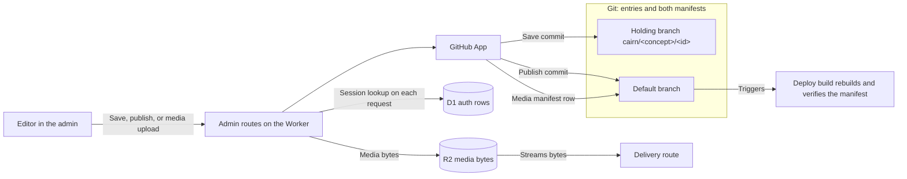

# Architecture

The engine is a CMS and an admin toolkit, and it stops at markdown content management and the admin frame. A site's features, actors, auth, data, and domain logic belong to the developer, who reaches the engine through its seams. Those seams form a narrow, versioned public surface. For a developer evaluating cairn or taking over a scaffolded site, the boundary marks which code the site writes and which engine contracts it relies on across releases.

The boundary runs from the subpaths a site imports to the promise each export carries across versions. An edit travels from a save on a holding branch, through a publish, to the deploy. The engine keeps the rest of its state in D1 and R2, beside the content in git. Because the engine builds on SvelteKit and Cloudflare, working with its seams assumes knowledge of SvelteKit routing, load functions, and form actions, and of Cloudflare Worker bindings. The following neighboring topics have separate pages.

- [Security model](security-model.md) covers the security properties of each piece.
- [Define an adapter and schema](define-an-adapter-and-schema.md) covers declaring the adapter field by field.
- [Content model](content-model.md) covers concepts and fieldsets in depth.
- [Configure media](configure-media.md) covers the media storage settings.
- [Upgrade cairn](upgrade-cairn.md) covers moving a site onto a newer version.
- The [export reference](../reference/README.md) covers each export's signature.

A cairn site declares one adapter, a single `CairnAdapter` object, and every route factory, admin screen, and delivery helper reads its behavior from that object. The engine hard-codes no concept, directory, or field.

## Entry points

A site touches the engine in three places. The following list names each place and the subpaths it imports.

- The adapter module imports `defineAdapter` from the root barrel, and `composeRuntime` folds that adapter into the runtime that `createCairnAdmin` from `/sveltekit` closes over.
- The admin mount renders `CairnAdmin` and `CairnAdminShell` from `/admin` over that factory's `load`, `shellLoad`, and `actions`.
- The public routes call `createPublicRoutes` and the feed, sitemap, and robots responders from `/delivery`.

Behind those calls, the `/sveltekit` layer reads and writes the content repository through the `Backend`, renders through the render pipeline, and reads and writes the media store and the auth store. The admin's Svelte components sit on `/admin` and receive the data that layer loads as props.

The directive stamping and dispatch inside the render pipeline, the commit tree shape sent to the GitHub API, and the guard's CSRF and session resolution are engine-internal. Each sits behind a stability-tiered subpath, `/render`, `/sveltekit`, or `/auth-crypto`, and none of them is a seam a site reaches into.

## Export map

Most of the engine's export map falls into six functional groups, and the following table names the subpaths in each group.

| Group | Subpaths |
|---|---|
| Core and adapter | The root barrel |
| SvelteKit layer | `/sveltekit` |
| UI | `/admin`, `/public`, `/admin-toolkit`, and `/islands` |
| Rendering | `/render` |
| Delivery | `/delivery` and `/media` |
| Auth and platform | `/auth-store`, `/auth-channel`, `/auth-crypto`, `/cloudflare`, `/vite`, and `/ambient` |

In the UI group, `/islands` is the separate client runtime that mounts a site's live components. The map also carries `/delivery/head`, `/delivery/data`, `/reproductions`, `/reproductions/manifest`, and `/log` outside the six groups, along with the style sheets `/admin-sources.css` and `/cairn-public.css`. The `/log`, `/reproductions`, and `/delivery/data` subpaths each have a reference page, and `check:reference` fails on any export left undocumented.

The map follows three placement rules.

- Nothing on the root barrel imports SvelteKit.
- Nothing on `/sveltekit` is a `.svelte` file.
- Admin Svelte components live on `/admin`, built-in public components live on `/public`, and no `/components` subpath exists.

The root barrel carries no server route, no Svelte component, and no per-request framework binding. A build script can therefore import it outside any request, as the [`cairnManifest`](../reference/vite.md#cairnmanifest) plugin does inside the app's Vite graph. A `/sveltekit` export bundled with plain esbuild outside Vite, such as [`createD1AuditSink`](../reference/sveltekit.md#created1auditsink) in a Cron Worker, needs no alias for SvelteKit's `$app/environment` module, because `loadPreview` on the same subpath imports that module dynamically at call time.

## Seams

A seam is a documented point where a site supplies its code or data to the engine. Adding a concept, a role, or a custom admin screen goes through a seam, and none of the three forks the engine. The following table names each seam, what a site supplies through it, and the page that uses it.

| Seam | What the site supplies | Used in |
|---|---|---|
| The `content` map | A `ConceptConfig` with a `fieldset` for each concept | [Content model](content-model.md) |
| `render` | A renderer built with `createRenderer` | [Configure rendering](configure-rendering.md) |
| The access map and roles | An access map and a role vocabulary | [Restrict admin access](restrict-admin-access.md) |
| The `identity` option on `createAuthGuard` | A proven email, in place of the built-in sign-in path | [Replace magic links with Cloudflare Access](replace-magic-links-with-cloudflare-access.md) |
| Custom admin routes | A route file under `src/routes/admin/`, which SvelteKit resolves ahead of the `[...path]` catch-all | [Add a custom admin screen](add-a-custom-admin-screen.md) |
| `navLayout` | A site entry in `editor.navLayout` that lists a custom admin screen in the sidebar | [Arrange the admin sidebar](arrange-the-admin-sidebar.md) |
| `BackendProvider` | A content backend other than GitHub | [`BackendProvider`](../reference/core.md#types) |

The following list adds one detail for each of four seams.

- In the role vocabulary, a role is a name the site defines, and a capability is one of `none`, `editor`, or `owner`.
- Under `identity`, [`createAuthGuard`](../reference/sveltekit.md#createauthguard) mints no token, creates no session, and sets no session cookie, but it still checks the proven email against the roster.
- A custom admin route inherits the nav, user, and theme chrome of [`CairnAdminShell`](../reference/admin.md#cairnadminshell) through the shared admin layout.
- Behind `BackendProvider`, [`createGithubApp`](../reference/core.md#creategithubapp) is the one provider the engine ships. The [Backend contract](#backend-contract) states the semantics any other provider must keep.

## Write path

An edit reaches the live site through a save onto a holding branch, a publish that copies the branch onto the default branch, and the deploy that the publish commit triggers.

```mermaid
flowchart LR
  accTitle: Diagram of the write path and the three data tiers, showing which admin action reaches git, D1, or R2
  accDescr: An editor's save, publish, or media upload reaches the admin routes on the Worker, whose guard looks up the session row in D1 on each request. The routes commit through the GitHub App, a save to the holding branch cairn/concept/id and a publish or a media manifest row to the default branch. A media upload also stores its bytes in R2. The publish commit triggers the deploy, whose build rebuilds and verifies the content manifest, and the delivery route streams media bytes from R2.
  editor[Editor in the admin]
  worker[Admin routes on the Worker]
  app[GitHub App]
  subgraph git[Git: entries and both manifests]
    hold["Holding branch cairn/#lt;concept#gt;/#lt;id#gt;"]
    main[Default branch]
  end
  d1[("D1 auth rows")]
  r2[("R2 media bytes")]
  build["Deploy build rebuilds and verifies the manifest"]
  delivery[Delivery route]
  editor -->|Save, publish, or media upload| worker
  worker -->|Session lookup on each request| d1
  worker -->|Media bytes| r2
  worker --> app
  app -->|Save commit| hold
  app -->|Publish commit| main
  app -->|Media manifest row| main
  main -->|Triggers| build
  r2 -->|Streams bytes| delivery
```

*A save commits no manifest change, and a publish commit upserts the entry's manifest row together with the entry file.*

### Save commits

A save commits the edit to a per-entry holding branch named `cairn/<concept>/<id>`, through the site's GitHub App installation token. The signed-in editor is the commit author, and the engine sets no committer. Each later save commits onto the same branch, so an editor iterates across saves while the entry stays off the live site. A save commits no manifest change.

### Branch existence

An entry is pending when its holding branch exists, and no other state marks it. The concept list finds pending entries by listing the branches under `cairn/<concept>/`.

### Publish commit

A publish copies the holding branch's content onto the default branch, with the editor as commit author. The publish commit carries the content manifest upsert together with the entry file. Publish-all commits every pending entry the editor can reach, plus the content manifest, as one commit to the default branch, so one deploy fires. A delete or a rename likewise carries its manifest change in the same default-branch commit as the file change. [Commit concurrency](#commit-concurrency) states when the engine deletes the holding branch after a publish.

### Build verification

The publish commit on the default branch triggers the site's existing deploy. At build time, the `cairnManifest` plugin rebuilds the content manifest in `buildStart` and verifies it against the markdown on disk. A committed manifest that has drifted from the markdown fails the build.

### Commit concurrency

Depending on the write, each commit the admin makes takes either the head-merge retry, which retries against a moved head, or the head guard, which fails on the first stale head. The head-merge retry makes three further attempts against a moved head before it reports a conflict. The following list names the writes on each side.

- The head-merge retry covers entry save, single publish, publish-all, entry delete and rename, and the media delete and metadata commits.
- The head guard covers the nav, tidy-settings, vocabulary, media upload manifest, and revert commits.

After a publish lands, the engine deletes the entry's holding branch only when the branch head still equals the SHA the publish captured, so a save that lands during the publish keeps the entry pending.

## Read path

The admin reads content in two ways, depending on whether a view needs one entry or facts about the whole corpus. An entry's edit and history loads assemble its view from one concurrent batch of reads through the `Backend`, covering the file, its pending branch head, the committed manifest, and the media manifest. Corpus-wide facts come from the committed content manifest on the default branch instead of a crawl of the entry files. The concept list's published entries, inbound links, reference and media usage, and the link check on save all read that manifest.

## Backend contract

Both paths reach the content store through a `Backend`, which a `BackendProvider` returns from `connect(env)` for a route that needs one. A provider also carries a `kind` tag and the default `branch`, and `createGithubApp` returns one whose `connect` mints and caches the installation token lazily. The `Backend` interface fixes the following semantics.

- A `commit` with `expectedHead` makes one attempt and throws `CommitConflictError` on a head mismatch, and a `commit` without `expectedHead` keeps the head-merge retry.
- `readFile` returns null for a missing path.
- `listCommits` returns an empty array for a missing file instead of throwing.
- `createBranch` returns the SHA it branched at and throws `BranchExistsError` on a name collision.
- `deleteBranch` treats a missing branch as success.

The core reference's [types table](../reference/core.md#types) carries the signatures.

## Data tiers

The engine keeps state in three data tiers, git, D1, and R2, and it places each kind of state by what reads it. The following table lists what each tier holds and how its records are keyed.

| Tier | Holds | Keyed by |
|---|---|---|
| Git | Content entries, the content manifest, and the media manifest | Concept and id, or a content-hash prefix for the media manifest |
| D1 | The `editor`, `magic_token`, and `session` rows, plus the opt-in `audit_log` and `preview_tokens` tables | Email for `editor`, SHA-256 token hash for `magic_token` and `preview_tokens`, session id for `session`, and row id for `audit_log` |
| R2 | Uploaded media bytes, deduplicated | Content hash |

Both manifests are committed JSON under `src/content/.cairn/`, and the media manifest describes the bytes that live in R2. A content manifest row carries an entry's title, permalink, summary, links, and edges. The media manifest keys each row by a 16-hex content-hash prefix, and it is the dedup lookup a media upload checks before storing anything. An entry body lives only in git, since no D1 table and no manifest row stores one.

D1 holds the auth rows and the opt-in operational tables. The guard looks up the `session` row by its session-cookie id on each admin request, and sign-in looks up a `magic_token` row by its SHA-256 hash. Only a site that wires `createD1AuditSink` writes to `audit_log`, one row per audited admin action. Only a site that mints preview links writes to `preview_tokens`, one hashed token per link, each row naming the draft it shares. The D1 auth store sits behind `/auth-store`, whose barrel re-exports the roster provisioning functions.

R2 holds the media bytes, since neither a git repository nor a D1 row suits binary assets at megabyte scale. [Configure media](configure-media.md) covers the media storage settings.

A site places its extension data, such as a member roster or an event schedule, where it chooses, and the one constraint is that its cookie and table names avoid the reserved `cairn_` prefix.

## Edit history

Every publish is a git commit on the default branch with the publishing editor as author. The default branch's history records who published each change and when, with no audit table involved. The save commits stay on the holding branch until a publish deletes it.

## Hard dependencies

The engine depends on SvelteKit and Cloudflare and carries no framework- or host-agnostic layer. `@sveltejs/kit` and `svelte` are required peer dependencies, and the [supported toolchain](../reference/supported-toolchain.md) page records their ranges.

The environment contract is Cloudflare Worker bindings, such as the `AUTH_DB` D1 database and the Email Sending binding, so a production site built on cairn runs on Cloudflare Workers. No seam replaces Cloudflare as the host, although a `BackendProvider` can replace GitHub as the content store.

## Stability tiers

A stability tier states what an export promises across versions, and the engine defines three of them. Extension API and Scaffold API are frozen contracts from 1.0, and while the engine is pre-1.0 an Extension-tier break can still ship in a minor release. The `check:surface` snapshot gate detects and discloses such a break without preventing it. Unstable API is importable today with no promise across minor versions. The [reference index](../reference/README.md#stability-tiers) defines each tier, and each export's reference entry names its tier.

In `0.86.0`, a minor version that shipped the `navLayout` seam, the engine changed two Extension API surfaces. The nav fields on `AdminShellData` changed shape, and so did the parameter and return types of `navFilter`. A site that read those fields or declared a `navFilter` had code to change before it could take the upgrade. The [migration notes for `0.86.0`](migration-notes.md#0860) list the edits that release asks of a site.

## Related resources

The following guides cover building a site on these seams.

- [Add cairn to a SvelteKit app](add-cairn-to-a-sveltekit-app.md)
- [Define an adapter and schema](define-an-adapter-and-schema.md)
- [Add a custom admin screen](add-a-custom-admin-screen.md)
- [Replace magic links with Cloudflare Access](replace-magic-links-with-cloudflare-access.md)
- [Upgrade cairn](upgrade-cairn.md)

The following concept pages take one part of the boundary in more depth.

- [Scaffolded site files](scaffolded-site-files.md)
- [Content model](content-model.md)
- [Security model](security-model.md)

The following external pages document the platforms the engine builds on.

- [SvelteKit routing](https://svelte.dev/docs/kit/routing)
- [SvelteKit form actions](https://svelte.dev/docs/kit/form-actions)
- [Cloudflare Workers bindings](https://developers.cloudflare.com/workers/runtime-apis/bindings/)
- [GitHub Apps overview](https://docs.github.com/en/apps/overview)
