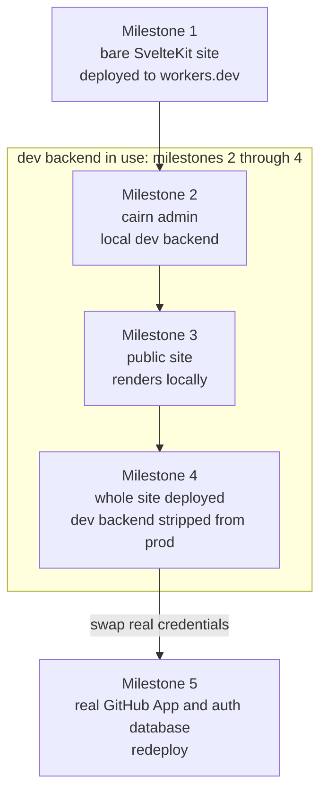

# Build a site by hand

`create-cairn-site` gets a default site running with zero code authored. This walkthrough is
the other route: every file, written by you, so you know exactly what wires to what before you
ever hand a decision to a scaffold. Read [What the scaffold wrote](./what-the-scaffold-wrote.md)
first if you want the tool's own output as a reference tree to compare against as you go.



*The admin runs against the in-memory dev backend on your own machine from Milestone 2 on. The
deployed site in Milestone 4 carries no dev backend in its bundle, so its `/admin` reaches the
real guard and goes no further than the sign-in page. Milestone 5 supplies the GitHub App and
the auth database, and is where a save first commits to a real repository.*

Work through the milestones in order. The map shows what each one leaves you with, and the
early milestones prove the deploy pipeline before there's anything content-shaped to deploy. By
the end you'll have a one-concept site, editable through `/admin`, publishing through a real
GitHub App, live on a `workers.dev` subdomain with no domain of your own required.

You'll need Node 24 or later, a GitHub account, and a Cloudflare account. Everything through
Milestone 4 runs on Cloudflare's free tier. Milestone 5 needs a domain zone, and a second
person's sign-in is what puts the site on Workers Paid. Keep `typescript` on 6 for now: `svelte-check`, which types your site and cairn's shipped declarations, can't run on TypeScript 7 until the 7.1 compiler API lands, and `npx sv create` already pins the right major. cairn's own code and the types it ships are 7-clean, so the move is a dependency bump when the tooling catches up.

## Milestone 1: a bare SvelteKit site, deployed

**Objective:** a plain SvelteKit app, building on Cloudflare's adapter, live at a `workers.dev`
URL. No cairn yet. This proves the deploy loop before you have any content worth deploying.

Scaffold a new project:

```bash
npx sv create --template minimal --types ts --no-add-ons my-cairn-site
cd my-cairn-site
npm install
```

Open `vite.config.ts`. A current `sv create` scaffold carries **no `svelte.config.js` file at
all**; if you've built a SvelteKit site before, that's the one thing to unlearn. SvelteKit's own
config, including the adapter, now lives inline in the `sveltekit()` plugin call inside
`vite.config.ts`:

```ts
import adapter from '@sveltejs/adapter-auto';
import { sveltekit } from '@sveltejs/kit/vite';
import { defineConfig } from 'vite';

export default defineConfig({
  plugins: [
    sveltekit({
      compilerOptions: {
        runes: ({ filename }) =>
          filename.split(/[/\\]/).includes('node_modules') ? undefined : true,
      },
      adapter: adapter(),
    }),
  ],
});
```

`adapter-auto` picks an adapter at build time by guessing your target from the environment; for a
site you're deploying yourself, name the target explicitly instead. Install Cloudflare's adapter
and swap the import:

```bash
npm install -D @sveltejs/adapter-cloudflare
```

```ts
import adapter from '@sveltejs/adapter-cloudflare';
import { sveltekit } from '@sveltejs/kit/vite';
import { defineConfig } from 'vite';

export default defineConfig({
  plugins: [
    sveltekit({
      compilerOptions: {
        runes: ({ filename }) =>
          filename.split(/[/\\]/).includes('node_modules') ? undefined : true,
      },
      adapter: adapter(),
    }),
  ],
});
```

Any other kit-level option that used to live in `svelte.config.js`, `alias`, `csrf`, and so on,
lands the same way: as a sibling key inside that same `sveltekit({ ... })` call. You'll add
`csrf` there in Milestone 2, once there's an admin surface that needs it.

Cloudflare's adapter needs a Worker config file, which `sv create` doesn't write either. Add
`wrangler.jsonc` at the project root:

```jsonc
{
  "name": "my-cairn-site",
  "compatibility_date": "2026-08-21",
  "main": ".svelte-kit/cloudflare/_worker.js",
  "assets": {
    "directory": ".svelte-kit/cloudflare",
    "binding": "ASSETS"
  }
}
```

Sign in to Cloudflare and deploy:

```bash
npx wrangler login
npm run build
npx wrangler deploy
```

`wrangler deploy` prints the live URL, `<name>.<your-subdomain>.workers.dev`. Open it. That's the
default SvelteKit welcome page, served from a real Cloudflare Worker, with no domain purchased
and no DNS touched.

**You know it worked when:** the printed `workers.dev` URL loads the page in a browser.

## Milestone 2: cairn, running against a local double

**Objective:** the cairn admin, running at `/admin` on your machine, with one content concept,
backed by an in-memory double that needs no GitHub App and no database yet.

Install the engine, its local-development companion, and `@cloudflare/workers-types`:

```bash
npm install @glw907/cairn-cms
npm install -D @glw907/cairn-cms-dev @cloudflare/workers-types
```

cairn's own shipped `.d.ts` files import `D1Database`, `R2Bucket`, and other Cloudflare types
directly from `@cloudflare/workers-types`, so it's a required `devDependency` even if you generate
your own binding types with `wrangler types`. cairn declares it as a `peerDependency`, so a plain
`npm install` without it refuses to resolve.

`@glw907/cairn-cms-dev` stands in for the GitHub commit pipeline and the magic-link sign-in loop
with in-memory fakes, so you can build and click through the whole admin before either one
exists for real. It ships behind a three-layer fence (a build-time flag that strips it from a
production bundle, a `devDependency` boundary, and a runtime tripwire the guard enforces) and
must never reach a deployed site; you'll leave the fence in place and never touch it again after
this milestone.

### Declare the ambient types

```ts
// src/app.d.ts
import '@glw907/cairn-cms/ambient';

declare global {
  namespace App {}
  const __CAIRN_DEV_BUILD__: boolean;
}

export {};
```

The `@glw907/cairn-cms/ambient` import augments `App.Locals` with the four fields the engine
reads and writes on every admin request. The `__CAIRN_DEV_BUILD__` constant is the build-time
half of the dev-backend gate you'll wire into `hooks.server.ts` next.

This declares `App.Locals`, not `App.Platform`. A custom admin route that reads
`event.platform.env` for a binding of its own, an audit sink's database, say, needs
`App.Platform` declared too, once you build one; [The canonical admin
mount](../reference/admin-routes.md#the-guard-and-the-ambient-type) shows the worked block when
you get there.

### Declare a concept

Content lives as markdown files with frontmatter, one directory per concept. Create the
directory and one sample entry:

```bash
mkdir -p src/content/posts
```

```md
<!-- src/content/posts/2026-08-14-hello.md -->
---
title: Hello, cairn
date: 2026-08-14
description: The first entry in a hand-built site.
---
This is the body. It's plain markdown.
```

Declare the concept, the render pipeline, and the adapter in `src/lib/cairn.config.ts`. The
`backend` and `email` values matter only once you deploy for real, in Milestone 5; for now the
dev backend intercepts every request before either one connects, so placeholders are fine:

```ts
// src/lib/cairn.config.ts
import {
  defineAdapter,
  defineConcept,
  defineRegistry,
  fieldset,
  fields,
  githubApp,
  createRenderer,
  composeRuntime,
  parseSiteConfig,
} from '@glw907/cairn-cms';
import siteYaml from './site.config.yaml?raw';

export const siteConfig = parseSiteConfig(siteYaml);

const registry = defineRegistry({ components: [] });
const { renderMarkdown } = createRenderer(registry);

export const cairn = defineAdapter({
  content: {
    posts: defineConcept({
      dir: 'src/content/posts',
      label: 'Posts',
      singular: 'post',
      routing: 'feed',
      fields: fieldset({
        title: fields.text({ label: 'Title', required: true }),
        date: fields.date({ label: 'Date' }),
        description: fields.textarea({ label: 'Description' }),
      }),
    }),
  },
  backend: githubApp({
    owner: 'you',
    repo: 'my-cairn-site',
    branch: 'main',
    appId: 'placeholder',
    installationId: 'placeholder',
  }),
  email: { from: 'cms@example.com' },
  rendering: {
    render: ({ body, resolve, resolveMedia, resolveFragment }) =>
    renderMarkdown(body, { resolve, resolveMedia, resolveFragment }),
    components: registry,
  },
});

export const runtime = composeRuntime({ adapter: cairn, siteConfig });
```

```yaml
# src/lib/site.config.yaml
siteName: My Site
description: A hand-built cairn site.
```

`composeRuntime` folds the adapter and the parsed site config into the shape the admin and
delivery layers read; see [Define an adapter and schema](./define-an-adapter-and-schema.md) for
what each field on `defineConcept` and `fields.*` means.

### Mount the admin

Add `createCairnAdmin` beside the runtime, then the two-file catch-all route pair plus the
shared shell layout. This is the whole admin mount:

```ts
// src/lib/cairn.server.ts
import { createCairnAdmin } from '@glw907/cairn-cms/sveltekit';
import { runtime } from './cairn.config.js';

export const admin = createCairnAdmin(runtime, {
  auth: { bootstrapOwner: { email: 'you@example.com', displayName: 'You' } },
});
```

Set `bootstrapOwner`'s email to your own now. It does nothing yet, the dev backend signs you in
without touching the auth store at all, but it's the mechanism Milestone 5 uses to create your
first real owner row with no manual database insert, so it's one less thing to remember later.

```ts
// src/routes/admin/[...path]/+page.server.ts
import { admin } from '$lib/cairn.server.js';

export const prerender = false;
export const load = admin.load;
export const actions = admin.actions;
```

```svelte
<!-- src/routes/admin/[...path]/+page.svelte -->
<script lang="ts">
  import { CairnAdmin } from '@glw907/cairn-cms/components';
  import type { AdminData } from '@glw907/cairn-cms/sveltekit';
  import { cairn } from '$lib/cairn.config.js';
  import type { ActionData } from './$types';

  let { data, form }: { data: AdminData; form: ActionData } = $props();
</script>

<CairnAdmin {data} {form} render={cairn.rendering.render} registry={cairn.rendering.components} />
```

```ts
// src/routes/admin/+layout.server.ts
import { admin } from '$lib/cairn.server.js';

export const load = admin.shellLoad;
```

```svelte
<!-- src/routes/admin/+layout.svelte -->
<script lang="ts">
  import { CairnAdminShell } from '@glw907/cairn-cms/components';
  import type { AdminShellData } from '@glw907/cairn-cms/sveltekit';
  import type { Snippet } from 'svelte';

  let { data, children }: { data: { shell: AdminShellData }; children: Snippet } = $props();
</script>

<CairnAdminShell data={data.shell}>{@render children()}</CairnAdminShell>
```

Keep `prerender = false` on the catch-all. The admin is session-gated; a site that prerenders by
default would otherwise try to bake a build-time snapshot of it.

### Wire the dev backend and the CSRF handoff

`hooks.server.ts` picks the dev backend or the real guard, gated on the build-time flag plus an
explicit runtime opt-in, so a production build strips the branch entirely:

<!-- snippet-check-skip: reads __CAIRN_DEV_BUILD__, the ambient global declared in the app.d.ts block above -->
```ts
// src/hooks.server.ts
import { createAuthGuard } from '@glw907/cairn-cms/sveltekit';
import type { Handle } from '@sveltejs/kit';

let handle: Handle;
if (__CAIRN_DEV_BUILD__ && process.env.CAIRN_DEV_BACKEND === '1') {
  const { devBackendHandle } = await import('@glw907/cairn-cms-dev');
  handle = devBackendHandle();
} else {
  handle = createAuthGuard();
}
export { handle };
```

Declare the build-time flag in `vite.config.ts`, and add the `csrf` option cairn's guard needs:
double-submit CSRF for the admin is the guard's job, so kit's own origin check would fight it.
Both are new keys inside the same `sveltekit({ ... })` call from Milestone 1. `checkOrigin` itself
is deprecated as of SvelteKit 2.61 in favor of `csrf.trustedOrigins`, but stays supported across
cairn's tested range. See [Supported toolchain](../reference/supported-toolchain.md#the-checkorigin-deprecation)
for why cairn still relies on it.

Name `__CAIRN_DEV_BUILD__` directly at every call site that reads it, as `hooks.server.ts` does
above, never through a shared exported constant. Vite substitutes the flag as a literal into the
text of the module that names it, so an inlined check folds away with its dead branch; a constant
exported from one module and imported into another survives, because the fold happens inside the
constant's own chunk and never propagates across the module boundary. Route the check through a
shared constant and the `@glw907/cairn-cms-dev` import ships in your deployed Worker.

Add `ssr: { noExternal: ['@glw907/cairn-cms'] }` to the same config. The package ships its
`.svelte` files straight from source under its `svelte` export condition, so Vite has to run them
through your Svelte plugin rather than treat the package as pre-built and skip over it; without
this line, the admin's components fail to build:

```ts
import adapter from '@sveltejs/adapter-cloudflare';
import { sveltekit } from '@sveltejs/kit/vite';
import { defineConfig } from 'vite';

export default defineConfig(({ command }) => ({
  define: { __CAIRN_DEV_BUILD__: JSON.stringify(command === 'serve') },
  plugins: [
    sveltekit({
      compilerOptions: {
        runes: ({ filename }) =>
          filename.split(/[/\\]/).includes('node_modules') ? undefined : true,
      },
      adapter: adapter(),
      csrf: { checkOrigin: false },
    }),
  ],
  ssr: { noExternal: ['@glw907/cairn-cms'] },
}));
```

### Run it

```bash
CAIRN_DEV_BACKEND=1 npm run dev
```

On Windows, set the variable with your shell's own syntax (`set CAIRN_DEV_BACKEND=1 &&` in
`cmd.exe`, `$env:CAIRN_DEV_BACKEND=1;` in PowerShell) or add an npm script that does it for you.

Open the printed URL's `/admin`. You land signed in as the owner, no email loop, and the Posts
list shows the one sample entry. Open it, change the description, save, and publish; the dev
backend holds it in memory, so nothing leaves your machine yet.

**You know it worked when:** `/admin` loads signed in, the Posts list shows your sample entry,
and a save-then-publish round trip succeeds.

<details>
<summary>Why does an adapter with placeholder GitHub credentials even typecheck?</summary>

`githubApp(...)` builds the value the adapter's `backend` field takes; it validates shape, not
whether the values name a real App. The dev backend replaces the connection at request time
(`event.locals.cairnBackend` wins over the real provider), so nothing in this milestone ever
dials out to GitHub. The values start mattering the moment you remove the dev backend, which is
exactly what Milestone 5 walks through.
</details>

## Milestone 3: the public site

**Objective:** a real page rendering your post, plus the machine-readable surfaces (feed,
sitemap, robots) a site is expected to carry.

Build the typed content index from the raw markdown files, and the cross-concept resolver every
public route reads:

```ts
// src/lib/content.ts
import { createSiteIndexes } from '@glw907/cairn-cms/delivery';
import { cairn, siteConfig } from './cairn.config.js';

const postsRaw = import.meta.glob('/src/content/posts/*.md', {
  query: '?raw',
  import: 'default',
  eager: true,
}) as Record<string, string>;

export const indexes = createSiteIndexes(cairn, siteConfig, { posts: postsRaw });
export const site = indexes.site;
export const ORIGIN = 'http://localhost:5173';
```

Add the [`cairnManifest`](../reference/vite.md) plugin to `vite.config.ts`, alongside the keys
from Milestone 2. It evaluates your content corpus at build time and fails the build if the
committed manifest has drifted from the markdown files on disk, the same check `cairn-doctor`
reads when it reports on your manifest:

<!-- snippet-check-skip: elides the sveltekit() plugin and other vite.config.ts keys from Milestone 2 (defineConfig and sveltekit are already imported there) to focus on adding the manifest plugin -->
```ts
import { cairnManifest } from '@glw907/cairn-cms/vite';

export default defineConfig(({ command }) => ({
  // ...the sveltekit() plugin and other keys from Milestone 2
  plugins: [
    sveltekit({
      /* ... */
    }),
    cairnManifest({
      configModule: '/src/lib/cairn.config.ts',
      content: { posts: '/src/content/posts/*.md' },
      manifestPath: '/src/content/.cairn/index.json',
    }),
  ],
  ssr: { noExternal: ['@glw907/cairn-cms'] },
}));
```

Regenerate the manifest after any hand-edit to content outside the admin, with the
[`cairn-manifest`](../reference/cli-cairn-manifest.md) command, which reads the same options off
the plugin:

```bash
npx cairn-manifest
```

Wire the catch-all public route:

```ts
// src/routes/(site)/[...path]/+page.server.ts
import type { PageServerLoad, EntryGenerator } from './$types';
import { createPublicRoutes } from '@glw907/cairn-cms/delivery';
import { site, ORIGIN } from '$lib/content.js';
import { cairn, siteConfig } from '$lib/cairn.config.js';

export const prerender = true;

const routes = createPublicRoutes({
  site,
  render: cairn.rendering.render,
  origin: ORIGIN,
  siteName: siteConfig.siteName,
  description: siteConfig.description,
});

export const entries: EntryGenerator = () => routes.entries();

export const load: PageServerLoad = ({ url }) => routes.entryLoad({ url });
```

```svelte
<!-- src/routes/(site)/[...path]/+page.svelte -->
<script lang="ts">
  import type { PageData } from './$types';
  import { CairnHead } from '@glw907/cairn-cms/delivery/head';

  let { data }: { data: PageData } = $props();
</script>

<CairnHead seo={data.seo} />

<article>
  <h1>{data.entry.title}</h1>
  {@html data.html}
</article>
```

Restart the dev server, and visit `/posts/hello`. Every concept defaults to the permalink
pattern `/<id>/:slug`, except `pages`, which defaults to `/:slug`, and the default `datePrefix`
of `day` strips the entry filename's `2026-08-14-` stem from the slug. `routing: 'feed'` marks
the entry dated and feed-eligible. It doesn't shape the URL. Run `svelte-kit sync` or reload if
the route doesn't resolve on the first try. You should see your rendered entry.

This is the minimum public surface. A real site also wants the raw-markdown twin, the feed, the
sitemap, and `robots.txt`; [Wire the delivery surface](./wire-the-delivery-surface.md) covers all
four, plus the one route-matching detail (a suffix-matched `.md` route coexisting with the plain
catch-all) that isn't obvious from the reference alone.

**You know it worked when:** the post you wrote in Milestone 2 renders as a real page.

## Milestone 4: deploy the whole thing, still against the dev backend

**Objective:** build and deploy what you have so far, proving the production build works before
you swap in real credentials.

```bash
npm run build
npx wrangler deploy
```

Visit the deployed `workers.dev` URL. The public post renders. As the map shows, `/admin` on
the deployed site still doesn't work here: the production build carries no dev backend, so
`createAuthGuard()` runs with no GitHub App or database behind it, exactly as expected.
Milestone 5 gives it both.

**You know it worked when:** the deployed URL serves your post, and `/admin` on that same URL
loads the sign-in page (not a crash, and not signed in).

## Milestone 5: real credentials, real publishing

**Objective:** replace the dev backend with a real GitHub App and a real auth database, so a
save actually commits to a repository and a sign-in actually sends an email.

Sending that email needs a domain zone connected to Cloudflare, since Email Sending onboards on a
zone, and the `workers.dev` subdomain this walkthrough has used through Milestone 4 has none.
[Add cairn to a SvelteKit app](./add-cairn-to-a-sveltekit-app.md) covers onboarding a zone once
you own one. The moment a second person needs their own sign-in rather than just you, a real
email reaching them needs Cloudflare's Workers Paid plan. See
[what a second editor needs](../admin/before-you-start.md#what-a-second-editor-needs) for what it
costs and when the bill starts.

This milestone is almost entirely account setup rather than code, and it's exactly the setup
Add cairn to a SvelteKit app already walks through in full:
creating the GitHub App and installing it on your content repo, provisioning the `AUTH_DB` D1
database and applying its migration, and wiring the `EMAIL`, `AUTH_DB`, and
`GITHUB_APP_PRIVATE_KEY_B64` bindings into `wrangler.jsonc` and your Worker's secrets. Follow it
now, then come back here.

With those in hand, three files change and a fourth stops mattering:

**1. `cairn.config.ts`'s `backend` and `email` get their real values**, replacing the
placeholders from Milestone 2:

<!-- snippet-check-skip: elides the defineAdapter object opened in Milestone 2's block above to show only the backend and email members that change -->
```ts
backend: githubApp({
  owner: 'your-github-username',
  repo: 'my-cairn-site',
  branch: 'main',
  appId: '123456',
  installationId: '78901234',
}),
email: { from: 'cms@your-domain.example' },
```

**2. `wrangler.jsonc` gains the bindings**, on top of what Milestone 1 wrote:

```jsonc
{
  "name": "my-cairn-site",
  "compatibility_date": "2026-08-21",
  "main": ".svelte-kit/cloudflare/_worker.js",
  "observability": { "enabled": true },
  "assets": {
    "directory": ".svelte-kit/cloudflare",
    "binding": "ASSETS"
  },
  "send_email": [{ "name": "EMAIL" }],
  "d1_databases": [
    {
      "binding": "AUTH_DB",
      "database_name": "my-cairn-site-auth",
      "database_id": "<the id wrangler d1 create printed>",
      "migrations_dir": "migrations"
    }
  ],
  "vars": {
    "PUBLIC_ORIGIN": "https://my-cairn-site.<your-subdomain>.workers.dev"
  }
}
```

**3. `src/lib/content.ts`'s `ORIGIN` constant stops pointing at localhost.** Milestone 3 set it to
`'http://localhost:5173'`, and `export const prerender = true` bakes it into every canonical URL,
the feed, and the sitemap at build time; update it to match the deployed origin below before you
rebuild:

```ts
export const ORIGIN = 'https://my-cairn-site.<your-subdomain>.workers.dev';
```

**4. `hooks.server.ts` stops mattering**, without needing an edit. On a production build,
`__CAIRN_DEV_BUILD__` folds to `false`, so the `import('@glw907/cairn-cms-dev')` branch never
runs and the bundle never carries it; `createAuthGuard()` is the only path a deployed request can
reach.

Rebuild and redeploy:

```bash
npm run build
npx wrangler deploy
```

Visit `/admin/login` and sign in with the email you set as `bootstrapOwner` back in Milestone 2.
That first request creates your owner row automatically (`editor.bootstrapped` in the logs), no
manual database insert needed. Click the link in the email, and you're in, for real: a save now
opens a branch and commits to your GitHub repo. [Architecture](./architecture.md#the-write-path)
walks through that write path in full, from holding branch to publish to deploy.

Before you trust this deploy, run the doctor:

```bash
npx cairn-doctor --from cms@your-domain.example --repo your-github-username/my-cairn-site
```

It checks the bindings, the auth store, the GitHub App, and more, and names what's still missing
for most of what it covers. [Is it working?](../admin/is-it-working.md) explains every condition
it can report.

One gap to know about: the `config.csrf-disable-missing` check reads `svelte.config.js` looking
for the `csrf`/`checkOrigin` pair, and this scaffold carries no such file, since that wiring lives
in `vite.config.ts` instead, from Milestone 2 earlier. On this tree the check reports a skip, not
a pass, and a skip reads no differently from clean in the doctor's summary line. Confirm the
double-submit CSRF handoff yourself: the `csrf: { checkOrigin: false }` key in your
`vite.config.ts`, and `createAuthGuard()` wired into `hooks.server.ts`.

**You know it worked when:** signing in at `/admin/login` on the deployed site sends you a real
email, and a save-then-publish round trip lands a real commit on your GitHub repo.

## Where to go from here

You now have every file a hand-built cairn site needs, and you've seen what each one does. From
here:

- [Declare your own concept](./declare-your-own-concept.md) adds a second content type and links
  it to the first with a reference field.
- [Configure rendering](./configure-rendering.md) registers your first custom markdown
  component, the `render` pipeline you stubbed with an empty registry in Milestone 2.
- [Add a custom admin screen](./add-a-custom-admin-screen.md) builds a route under `/admin` that
  isn't one of the engine's own views.
- [Own your domain](../admin/own-your-domain.md) moves the site off `workers.dev` onto a domain
  you own, whenever you're ready for one.
