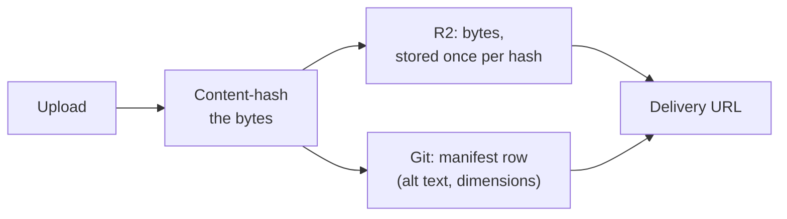

# Data tiers

Where cairn stores state, and why each kind of data lives where it does. Three tiers, each chosen
for what it's good at, none of them interchangeable with another.

| Tier | What it holds | How it's keyed | Selection rule |
| --- | --- | --- | --- |
| Git | Content entries; the content manifest; the media manifest | Entries and the content manifest by concept and id; the media manifest by a content-hash prefix | Anything an editor authored, or would expect to find in the repository's own history |
| D1 | `editor`, `magic_token`, `session` (baseline); `audit_log` and `preview_tokens` (opt-in) | Editor by email; tokens and sessions by their SHA-256 hash; audit and preview rows by their own ids | Anything a route must answer in milliseconds, keyed by a session or a token |
| R2 | Uploaded media bytes | By their own content hash, deduplicated | Anything whose byte size matters and that a URL should serve directly |

## Git: content, the source of truth

Every entry is a markdown file with frontmatter, committed to the site's own repository. Git is the
source of truth for content by design: it's already the deploy trigger, it's already versioned, and
an editor's history is already an audit trail with no extra infrastructure. cairn never stores an
entry's body anywhere else; a read either fetches the file directly or reads a projection of it,
never a second copy that could drift from what's actually committed.

The content manifest, one JSON row per entry, carries identity, routing facts, outbound `cairn:`
links, reference-field edges, tags, and included fragments. A build regenerates and verifies it; a
save patches its one changed entry in the same commit as the content change. It exists so the admin
and the delivery layer can answer "what links here" or "what's tagged this" without an N+1 crawl of
the repository through the GitHub API. See [Content model](./content-model.md). The media manifest,
the equivalent small index for stored assets, is covered below.

## D1: auth state and small operational records

Everything that has to answer a lookup in milliseconds on every admin request, and nothing that
belongs in an editor-readable git history, lives in D1. The baseline auth store (`0000_auth.sql`)
holds `editor`, `magic_token`, and `session`, always present once a site wires `AUTH_DB`. A token and
a session id are both looked up by their SHA-256 hash, never the raw value. `role` used to carry a
database `CHECK` constraint limiting it to `owner`/`editor`; `0001_roles.sql` rebuilds the table to
validate against a site's declared role vocabulary at the application layer instead, so a site can
extend the role set without a further schema migration. See [Security model](./security-model.md).

Two further tables are opt-in, each arriving with its own migration only when a site wires the
feature that needs it. `audit_log` (`0002_audit.sql`) is written only by a site that wires
`createD1AuditSink`; it holds one row per audited admin action, timestamped at
millisecond-resolution ISO 8601 rather than the coarser, locally parsed format an earlier schema
this one was adapted from used, since this column exists to be read by people. `preview_tokens`
(`0003_preview.sql`) is written only by a site that mints preview links; it holds a hashed,
single-use-per-link token naming the draft it shares, swept on expiry the same no-cron way
`magic_token` is. See [Share a draft preview](./share-a-draft-preview.md).

D1's role is deliberately narrow. It never holds content, and it never holds anything an editor
would expect to find by reading the repository; if a fact belongs in git's audit trail, it goes in
a commit, not a database row.

## R2: media bytes, deduplicated by content hash

A site that declares a `media` block on its adapter gets an R2 bucket for uploaded media, bound
by name and resolved at request time from that declared binding, never a hard-coded one. Each
manifest row carries what the bytes themselves can't: a display name, alt text, the original
filename, and known pixel dimensions. Delivery serves the stored MIME type verbatim rather than
guessing from a URL extension, and optionally reaches Cloudflare's own Image Transformations for
the variant presets a site's `variants` field on that same `media` block declares, when the zone
has transformations on; without that, the resolver serves the bare full-size original regardless
of what preset was asked for.

*Bytes are addressed by their own content hash, so the same image uploaded twice is stored once.
The media manifest, keyed by that same 16-hex hash prefix, is the dedup lookup an ingest checks
before writing anything, unlike the content manifest, which keys by concept and id.*

R2 exists specifically because git is the wrong place for binary asset bytes at any real scale, and
D1 is the wrong place for anything measured in megabytes. Both manifests are committed JSON under
`src/content/.cairn/`. Only the bytes they describe live in a different tier.

## Choosing the right tier for something new

The question that decides a new fact's home is what has to read it, and how fast. Something a
route needs to answer in milliseconds, keyed by a session or a token, belongs in D1. Something
whose byte size matters and that a URL should serve directly belongs in R2. Everything else, and
especially anything an editor authored or would expect to find in the repository's own history,
belongs in git, either as content or as one of the two committed manifests. A site extending cairn
with its own data (a member roster, an event schedule) makes this same choice for its own tables
and buckets; nothing about the engine's own three tiers constrains where a site's own extension
data lives, beyond the reserved `cairn_` cookie and table-naming conventions [Security
model](./security-model.md) and [Auth channel security model](./auth-channel-security-model.md)
each note in their own scope.
