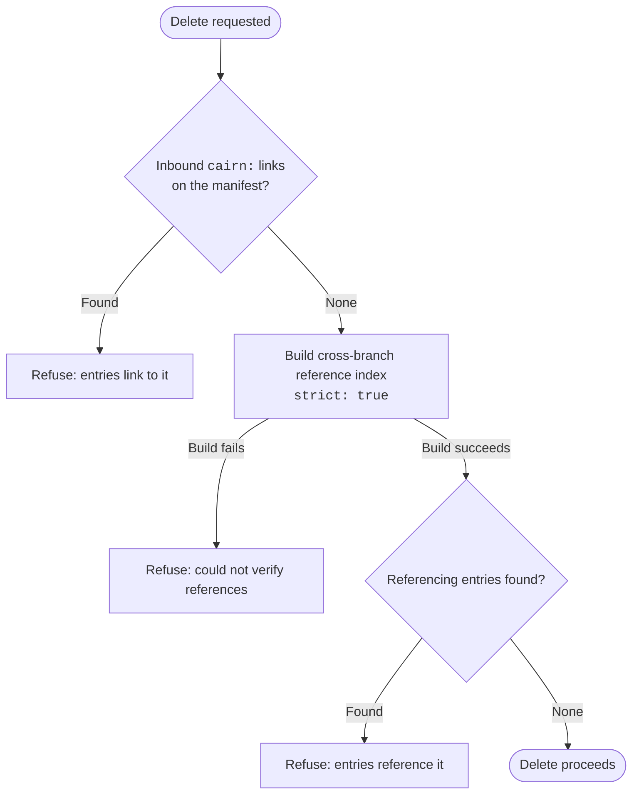

# Link content with references

**Contract:** declare a typed edge from one entry to another, and understand what cairn does
with it: resolution on the public side, a build-time integrity check, and a delete guard that
refuses to strand it.

**Precondition:** at least two concepts declared; [Declare your own concept](./declare-your-own-concept.md)
covers adding the second one and introduces the `reference` field this page goes deeper on.

A `reference` field stores another entry's permanent id in frontmatter, typed to one concept:

<!-- snippet-check-skip: elides the concept's other required fields (dir, label, singular, shown in full in core.md's worked example) to focus on the reference field -->
```ts
import { defineConcept, defineFieldset, fields } from '@glw907/cairn-cms';

const posts = defineConcept({
  // ...
  fields: defineFieldset({
    // ...
    author: fields.reference({ label: 'Author', concept: 'authors', required: true }),
  }),
});
```

An entry can hold more than one edge with `array(reference)`, rendered in the editor as a
removable chip list instead of a single picker:

```ts
import { fields } from '@glw907/cairn-cms';

const contributors = fields.array(fields.reference({ concept: 'authors', label: 'Contributor' }), { label: 'Contributors' });
```

## What a reference actually is

The stored value is the target's permanent id, nothing else: `author: a1b2c3d4`, not a title or
a path. The engine reads every `reference` and `array(reference)` field off an entry's
frontmatter against its concept's fields, recording each as a
[`ReferenceEdge`](../reference/core.md#types) (`{ field, concept, id }`), with `concept` taken
from the field's own declaration rather than the stored value, so a hand-edited file can't
misdirect an edge to a concept it was never typed for. The manifest records these edges per
entry, alongside the outbound `cairn:` link edges the same entry carries.

Renaming a target entry doesn't break the edge. The reference rewriter is byte-preserving: it
splices the changed id into the frontmatter by source offset rather than reformatting the file
through a YAML round trip, so a rename updates every referencing entry's stored id and touches no
other byte of those files. Comments, key order, and line endings survive unchanged.

## Resolving a reference on the public side

The typed id is only the graph edge; a public route resolves it to the target's actual title and
permalink at request time:

```ts
import { resolveReferences, type ResolvedReference, type SiteResolver } from '@glw907/cairn-cms/delivery';
import type { ConceptDescriptor } from '@glw907/cairn-cms';

declare const site: SiteResolver;
declare const postsDescriptor: ConceptDescriptor;
declare const entry: { frontmatter: Record<string, unknown> };

const refs = resolveReferences(site, postsDescriptor, entry.frontmatter);
const author = refs.author as ResolvedReference | undefined;
```

A `reference` field resolves to one `ResolvedReference`; an `array(reference)` field resolves to
an array of them, in edge order.
[`resolveReferences`](../reference/delivery-data.md#resolvereferences) drops an id with no live
target rather than throwing, since a build already guarantees every committed reference resolves
(the next section); an unresolved id at request time means a mid-flight or draft target, not a
broken build. Render the resolved value as a link to the target's page:

```svelte
{#if author}
  <a href={author.permalink}>{author.title}</a>
{/if}
```

## The integrity guarantee

A dangling reference, an id naming an entry that doesn't exist, fails the build.
[`verifyReferences`](../reference/core.md#manifest-serialize-and-verify) walks the manifest and
throws, naming the source entry, the field, and the missing target, the moment a build runs it.
Unlike a `cairn:` link, a reference has no prerender-time resolver fallback, so this build gate is
its only integrity check.

## The delete guard

An owner or editor can't delete an entry another entry still references. The delete action checks
two things against the target before it runs: inbound `cairn:` body links from the published
manifest, and inbound reference edges from a cross-branch index built over the manifest plus every
open `cairn/*` edit branch, each reported with the referencing field names. This is the same shape
a fragment's delete guard uses against `::include` (see
[Reuse content across entries](./reuse-content-across-entries.md)): the engine won't let a save
silently orphan another entry's edge.



*The index build itself fails closed: a read error refuses the delete rather than counting as an
absent reference.*

## What blocks and what only warns

Delete and rename both read that same cross-branch reference index, built with `strict: true`. An
unpublished draft's edge still counts: deleting or renaming its target is refused even though
nothing about the edge is live yet. Renaming also refuses outright, naming the blocking entries,
when a *different* open branch than the entry's own holds an inbound edge, so a rename can't
silently break a save someone else has in progress.

A save itself is more permissive. Saving an entry whose `reference` field names a missing or
still-draft target only warns, since the target may simply not be published yet and the
build-time check above is the real backstop. A body `cairn:` link to a missing target is stricter
and refuses the save outright, since a body link degrades to visibly broken text for a reader in a
way a resolved reference field never does.

**You know it worked when:** the editor renders your reference field as a picker scoped to the
right concept, a build against a dangling id fails loudly naming the source and field, and
deleting a referenced entry is refused with the referencing entries named.
