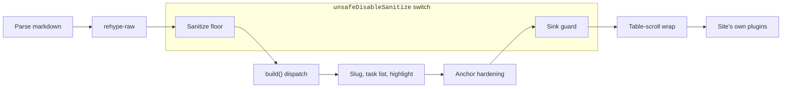

# Render safety

What `createRenderer`'s pipeline sanitizes by default, why, and the one switch that turns it off.

## The threat this defends against

cairn's content is authored by editors through a web form, not by the site's own developers editing
their own repository. That puts cairn in a different camp than a trusted-content static-site
generator, where the person writing markdown is assumed to be the developer. The realistic threat
is a compromised editor account, or an editor pasting something from the web that carries a hidden
script or an `onerror` attribute, not an anonymous public attacker; editors are a small, owner-
curated allowlist committing through the GitHub App with a full git history. That doesn't change
the failure mode. Any editor, or anyone who takes over an editor's session, can otherwise run script
in every visitor's browser, since the render output goes straight to the public site.

## The pipeline order

`createRenderer` composes remark and rehype stages into one fixed order. This diagram carries
that order; the sections below keep the why behind each stage and its exact allowlist details.

*The render pipeline runs nine stages in this fixed order: parsing, raw-HTML admission, the
sanitize floor, component `build()` dispatch, heading slugs with task-list and syntax
highlighting, anchor hardening, the sink guard, the table-scroll wrap, and finally a site's own
plugins. The `unsafeDisableSanitize` switch turns off exactly the sanitize floor and the sink
guard, the two stages the subgraph spans; every stage between them still runs.*

[Configure rendering](./configure-rendering.md#extend-the-pipeline-itself) covers the two seams
into this pipeline: `sanitizeSchema` extends the allowlist the floor uses, and a site's own
`remarkPlugins`/`rehypePlugins` compose at the position the diagram's last stage shows.

## A floor ships on by default

Every renderer `createRenderer` builds runs a sanitize floor unless a site opts out explicitly.
`rehype-sanitize`, seeded from its own GitHub-lineage `defaultSchema` (the same allowlist behind
GitHub's own markdown rendering), strips `<script>` tags, inline event-handler attributes, and
`javascript:`/`data:` URLs before anything else in the pipeline touches the tree. A site does not
wire this up; it exists because the reference delivery path once had no floor at all, which is
exactly the gap this design closes.

## Extend the allowlist; never weaken the strip

A site customizes what its own content needs through `sanitizeSchema`, a function that receives
cairn's default schema and returns the schema to use. The pattern is additive: start from the
argument, add the benign tags and attributes real content actually uses (an in-page `<nav>` table
of contents, a `

` disclosure, an anchor's `class` and `target`), and return it.
There is no supported way to remove an entry from the dangerous-protocol strip or re-admit
`<script>` through this option; the posture is extend-only by design, the same posture WordPress's
`kses` filter and rehype-sanitize's own schema-spreading convention both use.

A separate, code-level `unsafeDisableSanitize` switch exists for a site whose content is entirely
developer-controlled, and it is the one true off switch: it removes both the pre-dispatch floor and
the post-dispatch guard described below. It is not an editor-facing setting anywhere in the admin,
and it is not something a site should reach for because a sanitize finding is inconvenient; reaching
for it on a site that takes editor content back opens exactly the XSS surface the floor exists to
close.

## What the floor admits beyond the defaults

Starting from `defaultSchema` alone would strip things cairn's own render output legitimately
needs, so the built schema adds a small, specific set on top:

- **The directive markers** cairn's own dispatch pipeline stamps onto elements (`data-primitive`,
  `data-slot`, `data-role`, `data-rise`, and a `data-attr-<key>` marker per attribute a site's
  component registry declares) survive the floor as inert data attributes, so the dispatch step
  that runs after sanitization can still read its own stamps.
- **`nav`, `details`, `summary`, `figure`, and `figcaption`** join the tag allowlist, since real
  site content and the engine's own placed figures use them.
- **`className` on any element**, since cairn's whole styling approach is class-driven; the default
  schema's own narrower per-tag exception for anchors is dropped first, since it would otherwise
  silently override the broader admission and strip an author's link class.
- **`srcSet` and `sizes` on `img`**, the render step's responsive-delivery attributes, which the
  default schema's wildcard admission doesn't cover on its own.
- **The inert `cairn:` URL scheme on `href`**, alongside the schemes the default allowlist already
  admits. The render pipeline resolves a `cairn:` link to a live permalink before delivery; one that
  never resolves survives the floor in its literal, inert token form, a visible signal rather than
  an executable one. `javascript:` and `data:` are never in the default allowlist and stay stripped
  regardless of any of the above.

## A second guard closes a later gap

The sanitize floor runs ahead of a site's own component `build()` functions deliberately, so
their trusted output and any inline SVG icons they emit are never sanitized away (see [The
pipeline order](#the-pipeline-order)). That ordering opens a narrower, later gap: a `build()`
function is site-developer code, but it can still route a raw author-supplied attribute value
into a sink it constructs, one the pre-dispatch floor never saw built yet. `rehypeSinkGuard`
runs after anchor hardening, over the fully built tree, and closes that gap regardless of which
plugin or which `build()` produced the element: it strips any `on*` attribute and any inline
`style`, and it scheme-checks every URL-bearing property (`href`, `src`, `srcSet`, and others)
against the same safe-scheme list the floor uses, deleting one that resolves to an unsafe
scheme. It runs under the same `unsafeDisableSanitize` switch as the floor, and it does not
remove a `build()`-emitted `<script>`, `<style>`, or `iframe srcdoc` element outright; a
component author who reaches for one of those is running their own code, which sits outside
what a content-safety guard governs.

## Raw HTML is cleaned, not dropped

A site's markdown can carry raw HTML, and cairn parses it (`rehype-raw`) rather than escaping it to
literal text, because real content depends on it: an in-page table of contents, a styled call-to-
action anchor, a disclosure widget. The floor runs immediately after that parse step, so raw HTML
gets the identical treatment authored-through-directives content gets: cleaned to the allowlist,
never delivered verbatim and never dropped wholesale.

## Anchor hardening and highlighting

Every anchor with `target="_blank"` gets its `rel` forced (`noopener noreferrer` by default,
configurable, or disabled for a site that owns its own anchor hardening) after highlighting and
ahead of the sink guard (see [The pipeline order](#the-pipeline-order)), so it covers a
component-built anchor the same as an author-typed one. Build-time syntax highlighting emits
class-only output with no inline style, so it needs no special placement relative to either
safety layer.

## What a site's own `render` still needs to get right

The floor, the sink guard, and the anchor hardening cover the render pipeline's own output. A
component a site registers can still choose to bypass all of this by rendering trusted, literal
markup outside the tree the pipeline sanitizes (an SSR fetch a `build()` function makes and injects
directly, for instance); that choice is the site's own code, and this page's guarantees stop at the
boundary of what `createRenderer` actually produced.
