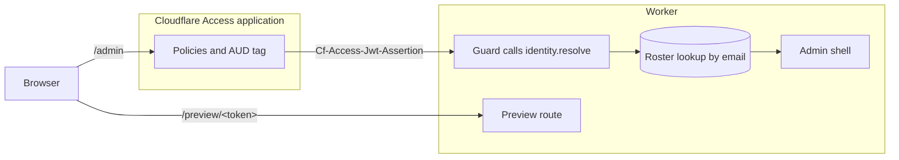

# Replace magic links with Cloudflare Access

Replace cairn's magic-link sign-in with your organization's identity provider, using a Cloudflare
Access application in front of the admin and a resolver that maps its token to a roster email.

This page assumes a site whose guard already signs editors in by magic link, as
[Add cairn to a SvelteKit app](add-cairn-to-a-sveltekit-app.md) sets it up.

A Cloudflare Access self-hosted application in front of the Worker admits only the users who match
its policies. It signs those users in through a connected identity provider (IdP).



*Access admits a request only when it matches the application's policies. The guard passes the
request to the site's resolver, which verifies the token Access attaches. The guard then looks the
returned email up in the roster. A `/preview/<token>` request stays outside the application.*

## Decide whether to switch

Configuring [`createAuthGuard`](../reference/sveltekit.md#createauthguard)'s `identity` option
replaces the whole magic-link path, with no partial adoption where some editors keep magic links
and others go through the gate. To stay on magic links and change the sign-in email instead, see
[Customize the sign-in email](add-cairn-to-a-sveltekit-app.md#customize-the-sign-in-email). The
guard's reference entry records the stability tier of this option and of the three types it names.

The free Cloudflare Zero Trust plan caps the number of users who authenticate through Access, so a
larger editorial team needs a paid plan. The
[Zero Trust plans page](https://www.cloudflare.com/plans/zero-trust-services/) states the current
cap.

## Prepare the roster

The Access application and the roster are two independent admission lists that never reconcile
automatically. A user must pass the application's policies to reach `/admin` and must also hold a
roster row to edit.

Before you enable `identity`, prepare the roster with these steps:

1. In the roster screen, confirm that every editor's email is the primary address the IdP
   asserts, not an alias.

   Once `identity` is on, the guard refuses an editor whose row carries an alias as unknown. Fix a
   mismatch from the roster screen or with `wrangler d1 execute` against `AUTH_DB`.

2. In `AUTH_DB`, confirm that the first owner's row exists.

   Identity mode can't bootstrap an owner, since the owner bootstrap lives only in the magic-link
   routes, which the `identity` branch never reaches. Seed the owner through `create-cairn-site` or
   with `wrangler d1 execute` against `AUTH_DB`.

## Create the Access application

Create a self-hosted Access application for the site's hostname and connect it to your IdP, as
Cloudflare's
[self-hosted application guide](https://developers.cloudflare.com/cloudflare-one/access-controls/applications/http-apps/self-hosted-public-app/)
describes. Google Workspace and Microsoft Entra ID each have a dedicated connector, and Cloudflare's
one-time PIN is a separate login method. An editor behind Access can then sign in with the
organization's Google or Microsoft account.

To configure the application and close the paths around it, follow these steps:

1. In the application's paths, cover `/admin`, every path beneath it, and `/admin/__data.json`.

   The `/admin/__data.json` path is SvelteKit's data-only fetch. Leave `/preview/<token>` uncovered.
   Where application paths overlap, Access applies the most specific path first.

2. In the application's CORS settings, leave every setting off.

   Enabling them can make the `X-Cairn-CSRF` header settable cross-origin, which defeats the CSRF
   check the admin guard runs on that header.

3. In the application's login methods, enable no method whose email claim the signing-in user
   controls.

   The guard admits whatever email the resolver returns once it matches a roster row. A user who
   controls that claim can therefore sign in as any roster address.
   [Identity mode's threat surface](security-model.md#identity-modes-threat-surface) covers the
   residual risks.

4. In the application's **Additional settings**, copy the AUD tag.

   A verifier validates the token against this tag, never the application's id. The tag changes
   only when the application is deleted or recreated.

5. In the zone's cache rules, confirm that no rule matches `/admin`.

   A cache rule can ignore the origin's `Cache-Control` and cache the response for a set TTL. That
   overrides the engine's `private, no-store` on every admin response, so one editor's cached page
   can reach the next matching request.

6. In the Worker's Wrangler configuration, set both `workers_dev` and `preview_urls` to `false`.

   When `preview_urls` is omitted, Wrangler leaves an existing preview URL setting alone. A site
   with preview URLs on then still routes `/admin` requests to the Worker on an ungated
   `workers.dev` hostname. The guard makes no hostname check, so it admits a request on any
   hostname whenever the resolver accepts the token it presents.

## Write the verifier

The verifier is site code, since the engine ships no OpenID Connect (OIDC) client and doesn't
depend on `jose`. TypeScript checks the resolver's shape against its type, but no part of cairn
checks the verification it performs.

A verifier for an Access token meets the following requirements:

- It reads the `Cf-Access-Jwt-Assertion` header, since Access doesn't guarantee the
  `CF_Authorization` cookie and a browser can set that cookie by hand.
- It checks the signature against the team's `/cdn-cgi/access/certs` keys and checks the `iss` and
  `aud` claims.
- It requires `type` to be `app`, which marks an application token and excludes the `org` global
  session token.
- It refuses a token with no `email` claim, which also refuses a service token.

To write the verifier, follow these steps:

1. In the site's project, install `jose`.
2. In the site's project, create a config module that exports the team domain, the AUD tag you
   copied, and the gate's logout address.
3. In the site's project, create a resolver module that exports an `IdentityResolver` meeting the
   verifier requirements.

The following resolver module is illustrative, adapted from Cloudflare's Workers sample in
[Validate JWTs](https://developers.cloudflare.com/cloudflare-one/access-controls/applications/http-apps/authorization-cookie/validating-json/),
which stays the authoritative reference:

```ts
// src/lib/access-identity.ts
import { createRemoteJWKSet, jwtVerify } from 'jose';
import type { IdentityResolver } from '@glw907/cairn-cms/sveltekit';
// teamDomain is https://<team>.cloudflareaccess.com, audTag is the application's AUD tag, and
// logoutUrl is the gate's logout address.
import { audTag, logoutUrl, teamDomain } from './access-config.js';

const JWKS = createRemoteJWKSet(new URL(`${teamDomain}/cdn-cgi/access/certs`));

export const accessIdentity: IdentityResolver = {
  label: 'Example Org sign-in',
  logoutUrl,
  async resolve(event) {
    const token = event.request.headers.get('cf-access-jwt-assertion');
    if (!token) return { ok: false, reason: 'missing' };
    try {
      const { payload } = await jwtVerify(token, JWKS, {
        issuer: teamDomain,
        audience: audTag,
      });
      if (payload.type !== 'app') return { ok: false, reason: 'invalid' };
      if (typeof payload.email !== 'string' || payload.email === '') {
        return { ok: false, reason: 'no_email' };
      }
      return { ok: true, email: payload.email };
    } catch {
      return { ok: false, reason: 'invalid' };
    }
  },
};
```

The guard logs an identity refusal at error when its reason is `audience`, `issuer`, `keys`, or
`error`. Each of those reasons marks a misconfigured gate that would refuse the whole roster. Every
other reason logs at warn, and a resolver that throws is refused and logged at error. The
illustrative module returns `invalid` for every failed verification, so a wrong AUD tag logs at
warn.

`createAuthGuard` validates `logoutUrl` once, at construction, and throws unless the value is a
root-relative path or an absolute URL whose protocol is `https:`. For the address Access logs a
user out at, see Cloudflare's
[session management](https://developers.cloudflare.com/cloudflare-one/access-controls/access-settings/session-management/)
page. The optional `label` names the gate on the hand-off, identity-unresolved, and
unknown-identity pages, and it defaults to `your organization's sign-in`.

## Wire the resolver into the guard

`createAuthGuard` returns a plain SvelteKit `Handle` whether or not `identity` is set, so it
composes through `sequence` as it did under magic links.

To turn on identity mode, follow this step:

- In the site's server hooks, pass the resolver as the guard's `identity` option.

The following hooks file shows the option beside another handle:

```ts
// src/hooks.server.ts
import { sequence } from '@sveltejs/kit/hooks';
import { createAuthGuard } from '@glw907/cairn-cms/sveltekit';
import { accessIdentity } from '$lib/access-identity.js';
import { access } from './access.js';
import { theme } from './theme-handle.js';

export const handle = sequence(theme, createAuthGuard({ access, identity: accessIdentity }));
```

Under `identity`, the guard mints no token and creates no session or session cookie. The
`identity.resolve` function reads the gate's proof of identity, and the guard looks the proven
email up in the roster as it would a magic-link session's email.

The guard awaits `identity.resolve` on every non-public `/admin` request and keeps no session that
caches a verified identity, so the signature check runs once per request. That work also runs for a
request that reaches the Worker without passing the gate. A site can call
[`resolveRateLimit`](../reference/cloudflare.md#resolveratelimit) from
`@glw907/cairn-cms/cloudflare` ahead of the guard to limit that work on a best-effort basis.

A [`ResolvedIdentity`](../reference/sveltekit.md#resolvedidentity) carries an email and an optional
advisory `displayName`, never a role, since the guard takes the role from the roster row. The guard
trims and lowercases the returned email and looks it up with no cross-check. That string is the only
join between the gate and the roster. A proven email with no roster row gets the unknown-identity
page, and adding the row lets the next request succeed.

The `identity` option takes any [`IdentityResolver`](../reference/sveltekit.md#identityresolver), a
`resolve` function plus a `logoutUrl`. A site behind a different authenticating reverse proxy writes a resolver for that proxy's token in the
same shape.

## Logout and session lifetime under Access

Logout and session lifetime follow the gate once identity mode is on. Under `identity`,
`logoutAction` skips the session-row delete, clears every cookie, and redirects to the gate's
`logoutUrl`. The shell's logout posts to the bare `/admin`, a guarded path, so a stale tab whose
gate session already ended is refused with the identity-unresolved page.

On Access, a user-initiated logout clears the browser's authorization cookie, and Access stops
accepting that session's tokens shortly after, as Cloudflare's session management page describes.
Access enforces that cutoff in the request path. The origin verifier's validation is stateless and
has no revocation step, so it accepts an already-issued token until its `exp`.

Under `identity`, cairn's 30-day session no longer applies, and the Access application's session
duration governs how long an editor stays signed in.

## Verify the gate

No tool checks the login redirect or the `workers.dev` exposure, so a site runs every check here by
hand.

To confirm that the gate admits rostered editors and that no ungated hostname serves the admin,
follow these steps:

1. From a browser signed in through Access as a rostered editor, open `/admin`.
2. In the Worker's logs, confirm that the request left no
   [`guard.refused`](../reference/log-events.md) record with `reason: identity`.

   When such a record appears, its `detail` names the refusal's reason, and the editor sees the
   `auth.identity-unresolved` condition.

3. In the same logs, confirm that the request left no `auth.identity.unknown` record.

   That warn event marks a proven identity the roster doesn't recognize. Its `email` is the gate's
   normalized and capped address, logged after the roster lookup fails.

4. From a signed-out client, send an unauthenticated `GET` to the primary hostname's
   `/admin/login`, and confirm that the redirect lands on the gate's hostname.
5. Send an unauthenticated `GET` to `/admin` on `<worker-name>.<subdomain>.workers.dev` and on each
   preview URL, and confirm that no response comes from the Worker.
