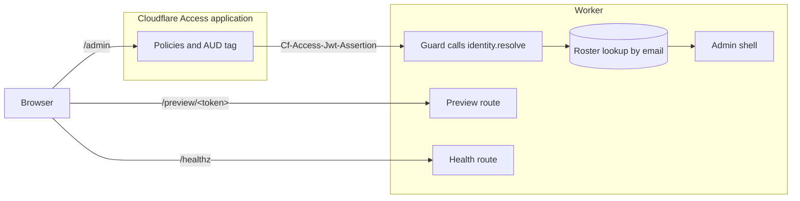

# Replace magic links with Cloudflare Access

Replace cairn's magic-link sign-in with your organization's identity provider by putting a
Cloudflare Access application in front of the admin. A resolver on the guard turns the Access token
into the email the guard looks up in the roster. A site makes this switch when its editors already
hold accounts in an identity provider such as Google Workspace or Microsoft Entra ID. Access admits
only the users who match an application's policies, and it signs them in through the identity
provider the application connects to. The work spans the site's server hooks and the account's
Zero Trust settings, so it takes a developer who can change both.

Setting [`createAuthGuard`](../reference/sveltekit.md#createauthguard)'s `identity` option replaces
the whole magic-link path, so every editor signs in through the gate or none does. Under
`identity`, the guard mints no token and sets no session cookie, since `identity.resolve` reads the
gate's proof of identity and the guard looks the proven email up in the roster as it would a
magic-link session's email. The free Cloudflare Zero Trust plan caps the number of users who
authenticate through Access, so an editorial team larger than the cap on the
[Zero Trust plans page](https://www.cloudflare.com/plans/zero-trust-services/) needs a paid plan.

This task assumes that you have edited a SvelteKit server hooks file, deployed a Worker with
Wrangler, and can read a JWT verification sample closely enough to own the code it becomes. A site
that wants only a different sign-in email keeps magic links and follows
[Customize the sign-in email](add-cairn-to-a-sveltekit-app.md#customize-the-sign-in-email) instead.
The guard's `identity` option takes any
[`IdentityResolver`](../reference/sveltekit.md#identityresolver), so a site behind a different
authenticating reverse proxy writes the same kind of resolver for that proxy's token and configures
that proxy in place of the Cloudflare steps. A site that needs a second population with a separate
sign-in, beside editors who keep magic links, follows
[Add a second sign-in group](add-a-second-sign-in-group.md) instead.

The threat analysis of running the guard in identity mode is in
[Identity mode's threat surface](security-model.md#identity-modes-threat-surface).
[Add cairn to a SvelteKit app](add-cairn-to-a-sveltekit-app.md) sets up magic-link sign-in itself.



*The guard reads the gate's token through `identity.resolve` before it looks the proven email up in
the roster. A `/preview/<token>` request and a `/healthz` request reach the Worker without passing
the application.*

## Before you begin

Before you switch, your site and Cloudflare account need the following:

- A deployed site whose guard signs editors in by magic link, as
  [Add cairn to a SvelteKit app](add-cairn-to-a-sveltekit-app.md) sets it up.
- The first owner's row in `AUTH_DB`, seeded by `create-cairn-site` or by
  [`wrangler d1 execute`](https://developers.cloudflare.com/workers/wrangler/commands/#d1-execute)
  if no magic-link sign-in has created it.
- A Cloudflare Zero Trust team with your identity provider connected, as Cloudflare's
  [self-hosted application guide](https://developers.cloudflare.com/cloudflare-one/access-controls/applications/http-apps/self-hosted-public-app/)
  describes.

Identity mode can't create that row, since `bootstrapOwner` runs only in the magic-link routes that
the `identity` branch never reaches.

The roster is the admission list that cairn holds, so it comes first.

## Prepare the roster

The Access application and cairn's roster are two admission lists that never reconcile
automatically, and the email string the resolver returns is their only join. Each roster email must
match the address the identity provider asserts before the deploy that switches the guard to
identity. The guard trims and lowercases the returned email and looks it up with no cross-check, so
a roster alias matches nothing.

To prepare the roster, follow these steps:

1. In the roster screen, compare each editor's email with the primary address the identity provider
   asserts, not an alias.
2. In the roster screen or with `wrangler d1 execute` against `AUTH_DB`, correct each mismatch.

The other admission list is the Access application's policy.

## Create the Access application

The guard trusts whatever email the application asserts, so the application must cover every admin
path and get that email from your identity provider.

To create and configure the application, follow these steps:

1. In Zero Trust, create a self-hosted application for the site's hostname, as Cloudflare's
   [self-hosted application guide](https://developers.cloudflare.com/cloudflare-one/access-controls/applications/http-apps/self-hosted-public-app/)
   describes.
2. In the application's paths, cover `/admin`, every path beneath it, and `/admin/__data.json`.

   The `/admin/__data.json` path is SvelteKit's data-only fetch, and `/preview/<token>` stays
   uncovered. Where application paths overlap, Access applies the most specific path first.

3. In the application's policies, add a policy that admits every editor in the roster, as
   Cloudflare's [policies page](https://developers.cloudflare.com/cloudflare-one/access-controls/policies/)
   describes.

   This policy is the application's admission list, so it must admit the same editors that the
   roster holds.

4. In the application's login methods, enable your identity provider but no method whose email
   claim the signing-in user controls.

   A user who controls that claim can sign in as any roster address.
   [Identity mode's threat surface](security-model.md#identity-modes-threat-surface) covers the
   risks that remain.

5. In the application's CORS settings, leave every setting off.

   Enabling them can make the `X-Cairn-CSRF` header settable cross-origin, which defeats the CSRF
   check the admin guard runs on that header.

6. In the application's **Additional settings**, copy the AUD tag.

   The verifier validates the token against this tag, never the application's id, and the tag
   changes only when the application is deleted or recreated.

7. In Zero Trust, note the team domain, `https://<your-team-name>.cloudflareaccess.com`, and the
   logout address that Cloudflare's
   [session management page](https://developers.cloudflare.com/cloudflare-one/access-controls/access-settings/session-management/)
   gives.

From the moment you save it, the application challenges every request to `/admin` on the site's
hostname, magic-link editors included. The guard behind it keeps signing editors in by magic link
until the deploy that switches it to identity. Two settings outside the application can still
deliver an admin response around it.

## Close the exposures outside the application

A cache rule that matches `/admin` can serve one editor's page to the next matching request, and an
ungated `workers.dev` hostname answers `/admin` too.

To close both exposures before the deploy that switches the guard to identity, follow these steps:

1. In the zone's cache rules, confirm that no rule matches `/admin`.

   A cache rule can ignore the origin's `Cache-Control` and cache the response for a set TTL, which
   overrides the engine's `private, no-store` header.

2. In the Worker's Wrangler configuration, set both `workers_dev` and `preview_urls` to `false`.

   When `preview_urls` is omitted, Wrangler leaves an existing preview URL setting alone, so a site
   with preview URLs on still serves `/admin` on `workers.dev`. The guard makes no hostname check,
   so it admits a request there whenever the resolver accepts its token. A token that Access has
   since revoked keeps verifying there until its `exp`. This setting takes effect at the deploy in
   [Wire the resolver and deploy the Worker](#wire-the-resolver-and-deploy-the-worker).

The verifier consumes the team domain, the AUD tag, and the logout address that you noted while
creating the application.

## Write the verifier

The verifier is code you write and own, since cairn ships no OpenID Connect (OIDC) client and
doesn't depend on [`jose`](https://github.com/panva/jose). TypeScript checks the resolver's shape,
and nothing in cairn checks the verification it performs.

A verifier for an Access token meets the following requirements:

- It reads the `Cf-Access-Jwt-Assertion` header, since Access doesn't guarantee the
  `CF_Authorization` cookie and a browser can set that cookie by hand.
- It checks the signature against the team's `/cdn-cgi/access/certs` keys and checks the `iss` and
  `aud` claims.
- It requires `type` to be `app`, which marks an application token and excludes the `org` global
  session token.
- It refuses a token with no `email` claim, which also refuses a service token.
- It returns the email and, optionally, a display name, never a role, since the guard takes the
  role from the roster row.
- Its refusal reason names the failure, since the guard logs `audience`, `issuer`, `keys`, and
  `error` at error level and other reasons at warn.

The signature check is stateless and has no revocation step, so a logout or revoke takes effect
only where Access sits in the request path. The guard uses the resolver's display name only when
the roster row's name is empty. The four reasons logged at error mark a misconfigured gate that
would refuse the whole roster.

To write the verifier, follow these steps:

1. In the site's project, install `jose`.
2. In the site's project, create a config module that exports the team domain, the AUD tag, and the
   logout address you noted.

   For the forms of logout address that the guard accepts, see the
   [`IdentityResolver`](../reference/sveltekit.md#identityresolver) entry.

3. In the site's project, create a resolver module that exports an `IdentityResolver` meeting the
   verifier requirements.

The following resolver module is illustrative and adapted from Cloudflare's Workers sample in
[Validate JWTs](https://developers.cloudflare.com/cloudflare-one/access-controls/applications/http-apps/authorization-cookie/validating-json/),
which stays the authoritative reference for the verification:

```ts
// src/lib/access-identity.ts
import { createRemoteJWKSet, jwtVerify } from 'jose';
import type { IdentityResolver } from '@glw907/cairn-cms/sveltekit';
// teamDomain is https://<your-team-name>.cloudflareaccess.com, audTag is the application's AUD
// tag, and logoutUrl is the address Cloudflare's session management page gives.
import { audTag, logoutUrl, teamDomain } from './access-config.js';

const JWKS = createRemoteJWKSet(new URL(`${teamDomain}/cdn-cgi/access/certs`));

// Map each jose error code this sample names to a refusal reason the guard logs.
function reasonFor(err: unknown): string | undefined {
  const { code, claim } = (err ?? {}) as { code?: string; claim?: string };
  switch (code) {
    case 'ERR_JWT_EXPIRED':
      return 'expired';
    case 'ERR_JWT_CLAIM_VALIDATION_FAILED':
      if (claim === 'aud') return 'audience';
      if (claim === 'iss') return 'issuer';
      return 'invalid';
    case 'ERR_JWKS_NO_MATCHING_KEY':
    case 'ERR_JWKS_MULTIPLE_MATCHING_KEYS':
    case 'ERR_JWKS_TIMEOUT':
      return 'keys';
    case 'ERR_JWS_SIGNATURE_VERIFICATION_FAILED':
    case 'ERR_JWT_INVALID':
    case 'ERR_JWS_INVALID':
      return 'invalid';
    default:
      return undefined;
  }
}

export const accessIdentity: IdentityResolver = {
  label: 'Example Org sign-in',
  logoutUrl,
  async resolve(event) {
    const token = event.request.headers.get('cf-access-jwt-assertion');
    if (!token) return { ok: false, reason: 'missing' };
    try {
      const { payload } = await jwtVerify(token, JWKS, {
        issuer: teamDomain,
        audience: audTag,
      });
      if (payload.type !== 'app') return { ok: false, reason: 'invalid' };
      if (typeof payload.email !== 'string' || payload.email === '') {
        return { ok: false, reason: 'no_email' };
      }
      return { ok: true, email: payload.email };
    } catch (err) {
      const reason = reasonFor(err);
      // Rethrow a failure the mapping doesn't name, so the guard logs it at error.
      if (reason === undefined) throw err;
      return { ok: false, reason };
    }
  },
};
```

The sample returns the reason its mapping gives and rethrows any other failure, which the guard
logs at error. The optional `label` names the gate on the sign-in hand-off page and the two refusal
pages, and it defaults to `your organization's sign-in`.

## Wire the resolver and deploy the Worker

`createAuthGuard` returns a plain SvelteKit `Handle` whether or not `identity` is set, so the guard
composes through `sequence` as it did under magic links. The resolver goes in as one option, and a
deploy puts it into effect.

To turn on identity mode, follow these steps:

1. In the site's server hooks file, pass the resolver as the guard's `identity` option.

   ```ts
   // src/hooks.server.ts
   import { sequence } from '@sveltejs/kit/hooks';
   import { createAuthGuard } from '@glw907/cairn-cms/sveltekit';
   import { accessIdentity } from '$lib/access-identity.js';
   import { access } from './access.js';
   import { theme } from './theme-handle.js';

   export const handle = sequence(theme, createAuthGuard({ access, identity: accessIdentity }));
   ```

2. In the project directory, build the site and deploy it with `npx wrangler deploy`, as in
   [Describe the Worker and deploy it](add-cairn-to-a-sveltekit-app.md#describe-the-worker-and-deploy-it).

   This deploy uploads the hooks option and the `workers_dev` and `preview_urls` settings from
   [Close the exposures outside the application](#close-the-exposures-outside-the-application)
   together. From this deploy on, identity mode is live, and the guard refuses as unknown an editor
   whose roster email differs from the provider's primary address.

Once the guard that carries the option is deployed, it differs from magic-link mode in the
following ways:

- The guard awaits `identity.resolve` on every non-public `/admin` request and caches no verified
  identity, so the signature check runs once per request.
- The Access application's
  [session duration](https://developers.cloudflare.com/cloudflare-one/access-controls/access-settings/session-management/)
  governs how long an editor stays signed in, and cairn's 30-day session no longer applies.
- Sign-out skips the session-row delete, clears every cairn cookie, and redirects to the gate's
  `logoutUrl`, where Access clears its authorization cookie.

A handle placed ahead of the guard can limit the per-request work on a best-effort basis by calling
[`resolveRateLimit`](../reference/cloudflare.md#resolveratelimit) from
`@glw907/cairn-cms/cloudflare`.

## Verify the gate

A working gate admits a rostered editor to `/admin`, sends a signed-out visitor to the gate's
hostname, and serves nothing on an ungated hostname. No tool checks the login redirect or the
`workers.dev` exposure yet, so you check both by hand against the deployed site.

To confirm that the gate admits rostered editors and that no ungated hostname serves the admin,
follow these steps:

1. From a browser signed in through Access as a rostered editor, open `/admin` on the deployed site
   and confirm that the admin shell opens.
2. In Workers Logs, confirm that the request left no
   [`guard.refused`](../reference/log-events.md) record with `reason: identity`.
3. In the same logs, confirm that the request left no `auth.identity.unknown` record.
4. From the admin, sign out and confirm that the browser lands on the gate's logout address.

   If it lands elsewhere, check the logout address that the config module exports.

5. From a signed-out client, send an unauthenticated `GET` to the primary hostname's
   `/admin/login` and confirm that the redirect lands on the gate's hostname.

   If the redirect stays on the site's hostname, confirm that the application's paths cover
   `/admin/login`.

6. From the same client, send an unauthenticated `GET` to `/admin` on
   `<worker-name>.<subdomain>.workers.dev` and each preview URL, and confirm that no response
   comes from the Worker.

   If the Worker answers, set `workers_dev` and `preview_urls` to `false` as in
   [Close the exposures outside the application](#close-the-exposures-outside-the-application), and
   deploy again.

A refused sign-in in the first three checks either stops at Access or leaves one of the guard's two
log records. [Resolve a refused sign-in](#resolve-a-refused-sign-in) works through both.

## Resolve a refused sign-in

The guard shows the identity-unresolved page when the resolver refuses or throws, and the
unknown-identity page when a proven email matches no roster row. Each page leaves one log record
that names the cause.

To find why an editor was refused, follow these steps:

1. If the refused request was a sign-out from a tab left open, sign in through the gate again.

   The shell's logout posts to the bare `/admin`, a guarded path, so a tab whose gate session
   already ended is refused there before `logoutAction` runs.

2. If the editor saw Cloudflare's Access block page rather than one of the guard's refusal pages,
   add the editor in the application's policies.

   That request never reached the Worker, so it left neither log record.

3. Otherwise, in Workers Logs, look for an `auth.identity.unknown` record from the refused request.
4. If one appears, add or correct the editor's roster row so that it carries the address in the
   record's [`email` field](../reference/log-events.md).

   The editor's next request succeeds.

5. Otherwise, read the refusal's reason in the `detail` of the request's `guard.refused` record
   with `reason: identity`.
6. If the reason is `expired`, `invalid`, or `no_email`, have the editor sign in through the gate
   again.

   The guard logs each of these at warn, below the four reasons that mark a misconfigured gate.

7. If the reason is `audience`, check the config module's AUD tag against the one in the
   application's **Additional settings**.
8. If the reason is `issuer` or `keys`, check the team domain in the config module.
9. If the reason is `missing`, confirm that the application's paths cover the requested path and
   that the request arrived on the primary hostname.
10. If the reason is `error`, read the thrown message in the `error` field of the
    [`guard.refused`](../reference/log-events.md) record and fix the resolver module.

    The sample returns no `error` reason and rethrows any failure its mapping doesn't name, so
    under the sample `error` means that the resolver threw.

11. If the refusal persists, work through [Debug your site](debug-your-site.md).

## See also

The following pages cover the seams and limits around identity mode:

- [Identity mode's threat surface](security-model.md#identity-modes-threat-surface) records the
  risks the gate leaves open.
- [Restrict admin access](restrict-admin-access.md) narrows which roster roles reach which admin
  screens.
- [Share a draft preview](share-a-draft-preview.md) sets up the `/preview/<token>` route that the
  Access application leaves uncovered.
- [Add a second sign-in group](add-a-second-sign-in-group.md) signs a second population in beside
  the editors.
- [`createAuthGuard`](../reference/sveltekit.md#createauthguard) documents the `identity` option,
  the three types it names, and their stability tier.
