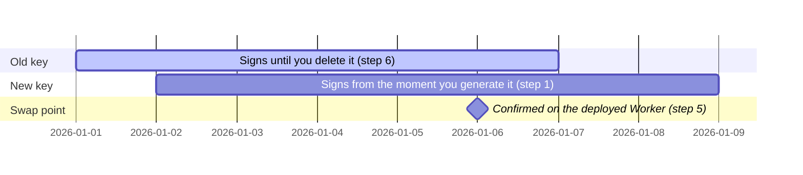

# Rotate the GitHub App key

Replace the private key your site's GitHub App signs commits with, without a window where the App
can't authenticate.

## Precondition

Your site's GitHub App already exists: [Add cairn to a SvelteKit app](./add-cairn-to-a-sveltekit-app.md#create-the-github-app)
and [Build a site by hand](./build-a-site-by-hand.md#milestone-5-real-credentials-real-publishing)
both create one, and `create-cairn-site` creates one too if your site started there. Whichever
produced it, you can reach that App's settings page under your GitHub account or organization's
Developer settings. You also need a way to run `wrangler secret put` against the site's Worker: a
local checkout with `wrangler` installed, signed in to the right Cloudflare account.

## Why there's no downtime window



*The old key keeps signing from before the rotation starts until you delete it in step 6. The new
key starts signing as soon as you generate it in step 1, so its validity window overlaps the old
key's for the whole rotation. The milestone marks step 5, the confirmed real save against the
deployed Worker, the point after which deleting the old key is safe. The axis dates are
placeholders that create the bar geometry; they don't name a real calendar.*

A GitHub App can hold more than one private key at once, which is the whole mechanism this page
relies on. Generating a new key does not invalidate the old one; the App keeps signing with
whichever key a caller presents until you delete a key by hand. Skip the confirm step and a typo
in the new key locks your site out with no working key left. See GitHub's own [managing private
keys for GitHub
Apps](https://docs.github.com/en/apps/creating-github-apps/authenticating-with-a-github-app/managing-private-keys-for-github-apps)
for the settings-page navigation and the exact limits GitHub enforces; this page covers cairn's
own half, the encode-and-install step and the verification.

## Steps

1. **Generate a new key.** On the App's settings page (GitHub's navigation for it is linked
   above), generate a new private key and download the `.pem` file. Leave the old key in place;
   do not delete it yet.

2. **Base64-encode it, on one line.** cairn's Worker reads the key as `GITHUB_APP_PRIVATE_KEY_B64`,
   a base64 encoding of the PEM with no line breaks. This command produces that encoding on any
   platform with Node available, and it is the exact encoding cairn's own tooling produces:

   ```bash
   node -e "process.stdout.write(require('fs').readFileSync('new-key.pem').toString('base64'))" > new-key.b64
   ```

   A shell `base64` utility works too, but its default line-wrapping behavior differs across
   platforms, and a wrapped value fails to decode. If you don't have Node handy, PowerShell's
   equivalent produces the same unwrapped form:

   ```powershell
   [Convert]::ToBase64String([IO.File]::ReadAllBytes("new-key.pem")) | Out-File -NoNewline new-key.b64
   ```

3. **Push it as a Worker secret.**

   ```bash
   cat new-key.b64 | npx wrangler secret put GITHUB_APP_PRIVATE_KEY_B64
   ```

   This overwrites the running secret immediately; the App id and installation id, which live in
   your adapter config rather than as secrets, don't change.

   If you also run `wrangler dev` locally, write the same base64 value into `.dev.vars` too. Local
   dev reads that file, never the deployed secret, so skipping this leaves your local site signing
   with the retired key even after the deployed Worker has moved on.

4. **Confirm the new key with a real publish, before you touch the old one.** No command checks
   the App's credentials on their own; the only proof that counts is a positive artifact from the
   deployed Worker. Sign in to the live admin and publish an edit. A commit authored by
   `cairn-cms[bot]` landing on `main` is that proof. An absence of error logs is not evidence: an
   empty log proves nothing unless `observability.enabled` is `true` in your site's
   `wrangler.jsonc`. A key that fails on the publish path logs `publish.failed` or `commit.failed`
   (Workers Logs, filtered by event), never `github.unreachable`, which fires only on a best-effort
   read elsewhere (`cairn adopt`, `--help`, or a publish-advisories fetch), not here.

5. **Delete the old key**, once step 4 produces that commit. Back on the App's settings page,
   delete the previous private key. GitHub requires at least one key to exist, so this only works
   after the new one is already active.

6. **Delete the local `.pem` and `.b64` files.** Neither needs to survive on disk once the secret
   is pushed; the Worker is the one place the key should live from here on.

## You know it worked when

A publish from the deployed admin produces a commit authored by `cairn-cms[bot]` on `main`. If
step 4 doesn't produce that commit, check Workers Logs for `publish.failed` or `commit.failed`
first; if the Worker secret from step 3 didn't take, re-push it and redeploy, otherwise re-check
the new key and the encoding from step 2.

## If something goes wrong

Before you delete the old key in step 6, you have a fast way back: re-push the old key's base64
value with the same `wrangler secret put` command from step 3, and the site is signing with it
again immediately. While the old key still exists, restoring service and diagnosing the new key
stay separate problems, so you can debug a key that isn't working without pressure to restore the
site first.

If you already deleted the old key and the new one doesn't work, generate a third key rather than
trying to recover the deleted one; GitHub does not let you restore a deleted key. See [Is it
working?](../admin/is-it-working.md) for `github.app-unreachable` and the doctor's other
conditions, or [the admin's troubleshooting page](../admin/troubleshooting.md) if the person
running this rotation isn't the one who wrote the adapter.
