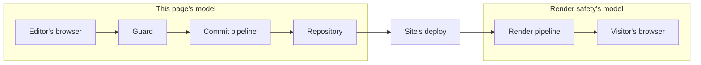

# Security model

How cairn authenticates an editor, protects `/admin` from forgery, and gates what a signed-in
session can reach. This covers the built-in owner/editor model that guards `/admin`; a second
audience's own login channel has its own contract, in [Auth channel security
model](./auth-channel-security-model.md).

## The threat model

The admin authors are a small, owner-curated allowlist of magic-link-authenticated people. Their
content never renders live directly; a save lands on a holding branch, and only a deliberate
publish, then the site's own deploy pipeline, puts anything in front of a visitor, so every change
carries a git audit trail. That shape is what the model below is built for: the realistic risk is
session and cookie handling, abuse of the unauthenticated magic-link request endpoint, and the cost
of a leaked commit credential, not an anonymous public attacker reaching content directly.



*The repository is the boundary between the two models. Everything up to it is this page's
subject; from there the site's own deploy hands off to the render pipeline, which [Render
safety](./render-safety.md) governs.*

## Sign-in: magic links, not passwords

An editor requests a sign-in link by email. cairn mints a single-use token, stores only its SHA-256
hash, and emails the raw token as a link. Consuming the link creates a session, stored the same way
(id, not the raw value the browser holds). The token lives ten minutes, the session thirty days,
and a repeat request from the same address is throttled to once a minute. All three are named
constants an adapter cannot loosen. There is no password anywhere in this path, and no third-party
identity provider; a sign-in proves only membership in the `editor` table.

The request path is deliberately non-enumerating: an address that isn't on the roster gets the
same `{ status: 'sent' }` response a real editor's address gets, so a stranger probing addresses
can't tell allowlist membership from the response alone. The one deliberate exception is the
cooldown above: a *repeat* request inside the one-minute window returns a distinct `throttled`
status, which does reveal that the address is on the roster. That's an accepted trade, made so a
real editor hammering the sign-in button doesn't flood their own inbox.

## Sign-in binds to the browser that asked

A magic link only works in the browser that requested it. The login page's own load leaves a random
nonce in a `cairn_login_pending` cookie (`HttpOnly`, `SameSite=Lax`, `__Host-` prefixed on https,
and an hour long, six times the token's ten minutes), the request action reuses it, and that
action stores the nonce's SHA-256 hash on the token row. The confirm action reads the cookie back
and compares the two hashes inside the same atomic `DELETE` that consumes the token, so a link
confirmed anywhere else is refused.

The cookie deliberately outlives the token. The nonce is opaque, and its only meaning is the
`nonce_hash` on a live token row, which its own ten-minute expiry sweeps, so a cookie that
survives the row grants nothing. What the longer life buys is the ordinary late click: an editor
opening a link fifteen minutes later still arrives carrying the cookie and reads "that link
expired" instead of a message about a different browser.

The binding closes a login-CSRF: without it, an attacker can request a link for *their own*
address and put it in front of an editor's browser, and the editor lands in the attacker's session,
where their next edit publishes under the attacker's account. It also stops a link-following mail
scanner from spending an editor's link before the editor clicks it.

Three properties of the refusal matter to an operator:

* The comparison **is** the consuming `DELETE`'s own predicate, not a check ahead of it, so a
  click from the wrong browser doesn't burn the link. The editor's own browser can still use it.
* A confirm from a browser holding no cookie passes SQL `NULL` rather than refusing outright. A
  row that carries a binding then matches nothing and survives; a row with **no** binding matches
  `nonce_hash IS NULL` and still signs the editor in.
* Only a bound row's refusal takes the distinct `?error=no-pending-request` code, with its own
  page copy naming this browser's missing pending sign-in. "Request a new one" alone is exactly
  the advice that reproduces the failure on a second device. The engine exports that code as
  `NO_PENDING_REQUEST_ERROR` from `@glw907/cairn-cms/sveltekit`, so a site rendering its own login
  page branches on the constant.

### The binding is last-requester-wins

A throttled re-request rebinds the live token to the browser that just asked. Nothing else about
that answer changes: no new token, no second email, and the cooldown window stays where it was.

The rebind exists because the binding alone is a lockout. An attacker who posts the sign-in form
for an editor's address once a minute keeps the live token bound to their own browser, and the
per-address cooldown they just started throttles the editor's own recovery request, so the editor
can neither confirm the link in their inbox nor earn a new one.

Last-requester-wins is safe because asking, on its own, grants nothing. The link only ever reaches
the editor's own inbox, so someone who posts the form learns no token. The worst they achieve is
making the editor's current link stop working, which they could already do before the binding
existed, since a fresh request replaces the previous token. The editor recovers by asking again,
and the rebind is symmetric, so the last person to ask is the one it works for.

The one residual, stated plainly: someone who *already holds* a token, because an editor forwarded
the mail, can make it work by posting the request form for that address inside the one-minute
cooldown, which rebinds the row to their browser. It takes both the token and the form, and only
inside that window. Outside it, their request mints a new token and destroys the forwarded one. So
forwarding a sign-in link is still a way to hand someone your account, and that's what to tell your
editors. What the binding stops is the passive cases: a link-following mail scanner, and an attacker
putting their own link in front of an editor's browser.

Two rows the rebind deliberately skips: an expired one, which stays dead however it's touched, and
an unbound one, for the reason in the next section. It's a single `UPDATE`, so a rebind racing the
confirm that consumes the row loses cleanly: either the update lands first and the confirm compares
against the new hash, or the delete lands first and the update matches nothing.

### An unbound token row is scanner-confirmable, by design

A `magic_token` row whose `nonce_hash` is `NULL` confirms from any browser, exactly as every row
did before this migration. Three things write one: a row minted by an engine older than the
migration, `create-cairn-site`'s bootstrap `INSERT`, and a recovery row an operator seeds by hand
to break a lockout. Each is a case where nobody's browser holds a matching nonce, so binding the
row would make it unusable. The engine's own request action always writes a binding, so an
unbound row is never the steady state of a running site. Treat one as what it is: a link a mail
scanner can spend, live for the ten minutes of its own expiry.

The cost is deliberate: an editor who requests a link on a desktop and opens it on a phone, or
whose mail app opens links in a WebView with its own cookie jar, is refused and has to request the
link again from the browser they'll read it in. Integrity wins over that convenience here, because
re-requesting is a cheap escape hatch and a hijacked editor session isn't.

The engine writes the nonce hash to `magic_token.nonce_hash`, added by
`migrations/0004_login_nonce.sql`. Apply that migration before deploying an engine that carries
this behavior; `npx cairn doctor` fails the `auth.store` check when the column is absent. The
column is nullable, and a row without a binding still confirms, so a link already in an inbox
survives the migration itself.

## The session cookie

The session cookie carries the `__Host-` prefix on every https deploy, which requires `Secure`
and `Path=/` and forbids `Domain`. The browser then ties the cookie to the exact origin that set
it, rather than to a `Domain` attribute a sibling host could also set. Local `http` development
drops the prefix, since `__Host-` requires `Secure` unconditionally and a dev cookie has no TLS to
set it with. The session cookie derives `Secure` through the same rule the CSRF cookie does
(below), so the two cookies can never disagree on one request.

The CSRF double-submit cookie uses the same `__Host-` discipline and the same `Secure` rule. The
rule is monotonic: an `https` request always resolves `Secure`, whatever the configuration says,
so a stale `http` value left in a deployed site's `PUBLIC_ORIGIN` can't downgrade a live TLS
request to a bare cookie that a sibling subdomain is then free to overwrite. Only a non-`https`
request consults anything further. A request to a local host (`localhost`, `127.0.0.1`, and their
siblings) keeps the bare name, so local development never tries to mint a `__Host-` cookie it
can't set. Otherwise the site's configured `PUBLIC_ORIGIN` decides. Under the monotonic rule this
branch is a conservative fallback that a guarded `/admin` path never reaches: an `https` request
already resolved `Secure` in the preceding sentence, and the guard refuses an `http` non-local
request on every admin path before any token issues. It exists so a non-admin surface that mints
the cookie resolves the same name the admin expects, and so an auth route a site mounts OUTSIDE
`/admin` still derives a name consistent with the rest of the site. That last case carries one
residual: a site that
mounts an auth route outside `/admin` and serves it over `http` on a non-local host still mints a
`__Host-` cookie the browser discards, since only an `/admin` path gets the guard's own https help
page. [Mount every load that issues a CSRF token under `/admin/**`](#response-hardening) is the
documented guard against it; there is no equivalent guard for a route a site chooses to mount
elsewhere.

On logout, both cookie-name forms delete for both cookies (bare and `__Host-`, session and CSRF),
each with its own matching `Secure` flag, not just the one the current request's own derivation
produces: a `PUBLIC_ORIGIN` change between login and logout changes which name that derivation
returns, and a single-form delete would strand whichever name the browser actually holds from the
earlier login.

The CSRF cookie's full attribute set: `HttpOnly`, `Path=/`, `SameSite=Lax` set explicitly (never
by attribute omission, since an omitted `SameSite` gets a browser's own default treatment for a
short window right when a fresh cookie is most likely to be used), and a `Max-Age` matching the
session cookie's own thirty-day lifetime.

The two cookies don't share one lifetime. The CSRF cookie re-anchors its `Max-Age` on every
issue, keeping the same value, while the session cookie's thirty days run from sign-in. The CSRF
value rotates at exactly two moments: a successful login mints a fresh one, so a value fixed on
the browser before sign-in can't carry into the session, and a logout deletes it. Nothing else
changes the value, so a second open admin tab's already-rendered form field keeps matching the
cookie. At the login moment another open tab holds at most a sign-in form, which the new session
makes moot, except when an already-signed-in browser re-authenticates through `/admin/auth/confirm`
(a public admin path): another tab there can hold a real authenticated form whose field then
mismatches the rotated cookie, taking one generic 403 that a reload recovers from. Binding the
token to authentication epochs outweighs that narrow self-healing edge.

## CSRF: cairn owns it, not the framework

SvelteKit's default CSRF check compares the request's `Origin` header against the site's own
origin and rejects a mismatch. It is a single global switch, with no per-route exception. It also
rejects a request that carries no `Origin` header at all, which a privacy-hardened browser can
send on a legitimate same-origin form post. A site running cairn sets `csrf: { checkOrigin:
false }` to hand that authority to the guard instead. `checkOrigin` is deprecated as of SvelteKit
2.61 in favor of `csrf.trustedOrigins`, but stays supported across cairn's tested range. See
[Supported toolchain](../reference/supported-toolchain.md#the-checkorigin-deprecation). The guard
enforces a stronger, `Origin`-independent rule of its own: every unsafe `/admin` form POST must
carry a valid double-submit token, a random
value set in a cookie at page-load time and echoed back as a hidden field, compared in constant
time. A token match cannot be forged cross-site regardless of what headers the browser did or
didn't send. Outside `/admin`, the guard restores the framework's own `Origin` check the site
disabled, so turning off `checkOrigin` for the admin's sake never weakens CSRF protection anywhere
else in the site.

## The guard's request order

[`createAuthGuard()`](../reference/sveltekit.md#createauthguard) is the site's `handle` hook:
every request passes through it in this fixed order.

1. **Dev-backend tripwire.** Fails closed if a deployed runtime carries the local-only flag.
2. **Non-admin origin check.** Restores the `Origin` check described above.
3. **HTTPS help page.** An `/admin` path over plain `http` on a non-local host gets a help page
   instead of a doomed form post.
4. **Bindings check.** A missing `AUTH_DB` binding fails every admin path with a named
   condition, not a raw 500.
5. **CSRF check.** Accepts the double-submit field or a custom header, since the guard can't
   clone a raw-body upload to read a form field.
6. **Session resolve.** Attaches `locals.cairnEditor` and `locals.cairnAccess` for the route to
   read.

Every step that refuses a request logs a named [`guard.rejected`](../reference/log-events.md)
reason: `dev_backend_in_prod`, `origin`, `https`, `bindings`, `csrf`, so a sign-in failure is
diagnosable from the logs rather than guessed at. The exception is step 6: a missing or invalid
session redirects to `/admin/login` without logging.

### The dev-backend flag's two refusals, and what they don't cover

`CAIRN_DEV_BACKEND` is refused in two places, deliberately on different terms, both sourced from
one shared module so neither the wording, the truthiness rule, nor the deployment witness can drift
between them. Only `1` and the boolean `true` count as set, in either env source, so a `CAIRN_DEV_BACKEND=true`
typo reads as unset. Both places read `platform.env` (a Cloudflare Worker var) and `process.env`
(an adapter-node OS variable), so neither deploy shape escapes the check.

The preceding guard refuses on the flag alone, because it mounts only in a production build; a
site's own dev branch replaces it entirely rather than running alongside it, so there's no
legitimate case where the guard sees the flag live at all. `createAuthChannel`'s own actions
(`request`, `confirm`, `logout`) refuse only when the flag is set **and** the request reaches a
deployed runtime, because `CAIRN_DEV_BACKEND='1'` is a second-audience dev transport's own enable
contract (see [Auth channel security
model](./auth-channel-security-model.md#the-dev-transport-is-not-a-dev-only-risk)): refusing on the
flag alone there would break every legitimate local dev-backend deployment. Both refusals fire as a
hard, unconditional throw or response before any other work the surface would otherwise do.

The channel's "deployed runtime" test reads your configured `PUBLIC_ORIGIN` before it reads the
request. A `PUBLIC_ORIGIN` naming a non-local host settles the question outright, whatever the
request claims about itself, because `event.url` derives from the client `Host` header everywhere
except Cloudflare, and a forged `Host: localhost` would otherwise talk the refusal down. The rule
only ever moves toward refusing: a `PUBLIC_ORIGIN` that names a local host, or that doesn't parse,
hands the question back to the request's own hostname rather than granting an exemption. Set
`PUBLIC_ORIGIN` on every deployment. That's what closes the residual, and a deployment that leaves
it unset still rests on the Host-derived fallback.

State the tripwire's coverage honestly: it catches the flag live in a deployed runtime, on
whichever of the two surfaces it touches. It can't see a dev-shaped transport a site deploys with
the flag left unset: `deliver`, `lookup`, and the rest of `createAuthChannel`'s config are opaque
site functions, so a site that builds a capture-style stand-in without ever setting the flag is
invisible to both refusals; that residual is exactly what the documented in-body pattern (a
`deliver` implementation that itself refuses without `ctx.env.CAIRN_DEV_BACKEND === '1'`, the
showcase's `captureDeliver`) exists to close. And a dev-branch bundle that replaces the guard
entirely, behind a site's own build-time `__CAIRN_DEV_BUILD__` conditional import, sits outside
both refusals by construction, since neither one ever runs in that bundle. The artifact-level
answer for that residual is CI's own dry-run grep: the showcase's e2e workflow runs `wrangler
deploy --dry-run` against a default build and greps the deployable output for
`scripts/checks/dev-fold-markers.txt` (which names `devBackendHandle` among other dev-only
symbols), failing if any marker survives into what Cloudflare would actually receive.

## Roles, capability, and the access map

An editor's `role` (the string stored in D1) resolves to one of three capabilities, `none`,
`editor`, or `owner`, through the site's declared role vocabulary
([`defineRoles`](../reference/core.md#defineroles)); a zero-config site gets the built-in
owner/editor pair with no declaration needed. Capability alone gates the engine's own screens. A
site's own custom routes additionally consult an access map
([`defineAccess`](../reference/core.md#defineaccess)). The guard and the admin's nav rendering
share that one declaration, so a route a session cannot reach does not appear in the nav.
[`requireAccess`](../reference/sveltekit.md#requireaccess)'s own contract is stricter than the
built-in screens': with no map at all it refuses every session, owner included, since an explicit
call to a gate that found nothing to gate on is a configuration bug.

cairn deliberately runs two different postures on that one map, described below: the engine's own
screens read it permissively, and a site's own POST actions read it fail-closed. Both postures are
intentional and stay as they are; nothing here changes route behavior.

### An access map is not a whitelist

A declared map narrows only the targets it names. Every screen or concept id the map has no key
for stays reachable to any editor-capability session, exactly the zero-config behavior a site with
no map at all gets; only a `none` session is refused everywhere, and the roster screen
(`editors`) stays owner-only no matter what the map says. [`canReach`](../reference/core.md#canreach-hasaccessrule)
is the one function that decides this, for both the engine's own route enforcement and the nav's
own visibility, so the two can never drift apart, and that pairing is easy to misread as "the map
only affects what's in the sidebar." It also gates real writes. An unmapped concept still lets an
editor-capability session save, publish, discard, delete, or rename its entries, and mint or
revoke a preview link for one. An unmapped `media` still lets that session upload, delete,
bulk-delete, replace, or purge an asset, and propagate its alt text. An unmapped `nav` still lets
it save the nav layout. An unmapped `settings` or `vocabulary` still lets it save the tidy
settings or the tag vocabulary.

The site-wide publish (`publishAll`, see
[`createContentRoutes`](../reference/sveltekit.md#createcontentroutes)) carries the same default
in its own shape. One request spans every concept, so it has no single target to gate with a
`requireEngineAccess` call; any editor-capability session can post to it. It filters the pending
entries it acts on by running `canReach` per entry's own concept id, so a concept the map narrows
publishes nothing on that session's behalf, but a concept the map never names publishes exactly as
it would with no map declared at all.

Two editor endpoints gate conditionally, for a related reason. The tidy action and the
personal-dictionary action that [`createContentRoutes`](../reference/sveltekit.md#createcontentroutes)
supplies run their access check only when `event.params.concept` is present, since the engine mounts
both under the entry editor's own concept-parameterized route, where it always is. Mount either one
on a route that carries no `concept` parameter and the check doesn't run at all, leaving the action
open to any editor-capability session. Keep both on a concept-parameterized route.

### Recovering whitelist semantics

A site that wants deny-by-default declares a rule for every target: each of its own concept ids,
plus all four fixed engine screens `validateAccessComposition` enforces (`media`, `vocabulary`,
`nav`, `settings`). Nothing is left for `canReach`'s permissive default to admit once every target
the map is asked about carries its own rule:

```ts
import { defineAccess, type RolesDeclaration } from '@glw907/cairn-cms';

// Your own declared vocabulary, whatever module you keep it in. Pass `undefined` instead if you
// have not declared one; see "Declare the map" in restrict-admin-access.md.
declare const roles: RolesDeclaration | undefined;

export const access = defineAccess(roles, {
  posts: ['editor'],
  pages: ['editor'],
  media: ['editor'],
  vocabulary: ['editor'],
  nav: ['owner'],
  settings: ['owner'],
});
```

An exhaustive map closes the site-wide publish path's own residual too, since that action's own
filter runs per concept id: once every concept carries a rule, no concept is left for it to
publish under the permissive default. Composition also runs a non-throwing check for exactly this
gap: see [`config.access_unmapped`](../reference/log-events.md) for the startup warning that
surfaces a map that covers some, but not all, of the required targets.

### `ownerOnly` stacks on the map, and does not replace it

This section states the `ownerOnly` rule in full. Every other page links here rather than restating
it.

A [`createSectionAction`](../reference/sveltekit.md#createsectionaction) or
[`adminAction`](../reference/sveltekit.md#adminaction) call's own `ownerOnly` option requires owner
capability in addition to the map's own rule, never instead of it. It only ever narrows, from "the
roles this rule admits" to "owner alone," and never turns a denial into an admission:

- A target the map has no rule for at all refuses even an owner-only call, the same no-rule floor
  the [fail-closed floor](#the-fail-closed-floor-for-a-site-authored-post) applies.
- For a non-owner session, the map's role list and the owner requirement must both pass, so the
  option can't widen what the map already admits.

This is a different `ownerOnly` from the cosmetic one a `navLayout` entry carries; see [Restrict
admin access by role, "ownerOnly stacks on the map, not the
nav"](./restrict-admin-access.md#owneronly-stacks-on-the-map-not-the-nav) for that contrast and a
worked example.

### The fail-closed floor for a site-authored POST

The permissive reading above is `canReach`'s own default; it is not the only posture the engine
runs on one map. `authorizeAdminTarget`, the shared sequence both
[`createSectionAction`](../reference/sveltekit.md#createsectionaction) and
[`adminAction`](../reference/sveltekit.md#adminaction)'s opt-in `access` option run, is fail-closed
at every one of its three gates, checked in this order:

1. No rule at all for the target refuses.
2. A session whose role is absent from an existing rule refuses. The exception is a session
   carrying owner capability, which `canReach` admits regardless of the role list.
3. `ownerOnly` set against a non-owner session refuses.

A target the map has no opinion on is refused here, the opposite of `canReach`'s
own unmapped-target reading, because this sequence's contract is "the site opted this action into
the map," the same "opted in and found nothing" refusal `requireAccess` already carries for a
site's own routes. `createSectionAction` runs it on every call and refuses with `fail(403)`.
`adminAction` runs it only when the call sets the `access` option, and refuses by throwing
`error(403, ...)`; with the option omitted it authorizes nothing, which is what every action
written before the option existed relies on. Either way the refusal is audited through
`cairnAuditSink` and logged as `auth.access.denied`, and the response names no gate.

## Response hardening

Every admin response carries `X-Content-Type-Options: nosniff`, `X-Frame-Options: DENY`, a
`frame-ancestors 'none'` policy, `Referrer-Policy: no-referrer`, a `Permissions-Policy` that denies
camera, microphone, and geolocation, `Strict-Transport-Security` (a site opts into pinning
sibling subdomains too), and `Cache-Control: private, no-store` (the admin HTML embeds the CSRF
token and the signed-in editor's identity, so no cache may hold it). A rejection response, one
that fires before the guard knows whether a site opted into subdomain pinning, sends no HSTS
header at all rather than a weaker one, since a browser that receives any HSTS header from a host
replaces its cached policy with what it just received.

Mount every load that issues a CSRF token under `/admin/**`, including `loginLoad`, `confirmLoad`,
and the admin shell load. The guard applies these headers only to an `/admin` path, so a token
rendered from a route mounted elsewhere travels without the cache posture that keeps it out of a
shared cache.

`Referrer-Policy: no-referrer` here is deliberately scoped to `/admin`, never a site-wide default.
A consuming site must not serve `no-referrer` for every route (a blanket `Referrer-Policy:
no-referrer` in `src/hooks.server.ts` or `static/_headers`). Under the Fetch spec, that policy
strips the `Origin` header from a plain same-origin top-level form POST, so the request arrives as
`Origin: null`. `originMatches` (`src/lib/sveltekit/csrf.ts`) stays a strict equality compare on
purpose, since some routes outside `/admin` have no second CSRF layer to fall back on, so it
rejects that request rather than loosening for a policy it does not control. The result is a
403 for a non-admin form even though the visitor never left the site. `cairn-doctor`'s
`config.no-referrer-blanket` check flags this heuristically.

`no-referrer` is safe on `/admin` specifically because `/admin`'s CSRF protection is the
double-submit token above, not the origin compare: stripping the `Referer` costs that route
nothing. `no-referrer` is not a safe default to copy onto a route whose only CSRF layer is
`originMatches`, every `createAuthChannel` action and any other non-admin form, since stripping
`Origin` there is exactly what breaks it. The remedy is to serve
`strict-origin-when-cross-origin` (or `same-origin`) as the site's own default, and scope
`no-referrer` only to routes that, like `/admin`, carry their own double-submit token; leave
`same-origin` on any route that instead relies on the origin compare, since `same-origin` still
strips `Referer` cross-origin while keeping the real `Origin` on a same-origin POST.

## What's deliberately out of scope here

`/admin` carries no full Content-Security-Policy. The nonce machinery a correct CSP would need
threads through a site's own SvelteKit config, not the engine, and the threat it would add coverage
for, an allowlisted editor's own session attacking itself, is low value against content that is
already git-audited before it ever goes live. The XSS surface that matters, arbitrary visitor
content, is governed on the public render path instead; see [Render safety](./render-safety.md) for
that control.

## The commit credential

Publishing authenticates to GitHub as the site's own GitHub App, never as a personal account. The
private key lives as a single Worker secret, decoded and used to sign a short-lived installation
token per request; it is never written to disk in the deployed runtime and never logged. See
[Rotate the GitHub App key](./rotate-the-github-app-key.md) for replacing that key without a window
where the App can't authenticate, and [Auth crypto](../reference/auth-crypto.md) for the primitives
this model is built from, which a second audience's own login flow can reuse directly.
