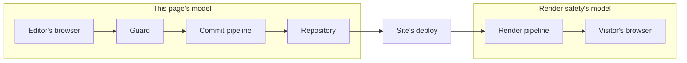

# Security model

How cairn authenticates an editor, protects `/admin` from forgery, and gates what a signed-in
session can reach. This covers the built-in owner/editor model that guards `/admin`; a second
audience's own login channel has its own contract, in [Auth channel security
model](./auth-channel-security-model.md).

## The threat model

The admin authors are a small, owner-curated allowlist of magic-link-authenticated people. Their
content never renders live directly; a save lands on a holding branch, and only a deliberate
publish, then the site's own deploy pipeline, puts anything in front of a visitor, so every change
carries a git audit trail. That shape is what the model below is built for: the realistic risk is
session and cookie handling, abuse of the unauthenticated magic-link request endpoint, and the cost
of a leaked commit credential, not an anonymous public attacker reaching content directly.

*The repository is the boundary between the two models. Everything up to it is this page's
subject; from there the site's own deploy hands off to the render pipeline, which [Render
safety](./render-safety.md) governs.*

## Sign-in: magic links, not passwords

An editor requests a sign-in link by email. cairn mints a single-use token, stores only its SHA-256
hash, and emails the raw token as a link. Consuming the link creates a session, stored the same way
(id, not the raw value the browser holds). The token lives ten minutes, the session thirty days,
and a repeat request from the same address is throttled to once a minute. All three are named
constants an adapter cannot loosen. There is no password anywhere in this path, and no third-party
identity provider; a sign-in proves only membership in the `editor` table.

The request path is deliberately non-enumerating: an address that isn't on the roster gets the
same `{ status: 'sent' }` response a real editor's address gets, so a stranger probing addresses
can't tell allowlist membership from the response alone. The one deliberate exception is the
cooldown above: a *repeat* request inside the one-minute window returns a distinct `throttled`
status, which does reveal that the address is on the roster. That's an accepted trade, made so a
real editor hammering the sign-in button doesn't flood their own inbox.

## The session cookie

The session cookie carries the `__Host-` prefix on every https deploy, which requires `Secure`
and `Path=/` and forbids `Domain`. The browser then ties the cookie to the exact origin that set
it, rather than to a `Domain` attribute a sibling host could also set. Local `http` development
drops the prefix, since `__Host-` requires `Secure` unconditionally and a dev cookie has no TLS to
set it with. The CSRF double-submit cookie follows the identical naming rule.

The CSRF cookie's full attribute set: `HttpOnly`, `Path=/`, `SameSite=Lax` set explicitly (never
by attribute omission, since an omitted `SameSite` gets a browser's own default treatment for a
short window right when a fresh cookie is most likely to be used), and a `Max-Age` matching the
session cookie's own thirty-day lifetime, so the pair lives and dies together. `Secure` derives
from the site's configured `PUBLIC_ORIGIN`, not from the request's own protocol, so a deployment
behind infrastructure the engine does not control still mints the cookie the browser expects; a
request to a local host (`localhost`, `127.0.0.1`, and their siblings) is the one exception,
always deriving from its own protocol so local `http` development never tries to mint a `__Host-`
cookie it cannot set. The token itself never rotates on a normal confirm-load re-issue; only its
`Max-Age` re-anchors, so a second open admin tab's already-rendered form field keeps matching the
cookie.

## CSRF: cairn owns it, not the framework

SvelteKit's default CSRF check compares the request's `Origin` header against the site's own
origin and rejects a mismatch. It is a single global switch, with no per-route exception. It also
rejects a request that carries no `Origin` header at all, which a privacy-hardened browser can
send on a legitimate same-origin form post. A site running cairn sets `csrf: { checkOrigin:
false }` to hand that authority to the guard instead. `checkOrigin` is deprecated as of SvelteKit
2.61 in favor of `csrf.trustedOrigins`, but stays supported across cairn's tested range. See
[Supported toolchain](../reference/supported-toolchain.md#the-checkorigin-deprecation). The guard
enforces a stronger, `Origin`-independent rule of its own: every unsafe `/admin` form POST must
carry a valid double-submit token, a random
value set in a cookie at page-load time and echoed back as a hidden field, compared in constant
time. A token match cannot be forged cross-site regardless of what headers the browser did or
didn't send. Outside `/admin`, the guard restores the framework's own `Origin` check the site
disabled, so turning off `checkOrigin` for the admin's sake never weakens CSRF protection anywhere
else in the site.

## The guard's request order

[`createAuthGuard()`](../reference/sveltekit.md#createauthguard) is the site's `handle` hook:
every request passes through it in this fixed order.

1. **Dev-backend tripwire.** Fails closed if a deployed runtime carries the local-only flag.
2. **Non-admin origin check.** Restores the `Origin` check described above.
3. **HTTPS help page.** An `/admin` path over plain `http` on a non-local host gets a help page
   instead of a doomed form post.
4. **Bindings check.** A missing `AUTH_DB` binding fails every admin path with a named
   condition, not a raw 500.
5. **CSRF check.** Accepts the double-submit field or a custom header, since the guard can't
   clone a raw-body upload to read a form field.
6. **Session resolve.** Attaches `locals.cairnEditor` and `locals.cairnAccess` for the route to
   read.

Every step that refuses a request logs a named [`guard.rejected`](../reference/log-events.md)
reason: `dev_backend_in_prod`, `origin`, `https`, `bindings`, `csrf`, so a sign-in failure is
diagnosable from the logs rather than guessed at. The exception is step 6: a missing or invalid
session redirects to `/admin/login` without logging.

## Roles, capability, and the access map

An editor's `role` (the string stored in D1) resolves to one of three capabilities, `none`,
`editor`, or `owner`, through the site's declared role vocabulary
([`defineRoles`](../reference/core.md#defineroles)); a zero-config site gets the built-in
owner/editor pair with no declaration needed. Capability alone gates the engine's own screens. A
site's own custom routes additionally consult an access map
([`defineAccess`](../reference/core.md#defineaccess)). The guard and the admin's nav rendering
share that one declaration, so a route a session cannot reach does not appear in the nav.
[`requireAccess`](../reference/sveltekit.md#requireaccess)'s own contract is stricter than the
built-in screens': with no map at all it refuses every session, owner included, since an explicit
call to a gate that found nothing to gate on is a configuration bug.

## Response hardening

Every admin response carries `X-Content-Type-Options: nosniff`, `X-Frame-Options: DENY`, a
`frame-ancestors 'none'` policy, `Referrer-Policy: no-referrer`, a `Permissions-Policy` that denies
camera, microphone, and geolocation, and `Strict-Transport-Security` (a site opts into pinning
sibling subdomains too). A rejection response, one that fires before the guard knows whether a site
opted into subdomain pinning, sends no HSTS header at all rather than a weaker one, since a browser
that receives any HSTS header from a host replaces its cached policy with what it just received.

`Referrer-Policy: no-referrer` here is deliberately scoped to `/admin`, never a site-wide default.
A consuming site must not serve `no-referrer` for every route (a blanket `Referrer-Policy:
no-referrer` in `src/hooks.server.ts` or `static/_headers`). Under the Fetch spec, that policy
strips the `Origin` header from a plain same-origin top-level form POST, so the request arrives as
`Origin: null`. `originMatches` (`src/lib/sveltekit/csrf.ts`) stays a strict equality compare on
purpose, since some routes outside `/admin` have no second CSRF layer to fall back on, so it
rejects that request rather than loosening for a policy it does not control. The result is a
403 for a non-admin form even though the visitor never left the site. `cairn-doctor`'s
`config.no-referrer-blanket` check flags this heuristically.

`no-referrer` is safe on `/admin` specifically because `/admin`'s CSRF protection is the
double-submit token above, not the origin compare: stripping the `Referer` costs that route
nothing. `no-referrer` is not a safe default to copy onto a route whose only CSRF layer is
`originMatches`, every `createAuthChannel` action and any other non-admin form, since stripping
`Origin` there is exactly what breaks it. The remedy is to serve
`strict-origin-when-cross-origin` (or `same-origin`) as the site's own default, and scope
`no-referrer` only to routes that, like `/admin`, carry their own double-submit token; leave
`same-origin` on any route that instead relies on the origin compare, since `same-origin` still
strips `Referer` cross-origin while keeping the real `Origin` on a same-origin POST.

## What's deliberately out of scope here

`/admin` carries no full Content-Security-Policy. The nonce machinery a correct CSP would need
threads through a site's own SvelteKit config, not the engine, and the threat it would add coverage
for, an allowlisted editor's own session attacking itself, is low value against content that is
already git-audited before it ever goes live. The XSS surface that matters, arbitrary visitor
content, is governed on the public render path instead; see [Render safety](./render-safety.md) for
that control.

## The commit credential

Publishing authenticates to GitHub as the site's own GitHub App, never as a personal account. The
private key lives as a single Worker secret, decoded and used to sign a short-lived installation
token per request; it is never written to disk in the deployed runtime and never logged. See
[Rotate the GitHub App key](./rotate-the-github-app-key.md) for replacing that key without a window
where the App can't authenticate, and [Auth crypto](../reference/auth-crypto.md) for the primitives
this model is built from, which a second audience's own login flow can reuse directly.
