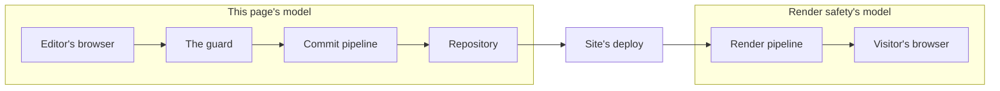

# Security model

How cairn authenticates an editor, protects `/admin` from forgery, and gates what a signed-in
session can reach. This covers the built-in owner/editor model that guards `/admin`; a second
audience's own login channel has its own contract, in [Auth channel security
model](./auth-channel-security-model.md).

## The threat model

The admin authors are a small, owner-curated allowlist of magic-link-authenticated people. Their
content never renders live directly; a save lands on a holding branch, and only a deliberate
publish, then the site's own deploy pipeline, puts anything in front of a visitor, so every change
carries a git audit trail. That shape is what the model below is built for: the realistic risk is
session and cookie handling, abuse of the unauthenticated magic-link request endpoint, and the cost
of a leaked commit credential, not an anonymous public attacker reaching content directly.

*This page's model spans an editor's browser, the guard, the commit pipeline, and the
repository. Render safety's model, on the right, spans deploy, the render pipeline, and a
visitor's browser; see [Render safety](./render-safety.md).*

## Sign-in: magic links, not passwords

An editor requests a sign-in link by email. cairn mints a single-use token, stores only its SHA-256
hash, and emails the raw token as a link; the link lives ten minutes. Consuming it creates a
session, stored the same way (id, not the raw value the browser holds). Both TTLs, and a
per-address send cooldown, are named constants an adapter cannot loosen: a magic-link token lives
ten minutes, a session thirty days, and a repeat request from the same address is throttled to once
a minute. There is no password anywhere in this path, and no third-party identity provider; the
allowlist itself, the `editor` table, is the whole authorization surface.

The request path is deliberately non-enumerating: an address that isn't on the roster gets the
same `{ status: 'sent' }` response a real editor's address gets, so a stranger probing addresses
can't tell allowlist membership from the response alone. The one deliberate exception is the
cooldown above: a *repeat* request inside the one-minute window returns a distinct `throttled`
status, which does reveal that the address is on the roster. That's an accepted trade, made so a
real editor hammering the sign-in button doesn't flood their own inbox, not an oversight.

## The session cookie

The session cookie carries the `__Host-` prefix on every https deploy: `Secure`, `Path=/`, no
`Domain`, which binds the browser's enforcement of the cookie to the exact origin rather than
trusting a `Domain` attribute nothing forges. Local `http` development drops the prefix, since
`__Host-` requires `Secure` unconditionally and a dev cookie has no TLS to set it with. The CSRF
double-submit cookie follows the identical naming rule.

## CSRF: cairn owns it, not the framework

SvelteKit's default CSRF check compares the request's `Origin` header against the site's own
origin and rejects a mismatch, but it is a single global switch with no per-route exception, and it
rejects a request that carries no `Origin` header at all, which a privacy-hardened browser can send
on an entirely legitimate same-origin form post. A site running cairn sets `csrf: { checkOrigin:
false }` to hand that authority to the guard instead. `checkOrigin` is deprecated as of SvelteKit
2.61 in favor of `csrf.trustedOrigins`, but stays supported across cairn's tested range. See
[Supported toolchain](../reference/supported-toolchain.md#the-checkorigin-deprecation). The guard
enforces a stronger, `Origin`-independent
rule of its own: every unsafe `/admin` form POST must carry a valid double-submit token, a random
value set in a cookie at page-load time and echoed back as a hidden field, compared in constant
time. A token match cannot be forged cross-site regardless of what headers the browser did or
didn't send. Outside `/admin`, the guard restores the framework's own `Origin` check the site
disabled, so turning off `checkOrigin` for the admin's sake never weakens CSRF protection anywhere
else in the site.

## The guard's request order

`createAuthGuard()` is the site's `handle` hook: every request passes through it in this fixed
order.

1. **Dev-backend tripwire.** Fails closed if a deployed runtime carries the local-only flag.
2. **Non-admin origin check.** Restores the `Origin` check described above.
3. **HTTPS help page.** An `/admin` path over plain `http` on a non-local host gets a help page.
4. **Bindings check.** A missing `AUTH_DB` binding fails every admin path with a named
   condition, not a raw 500.
5. **CSRF check.** Accepts the double-submit field or a custom header, since a raw-body upload
   can't clone its body to read a form field.
6. **Session resolve.** Attaches `locals.cairnEditor` and `locals.cairnAccess` for the route to
   read.

Every step that refuses a request logs a named [`guard.rejected`](../reference/log-events.md)
reason: `dev_backend_in_prod`, `origin`, `https`, `bindings`, `csrf`. The exception is step 6: a
missing or invalid session redirects to `/admin/login` without logging.

## Roles, capability, and the access map

An editor's `role` (the string stored in D1) resolves to one of three capabilities, `none`,
`editor`, or `owner`, through the site's declared role vocabulary (`defineRoles`); a zero-config
site gets the built-in owner/editor pair with no declaration needed. Capability alone gates the
engine's own screens. A site's own custom routes additionally read an access map (`defineAccess`),
one declaration the guard and the admin's nav rendering both read, so a route a session can't reach
never appears as a link it can't use. `requireAccess`'s own contract is stricter than the built-in
screens': with no map at all it refuses every session, owner included, since an explicit call to a
gate that found nothing to gate on is a configuration bug, not an open door.

## Response hardening

Every admin response carries `X-Content-Type-Options: nosniff`, `X-Frame-Options: DENY`, a
`frame-ancestors 'none'` policy, `Referrer-Policy: no-referrer`, a `Permissions-Policy` that denies
camera, microphone, and geolocation, and `Strict-Transport-Security` (a site opts into pinning
sibling subdomains too). A rejection response, one that fires before the guard knows whether a site
opted into subdomain pinning, sends no HSTS header at all rather than a weaker one, since a browser
that receives any HSTS header from a host replaces its cached policy with what it just received.

## What's deliberately out of scope here

`/admin` carries no full Content-Security-Policy. The nonce machinery a correct CSP would need
threads through a site's own SvelteKit config, not the engine, and the threat it would add coverage
for, an allowlisted editor's own session attacking itself, is low value against content that is
already git-audited before it ever goes live. The XSS surface that matters, arbitrary visitor
content, is governed on the public render path instead; see [Render safety](./render-safety.md) for
that control.

## The commit credential

Publishing authenticates to GitHub as the site's own GitHub App, never as a personal account. The
private key lives as a single Worker secret, decoded and used to sign a short-lived installation
token per request; it is never written to disk in the deployed runtime and never logged. See
[Rotate the GitHub App key](./rotate-the-github-app-key.md) for replacing that key without a window
where the App can't authenticate, and [Auth crypto](../reference/auth-crypto.md) for the primitives
this model is built from, which a second audience's own login flow can reuse directly.
