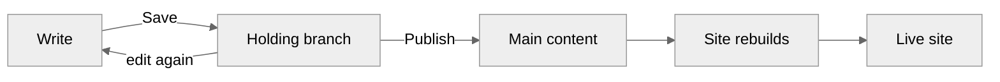

# Publish and discard

Every entry moves through the same cycle. You write, you save privately as often as you like, and at some point you decide the words are ready and publish them. Cairn keeps saving and publishing as two separate acts on purpose, so an unfinished paragraph never reaches a reader by accident. This guide walks through each step of that cycle, what an entry's status tells you, and what to do when a save or a publish doesn't go through.

- [Save privately](#save-privately)
- [Publish puts your draft on the live site](#publish-puts-your-draft-on-the-live-site)
- [What each status means](#what-each-status-means)
- [Discard unpublished changes](#discard-unpublished-changes)
- [Delete an entry](#delete-an-entry)
- [Publish the whole site at once](#publish-the-whole-site-at-once)
- [When cairn refuses a save or publish](#when-cairn-refuses-a-save-or-publish)

## Save privately

Save (`Ctrl S`, or the Save button in the header) stores your draft the moment you take it. Nothing about a save touches the live site. Readers keep seeing whatever was last published, no matter what your draft says or how far along it is. You can save a draft, come back and rework it a week later, and save again, and none of that reaches a reader until you publish. It isn't fully private, though: a colleague who opens the same entry sees your saved draft too, which is how two people can end up working the same entry at once.

Every save lands on the entry's own **holding branch**, a private line of history that exists only for that one entry (`cairn/<concept>/<id>`, if you ever see the name in a log or a GitHub notification). The first save on a new entry creates the branch. Every save after that adds to it. Once an entry exists, the Save button disables itself the moment your draft has nothing new to store.

A saved draft carries two kinds of advisory. Cairn refuses the save when a body link points at an entry that isn't on the live site yet (including one you've created but never published). It saves with a warning when the link points at a published-but-Hidden entry, which resolves once you un-hide it. If a reference field points at an entry that's missing or still a draft, the save warns the same way.

## Publish puts your draft on the live site

Publish (`Ctrl Shift S`, or the Publish button beside Save) is the deliberate step that changes what a reader sees. It publishes exactly what's on your screen at that moment, including anything typed since your last save, so there's never a mismatch between the preview you checked and the page that goes live. The Publish button appears only on an entry that has unpublished changes waiting.

Publishing copies your draft from its holding branch onto the site's main line of content:

You can loop through writing and saving as many times as you want. Each pass adds to the same holding branch, and nothing reaches readers. Publishing is the only step that leaves that loop; everything else keeps the work private. Once it lands on the site's main content, your site's deploy process picks up the change and rebuilds, which is why a newly published page takes a short moment to appear rather than updating instantly.

## What each status means

Every entry list shows a status badge, and the three values track exactly where an entry sits in that cycle.

| Status | What it means |
| --- | --- |
| **New** | Saved at least once, never published. It exists only on its holding branch. |
| **Edited** | Published before, and carrying unpublished changes now. Readers still see the older, published version. |
| **Published** | Live exactly as written. Nothing is waiting. |

The list's Pending edits filter gathers New and Edited together. That's the useful view when you're checking what still needs a decision. The Published filter shows the rest, and a separate Hidden toggle narrows to entries kept off the site's public lists, its own setting that can apply to an entry in any of the three statuses.

## Discard unpublished changes

Discard, in the entry's overflow menu, throws away what a holding branch is carrying, without asking whether you meant to publish it eventually. It's for the draft you've thought better of.

What discard leaves behind depends on whether the entry has ever gone live. On an entry that's Edited, discarding removes the unpublished changes, and the published version keeps standing exactly as it was: nothing a reader sees changes. On an entry that's New, there's no published version to fall back to, so discarding removes the entry entirely. The confirmation dialog names which of the two applies before you commit.

## Delete an entry

Delete, also in the overflow menu, removes the entry entirely: the published page, if there is one, and any unpublished changes waiting alongside it. Confirming asks once. On a published entry, the confirmation notes the delete can't be undone. On an entry that was never published, deleting it works exactly like discarding it.

Before it deletes anything, cairn checks whether another entry links to this one or references it in a typed field. When one does, cairn refuses the delete rather than let a link break silently. The confirmation lists exactly which entries point here, each one a link straight to its own editor, so you can remove or repoint those links first and delete again once nothing depends on this entry anymore.

## Publish the whole site at once

When more than one entry is waiting to go live, the admin's header carries a **Publish site** button naming the count, reachable from anywhere in the admin. It confirms with the full list of what's about to publish, grouped by concept, and then publishes everything in that list in one step. It's the fast path for a batch of edits several people made across the week, rather than opening each entry to publish it on its own.

## When cairn refuses a save or publish

Two editors can end up working the same entry at once, and cairn's rule is that neither one's words silently overwrite the other's. When the entry changed on GitHub after you opened it, most often because a colleague saved or published it while you were still writing, cairn refuses your save or publish rather than merge it by guesswork.

A refused save tells you the file changed since you opened it. The entry reloads automatically, showing your colleague's version and an explanation of what happened; your unsaved typing isn't kept, so reapply your changes onto the reloaded version before saving again.

A refused publish costs you less: your edits already reached the holding branch before the publish step failed. Reload the entry to confirm what's there, then publish again.
