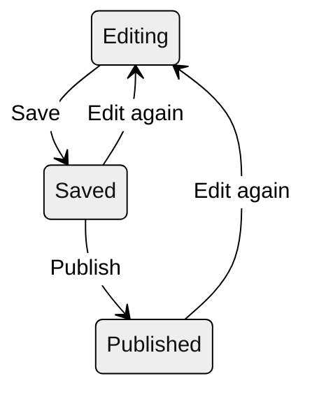

# Write in the editor

This is the complete reference for cairn's writing environment: every markdown element the editor understands, every mode and shortcut, the component system, and the path from draft to published page. It's meant to be consulted rather than read straight through; the table of contents below jumps anywhere. If you're new to cairn, [Welcome, editors](./editor-welcome.md) is the shorter orientation, and this page picks up where it leaves off.

- [The editor at a glance](#the-editor-at-a-glance)
- [Find and create entries](#find-and-create-entries)
- [Write markdown](#write-markdown)
- [Postures and modes](#postures-and-modes)
- [Components](#components)
- [Images and the media library](#images-and-the-media-library)
- [Tags](#tags)
- [Checks as you type](#checks-as-you-type)
- [Tidy](#tidy)
- [Keyboard shortcuts](#keyboard-shortcuts)
- [The details panel](#the-details-panel)
- [Save, review, and publish](#save-review-and-publish)
- [When something looks wrong](#when-something-looks-wrong)

## The editor at a glance {#the-editor-at-a-glance}

Opening an entry puts the title at the top, always visible, with the writing surface below it and a toolbar above the text. The toolbar's tabs switch between Write and Preview, and the details panel (the entry's date, address, tags, and other metadata) opens from the toolbar or with `Ctrl .`. Everything else stays out of the way until you ask for it.

<!-- LIVE-UI: the editor's zones, reproduced with the real components once the docs render through cairn -->

The editor keeps its own quick reference: `Ctrl /` opens a cheat-sheet of the markdown marks and the keyboard shortcuts without leaving your draft. This page is the long version of that sheet.

## Find and create entries {#find-and-create-entries}

The admin's front page lists your entries by kind, posts and pages each in their own list. Every row shows where that entry stands: **Published** means the live site carries it, **Edited** means it's published but has unpublished changes waiting, and **New** means it has never been published at all. A filter above the list narrows it to the entries that need attention, which is worth knowing on a site where drafts accumulate.

Creating an entry starts from the list: the New row at the foot of each list opens a dialog asking for a title. The address (the entry's URL) derives from the title as you type, and you can adjust it before creating; after that, the address lives in the details panel and changes only when you deliberately change it. Which list you start from decides what you're creating, and the difference between posts and pages is covered in [Welcome, editors](./editor-welcome.md#posts-and-pages).

## Write markdown {#write-markdown}

The reference below covers every mark the editor understands. Each example shows what you type; the preview, and the published page, show the result in your site's own styling. The toolbar enters any of these marks for you, so none of them need memorizing.

### Emphasis {#emphasis}

| You see | You type | Shortcut |
| --- | --- | --- |
| **Bold** | `**bold**` | `Ctrl B` |
| *Italic* | `*italic*` | `Ctrl I` |
| ~~Strikethrough~~ | `~~strikethrough~~` | toolbar |
| `Inline code` | `` `inline code` `` | `Ctrl E` |

Emphasis nests: `**bold with *italic* inside**` renders as **bold with *italic* inside**.

### Headings and paragraphs {#headings-and-paragraphs}

A line beginning with `#` marks is a heading, and the number of marks is the level:

```md
## A section heading

### A smaller one beneath it
```

`Ctrl Alt 2` makes the current line a heading, and `Ctrl Alt 3` a smaller one. Your entry's title is its own field above the draft, so headings inside the text usually start at the second level. A blank line starts a new paragraph; a line break without a blank line stays inside the same paragraph.

### Lists {#lists}

```md
- A bulleted list is lines that begin with a dash.
- Pressing Enter at the end of an item continues the list.

1. A numbered list begins with numbers.
2. The numbering corrects itself when items move.

- [ ] A task list adds brackets.
- [x] An x marks a finished task.
```

Lists nest by indenting an item beneath its parent. `Ctrl Shift 8` starts a bulleted list and `Ctrl Shift 7` a numbered one, and pressing Enter on an empty item ends the list.

### Quotes and horizontal rules {#quotes-and-rules}

```md
> A quotation is a line beginning with an angle bracket, and it can
> run as many lines as the quotation needs.
```

`Ctrl Shift 9` makes the current line a quotation. A horizontal rule (a line of three dashes, `---`, on its own line) draws a divider; it's in the toolbar's overflow menu.

### Links {#links}

An external link is a bracketed phrase followed by its address: `[the club's history](https://example.org/history)`. Select a phrase and press `Ctrl K`, and the editor writes the brackets and asks for the destination—which can be a web address or one of your site's own entries, picked from a list.

Internal links have a shorter form as well: `[[page-name]]` links to another entry by its name, and the site resolves it to the right address even if that entry's URL later changes. This is the more durable way to link your own pages.

### Code {#code}

Inline code takes backticks (`` `like this` ``, or `Ctrl E`). A code block takes a fence:

````md
```
Anything between the fences renders exactly as typed,
in a monospaced block.
```
````

The fence is in the toolbar's overflow menu.

### Tables {#tables}

```md
| Boat    | Skipper | Finish |
| ------- | ------- | ------ |
| Osprey  | Alvarez | 1st    |
| Kestrel | Chen    | 2nd    |
```

The pipes mark columns and the dashed row separates the header. The toolbar's table button inserts a starter table to fill in, which is easier than typing the pipes by hand. Alignment and spacing inside the source don't need to be tidy; the rendered table is.

### Footnotes {#footnotes}

```md
The race was decided on handicap.[^1]

[^1]: Under the club's 2025 rating table.
```

A footnote mark is a caret in brackets, and its text lives on its own line anywhere in the draft; the rendered page collects footnotes at the bottom and links them both ways. Bare web addresses also link themselves without any marks.

### Escaping {#escaping}

To show a mark literally instead of formatting with it, put a backslash before it: `\*not italic\*` renders as \*not italic\*.

## Postures and modes {#postures-and-modes}

The writing surface has two postures. **Prose**, the default, sets your text at a comfortable reading measure with generous type, the right surface for writing. **Markup** shows the same text denser and closer to the raw marks, which is the better view for reworking tables, long link lists, or anything where you want to see more structure at once. One click on the toolbar switches them, and nothing about the text changes—only how it's set.

**Write and Preview** are the toolbar's two tabs (`Ctrl Alt P` switches them). Preview renders your draft through the site's own machinery, so what you see is the page as readers will see it. While Preview is up, a width selector shows the page at desktop, tablet, phone, and small-phone sizes, which answers the "how does this look on a phone" question without a phone.

Three modes shape the writing itself, and all of them are optional. **Focus mode** (`Ctrl Shift F`) dims every paragraph except the one you're working in. **Typewriter scrolling** keeps your current line vertically centered, so your eyes stay in one place while the page moves. **Zen** (`Ctrl Shift .`) clears everything but your words. None of these change the text.

**Folding** collapses a component block to a single line from the marker in its margin (`Ctrl Shift [` and `]` fold and unfold from the keyboard), which keeps a long draft readable. A folded block unfolds itself the moment your typing or cursor touches it, so hidden text can never be edited unseen.

## Components {#components}

Components are the blocks that go beyond prose: callouts, video, pull quotes, and whatever else your site defines. They're also the one place the editor shows you something that looks less like writing and more like structure, so this section takes them slowly. The short version: the insert menu builds every block for you through a guided form with a live preview, and you never have to write one by hand.

### How a block works {#how-a-block-works}

A component block is ordinary text with a frame around it, and reading one part by part takes the mystery out:

```md
:::callout[Bring a life jacket]{tone="tip"}
The club has loaners at the boathouse, but the ones that fit
best are the ones you own.
:::
```

The first line is the frame's opening: three colons, the component's name, its title in square brackets, and its settings in braces. The last line, three colons alone, closes the frame. Everything between them is the block's body, and the body is ordinary markdown — write in it, emphasize in it, link from it, exactly as anywhere else on the page.

The frame and the body live by different rules. The body is yours to edit freely, as much and as often as you like. The frame is structural: the colons, the name, and the braces are how the site recognizes the block, so they're best left exactly as the insert menu wrote them. To change a title or a setting, edit the block through its form rather than retyping the frame: the same guided dialog that created it reopens on it, and the markup rewrites itself correctly.

If a frame does get damaged anyway (a deleted closing line, a mangled brace), nothing is lost. Your words are all still in the draft as plain text; the block stops appearing in its styled form, which is how you'll notice, and the repair is to rebuild the frame with the insert menu and move the body back inside. A block also folds down to a single line from the marker in its margin when you want it out of the way while writing, and a folded block unfolds itself the moment your cursor touches it.

### The starter set {#the-starter-set}

Which components exist is your site's decision, not cairn's. The set below is the typical starter library a cairn site begins with; yours may differ, and if the library doesn't meet your needs, a new component is exactly the kind of thing your site's developer can build. It will appear in the same insert menu beside the others.

### Callout {#callout}

A titled box that sets a passage apart from the flow, with a tone (note, tip, or warning) that controls its look:

```md
:::callout[Bring a life jacket]{tone="tip"}
The club has loaners at the boathouse, but the ones that fit
best are the ones you own.
:::
```

### Alert {#alert}

A stronger sibling of the callout for the things a reader must not miss—a cancellation, a safety notice. Same shape, more visual weight.

### Icon {#icon}

A small inline glyph from your site's declared icon set, for the places a symbol reads faster than a word. The insert form lists the available icons by name.

### Video {#video}

A video block takes a YouTube or Vimeo address and a title, and renders a styled link card. The page itself makes no request to the video platform; readers who want the video follow the card.

### Pull quote {#pull-quote}

A sentence lifted from the text and set large, with an optional attribution—the magazine device, for the line that deserves it.

### CTA {#cta}

A prominent link button (a label and a destination), for the page whose point is that the reader does something: register, join, donate.

### FAQ {#faq}

A question that opens to its answer when the reader clicks. The answer is ordinary markdown, so it can carry emphasis, links, and lists.

### Banner {#banner}

A time-limited announcement with an expiry date. It shows until the date passes and then hides itself, so a "registration closes Friday" notice never lingers into stale embarrassment.

## Images and the media library {#images-and-the-media-library}

Inserting an image opens the media library: choose an existing picture or upload a new one, and the editor places it in your draft as a figure, with a spot for a caption beneath it. Figures are built into cairn itself, so an image with its caption is one coherent block in the draft and one styled figure on the page.

Every image asks for a short written description (alt text). Readers who use a screen reader hear that description in place of the picture, and writing a good one is part of the craft: the test is whether the description carries what the picture contributes in context. "Two dinghies rounding the windward mark in light air" serves a racing story; "sailboats on a lake" does not. The editor marks images that still need a description, including an entry's hero image in the details panel.

The library is shared across the whole site. A photograph uploaded for one post is available to every page, replacing an image in the library updates it everywhere it appears, and the library screen shows where each image is used before you delete or replace anything.

## Tags {#tags}

Tagging a post means picking from your site's shared tag list, in the details panel. The list is maintained in the admin, deliberately: one vocabulary keeps the site's archive pages and topic feeds coherent as different people write over the years. If a tag you need is missing, the list can be extended; if an old post carries a tag that has since been retired, the editor flags it as no longer in your tag list, checked and removable, so you can decide what to do with it.

## Checks as you type {#checks-as-you-type}

The editor underlines two kinds of issue as you write, both in the same quiet amber.

**Spelling.** The spellchecker runs locally in the editor with your site's dialect. Clicking an underlined word opens a small popover with up to five suggestions, plus two other choices: **Add to dictionary**, which teaches the word to the whole site so it stays accepted for every writer from then on, and **Ignore**. Names, jargon, and terms of art belong in the dictionary; the first writer to add one spares everyone after.

**Mechanical slips.** Alongside spelling, the editor catches a small set of objective mistakes—a doubled word ("the the"), a double space, repeated punctuation—each with a one-click fix in the same popover. These checks are deliberately mechanical: there is no style or grammar opinion in them, and nothing about your phrasing is ever flagged. Style belongs to you (and, if your site enables it, to [tidy's](#tidy) suggestions, which you accept or reject).

A count of open issues sits at the edge of the editor, and `F8` and `Shift F8` step through them, which is the fast way to sweep a long draft before publishing.

## Tidy {#tidy}

Tidy is the optional AI copy-edit, and its remit—small fixes only, your voice untouched—is covered in [Welcome, editors](./editor-welcome.md#tidy-if-your-site-has-it). This section is the working procedure.

Run it over the whole draft, or select a passage first to tidy just that part. Tidy reads the text and comes back with its proposed edits shown in place, each one marked in your draft where it would apply. Then the review is yours:

1. Step through the proposals and **accept** or **reject** each one individually.
2. **Accept fixes** takes all the objective corrections (spelling-grade fixes) in one move, leaving the judgment calls for you.
3. **Reject all** clears the whole round.
4. An accepted round lands as a single change, so one undo takes the whole tidy back.

While a review is open the draft is read-only, the same way Preview is, so proposals can't tangle with new typing. Sometimes tidy returns with nothing to fix and says so without opening a review. Your text is never changed by anything you didn't accept.

## Keyboard shortcuts {#keyboard-shortcuts}

The tables below are the complete set. They're conveniences: typing markdown always works, and the keys are never requirements.

**Formatting**

| Action | Shortcut |
| --- | --- |
| Bold | `Ctrl B` |
| Italic | `Ctrl I` |
| Inline code | `Ctrl E` |
| Web link | `Ctrl K` |
| Heading / smaller heading | `Ctrl Alt 2` / `Ctrl Alt 3` |
| Bulleted / numbered list | `Ctrl Shift 8` / `Ctrl Shift 7` |
| Quote | `Ctrl Shift 9` |
| Continue list or quote | `Enter` |

**Editor and document**

| Action | Shortcut |
| --- | --- |
| Save | `Ctrl S` |
| Publish | `Ctrl Shift S` |
| Details panel | `Ctrl .` |
| Write / Preview | `Ctrl Alt P` |
| Cheat-sheet (this sheet) | `Ctrl /` |
| Command palette | `Ctrl K` (outside the editor) |

**Modes and navigation**

| Action | Shortcut |
| --- | --- |
| Zen | `Ctrl Shift .` |
| Focus mode | `Ctrl Shift F` |
| Fold / unfold block | `Ctrl Shift [` / `Ctrl Shift ]` |
| Next / previous issue | `F8` / `Shift F8` |

## The details panel {#the-details-panel}

`Ctrl .` (or the toolbar) opens the entry's metadata, grouped into Details, Visibility, and Address.

| Field | What it does |
| --- | --- |
| Date | A post's date, which orders the archives and appears wherever the site shows it. |
| Description | A short summary some sites show in lists and search results. |
| Hero image | The entry's leading image, chosen from the media library, with its own alt text. |
| Tags | The vocabulary picker described [above](#tags). |
| Hidden | Keeps a published entry off the site's lists while its address still works. |
| Address | The entry's URL. Change URL is deliberate and separate, because addresses are promises readers bookmark. |

Your site's schema can add fields of its own to this panel; they behave the same way, and they're saved with everything else.

## Save, review, and publish {#save-review-and-publish}

A draft moves through three states, and the moves between them are always yours:



**Save** (`Ctrl S`) commits your work privately. A saved draft persists indefinitely, readers never see it, and every save is kept, so no version of your work is ever lost. **Publish** (`Ctrl Shift S`) is the deliberate step that puts the entry on the live site—and it publishes exactly what the preview shows, nothing more or older. Editing a published entry starts the cycle again: your changes wait privately (the entry shows **Edited** in the list) until the next publish.

A draft you've thought better of can be **discarded**, which throws away the unpublished changes and leaves the published page exactly as it was. **Delete**, in the entry's overflow menu, removes the entry itself, and asks first. And if someone else edited the same entry while you were writing, cairn refuses to save over their work rather than merging by guesswork; neither of you can lose words to the other.

## When something looks wrong {#when-something-looks-wrong}

The [welcome page's closing section](./editor-welcome.md#when-something-looks-wrong) covers the ordinary oddities and how to report the rest; the short version is that your site's administrator is the first call, a useful report names the page and what you saw, and everything you publish is kept in the site's history, so nothing here is expensive to undo.
