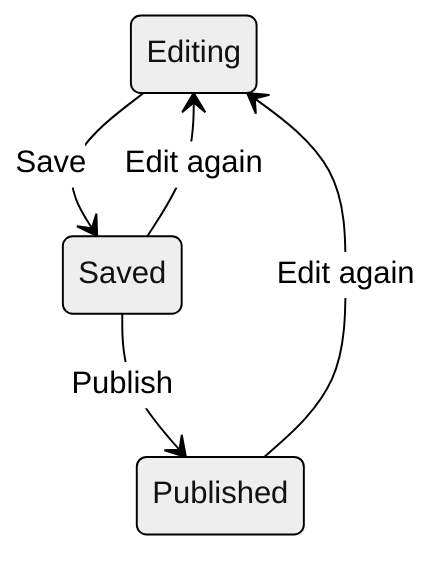

# Write in the editor

Everything your site publishes is written in cairn's editor. The heart of the matter is markdown, the small set of punctuation marks that shape plain text into formatted pages, and this guide covers every mark the editor understands. It also covers components (the framed blocks that carry more than prose), the editor's writing surfaces and modes, the checks that run while you type, and the path a draft travels from private work to published page. None of it assumes prior experience.

Two working notes first. Nothing you try can hurt the live site, because a draft stays private until you deliberately publish it, so the best way through this guide is with the editor open, trying things as you go. And there is no need to read everything before writing: the table of contents jumps to any one question, and if a ten-minute orientation would serve you better first, that's [Welcome, editors](./editor-welcome.md).

- [The editor at a glance](#the-editor-at-a-glance)
- [Find and create entries](#find-and-create-entries)
- [Write markdown](#write-markdown)
- [Postures and modes](#postures-and-modes)
- [Components](#components)
- [Images and the media library](#images-and-the-media-library)
- [Tags](#tags)
- [Checks as you type](#checks-as-you-type)
- [Tidy](#tidy)
- [Keyboard shortcuts](#keyboard-shortcuts)
- [The details panel](#the-details-panel)
- [Save, review, and publish](#save-review-and-publish)
- [When something looks wrong](#when-something-looks-wrong)

## The editor at a glance

Open any entry and the layout is the same. The title sits at the top and stays visible while you scroll. Below it is the writing surface, where the whole draft lives as one continuous text. Above the surface, a toolbar carries the formatting buttons, the insert menu, and two tabs: Write, where you work, and Preview, which shows the draft as the published page. The details panel, which holds the entry's date, address, tags, and other information about the entry rather than in it, opens from the toolbar or with `Ctrl .` and stays out of your way otherwise.

<!-- LIVE-UI: the editor's zones, reproduced with the real components once the docs render through cairn -->

`Ctrl /` opens the editor's built-in cheat-sheet, a compact list of every mark and shortcut, so the answer to "how do I make a heading again" never requires leaving your draft. And as you type, the editor marks spelling and mechanical slips with a quiet amber underline; the [Checks](#checks-as-you-type) section covers how to act on them.

## Find and create entries

<!-- LIVE-UI: the entry list with New, Edited, and Published rows visible -->

The admin's front page is the inventory of everything the site has: posts in one list, pages in another, and any other kinds your site defines in their own. Each row shows the entry's title, a short excerpt, and a status. **Published** means the live site carries it. An entry marked **Edited** is published too, but has changes waiting that readers haven't seen. **New** entries have never been published at all and exist only as drafts. When the lists grow long, a filter narrows them to the entries that need attention, meaning anything not simply published and current.

To create an entry, use the New row at the foot of the list you want it in. Which list matters: a post is dated writing that flows into the site's archives, and a page is the standing kind, a distinction [Welcome, editors](./editor-welcome.md#posts-and-pages) covers if it's unfamiliar. The dialog asks for a title, and as you type it, an address for the entry (its URL) takes shape beneath, derived from the title. You can adjust the address before creating. Afterward it lives in the [details panel](#the-details-panel) and never changes on its own, no matter how the title changes, because a published address is something readers bookmark and other sites link to.

## Write markdown

Writing in cairn is writing plain text, plus a small set of punctuation marks that tell the site what a piece of text is: a heading, an emphasis, a list, a link. The marks are the markdown convention, and they were chosen to look like what they mean, so a marked-up draft reads naturally even before anything renders it. You don't need to learn them before you start. The toolbar enters every one of them for you, the cheat-sheet (`Ctrl /`) lists them, and most writers find they've absorbed the few they use within a day or two.

The marks record what a piece of text *is*, and the site's design decides how it *looks*. You never choose a font, a size, or a color; those belong to the site's design, which is set once and applied to every page. So everything you write comes out looking like the rest of your site.

Pasting text from Word, Google Docs, or a web page carries its formatting across automatically: headings, bold and italic emphasis, links, and bulleted or numbered lists all arrive as the matching marks, no re-marking needed. Anything the marks don't cover, a table, an image, a color, a font, comes across as its plain words, so a paste never leaves behind markup the toolbar can't also produce. Pasting an image works too: the editor offers to add it to the media library on the spot. And a practical note on hardware: the editor is designed for a desktop or laptop browser, where a keyboard and a full-width page do the writing justice.

The sections below cover every mark the editor understands, one at a time, each with an example of what you type. The preview shows what renders.

### Emphasis

| You see | You type | Shortcut |
| --- | --- | --- |
| **Bold** | `**bold**` | `Ctrl B` |
| *Italic* | `*italic*` | `Ctrl I` |
| ~~Strikethrough~~ | `~~strikethrough~~` | toolbar |
| `Inline code` | `` `inline code` `` | `Ctrl E` |

Select some text and press the shortcut, and the marks wrap the selection; press it again to unwrap. With nothing selected, the shortcut inserts the marks and puts your cursor between them, ready to type. (The italic shortcut writes `_italic_`, an equivalent mark that renders identically.) Emphasis nests, so `**bold with *italic* inside**` gives you **bold with *italic* inside**.

Strikethrough shows text as deleted without deleting it, which is occasionally the right tool for a correction you want readers to see. Inline code sets a short run of text in a monospaced face, exactly as typed; writers outside technical subjects rarely need it.

### Headings and paragraphs

A heading is a line that starts with `#` marks and a space, and the number of marks sets the level: more marks, smaller heading.

```md
## A section heading

### A smaller one beneath it

The text of the section continues as ordinary paragraphs.
```

Your entry's title is its own field above the draft, so it takes the top level for you; headings inside the text normally start at the second level (`##`) and step down one level at a time. Keeping the levels in order matters more than it looks: readers who navigate by screen reader move through a page by its heading structure, and a skipped level leaves a gap a screen-reader user has no way around.

`Ctrl Alt 2` makes the current line a heading and `Ctrl Alt 3` a smaller one. For paragraphs, the rule is short: a blank line starts a new paragraph, and without the blank line, the text runs on in the same one.

### Lists

The editor supports three kinds of list: bulleted, numbered, and task lists.

A bulleted list is a set of lines that each start with a dash and a space. Leave a blank line between the list and the paragraph before it.

```md
Pack for the water:

- a life jacket
- dry clothes in a dry bag
- water and lunch
```

A numbered list starts each line with a number and a period. The numbers don't have to be in order in your draft, because the published list numbers itself. If you add an item in the middle, the numbering comes out right without any retyping.

A task list puts square brackets after the dash. `- [ ]` is an open item; `- [x]` marks it done. On the published page these show as checkboxes, for display only.

You can nest lists by indenting an item under its parent, and you can put bulleted items under numbered ones or the other way around.

```md
1. Rig the boat
   - sail battens first
   - then the halyard
2. Launch
```

Pressing Enter at the end of an item starts the next one. Press it again on an empty item to end the list. `Ctrl Shift 8` makes the current line a bulleted item and `Ctrl Shift 7` a numbered one, and both are on the toolbar.

### Quotes

A quotation is set apart from your own text by an angle bracket at the start of each line:

```md
> The forecast called for ten knots from the south.
> What we got was another matter.
```

Consecutive quoted lines render as one quotation block, and pressing Enter inside a quote continues it, the way lists continue. `Ctrl Shift 9` makes the current line a quote. For a quotation you want set large and displayed, rather than run in the flow of the text, see the [pull quote component](#pull-quote); the angle-bracket quote is for quoting within your prose.

### Horizontal rules

Three dashes alone on a line, with blank lines around them, draw a divider across the page:

```md
---
```

A rule marks a change of scene mid-page, and most writing never needs one. It's in the toolbar's overflow menu.

### Links

A link is a bracketed phrase followed by an address in parentheses:

```md
Results are posted on [the racing page](https://example.org/racing).
```

The bracketed phrase is what readers see and click, so make it say where the link goes. "The racing page" tells a reader what they'll get; "click here" tells them nothing, and readers using a screen reader often hear a page's links as a bare list, where "click here" is useless. The easiest way to make an external link is to select the phrase and press `Ctrl K`, and the editor writes the brackets and asks for the address.

Links to your own site's entries work differently. Type `[[` and start typing a name, and a picker of your entries opens; choose one, and the editor inserts a link addressed to the entry itself rather than to a URL. That kind of link keeps working even if the entry's address changes later. The toolbar's link-to-page button opens the same picker.

Bare web addresses also turn into links on their own—paste `https://example.org` into your text and it renders clickable—though a written-out address is rarely as readable as a phrase.

### Code

Inline code, covered under [Emphasis](#emphasis), sets a few words in monospace. For several lines, a fence does the same for a whole block:

````md
```
Anything between the fences renders exactly as typed,
in a monospaced block.
```
````

Both are tools for technical writing—commands, file names, fragments of markup—and if your site's subject isn't technical, you may never touch them. The fence is in the toolbar's overflow menu.

### Tables

A table is drawn with pipes for columns and a row of dashes under the header:

```md
| Boat    | Skipper | Finish |
| ------- | ------- | ------ |
| Osprey  | Alvarez | 1st    |
| Kestrel | Chen    | 2nd    |
```

The alignment in your draft doesn't have to be neat, because the rendered table aligns itself; the pipes only have to be present. Even so, hand-drawing one is tedious, and the toolbar's table button inserts a starter table for you to fill in. For working on a table that's already large, the [Wide posture](#postures-and-modes) shows the text denser, which makes the columns easier to track.

Tables are for tabular information. Results, schedules, and comparisons are typical uses. They are the wrong tool for laying out a page visually, and the site's design will not style them for that.

### Footnotes

A footnote is a caret and a label in brackets, with the note's text on its own line anywhere in the draft:

```md
The race was decided on handicap.[^1]

[^1]: Under the club's 2025 rating table.
```

The published page gathers all the notes at the bottom in order, links each mark to its note and back again. Where you keep the note lines in the draft is up to you; directly under the paragraph that references them is the easiest to maintain.

### Escaping

Occasionally you want a mark to be just a character: an asterisk that means multiplication, a literal dash at the start of a line that isn't a list. A backslash before the character takes away its meaning, so `\*not italic\*` renders as \*not italic\*, asterisks and all.

## Postures and modes

How you want the writing surface to look changes with the task. Drafting goes best with comfortable type and an uncluttered screen. Reworking a table is easier when the text is packed tightly, so the columns line up. For a final read you want to see the page the way a reader will. The editor gives you postures and modes for all of this. They are optional, and none of them changes your text.

The writing surface has two postures. **Prose**, the default, sets your text at a comfortable reading measure with generous type, and it's where most writing happens. **Wide** shows the same text denser and closer to the raw marks, which earns its keep on tables, long link lists, and structural cleanup. One toolbar click switches them.

**Write and Preview** are the toolbar's two tabs, and `Ctrl Alt P` flips between them. Preview isn't an approximation: it renders your draft through the site's own machinery, typography and all, so what you see is the page as readers get it. While Preview is up, a width selector shows the page at desktop, tablet, phone, and small-phone sizes, so you can check the phone layout without a phone.

Three modes shape the writing itself. **Focus mode** (`Ctrl Shift F`) dims every paragraph except the one you're working in, which quiets a long draft down to the sentence at hand. **Typewriter scrolling** keeps your current line vertically centered, so your eyes stay in one place while the page moves under them; it's a toolbar toggle. **Zen** (`Ctrl Shift .`) clears away everything except your words, and pairs naturally with either of the other two.

**Folding** belongs to [component blocks](#components): a block collapses to a single line from the marker in its margin (`Ctrl Shift [` folds, `Ctrl Shift ]` unfolds), which keeps a block-heavy draft readable. Every component block starts folded when you open an entry, so a long draft reads as prose first. Unfold the ones you want to work in. A folded block unfolds itself the moment your typing or cursor touches it, so text can never be edited while hidden.

## Components

Components are the blocks that go beyond prose: callouts, video, pull quotes, and whatever else your site defines. They're also the one place the editor shows you something that looks less like writing and more like structure, so this section takes them slowly. The short version: the insert menu builds every block for you through a guided form with a live preview, and you never have to write one by hand.

<!-- LIVE-UI: the insert form beside its live preview, mid-composition -->

### How a block works

A component block is ordinary text with a frame around it, and reading one part by part takes the mystery out:

```md
:::callout[Bring a life jacket]{tone="tip"}
The club has loaners at the boathouse, but the ones that fit
best are the ones you own.
:::
```

The first line is the frame's opening: three colons, the component's name, its title in square brackets, and its settings in braces. The last line, three colons alone, closes the frame. Everything between them is the block's body. The body is ordinary markdown, and you write in it, emphasize in it, and link from it exactly as anywhere else on the page.

The frame and the body live by different rules. The body is yours to edit freely, as much and as often as you like. The frame is structural: the colons, the name, and the braces are how the site recognizes the block, so leave them as the insert menu wrote them. To change a title or a setting, edit the block through its form rather than retyping the frame. The same guided dialog that created it reopens on it, and the markup rewrites itself correctly.

If a frame does get damaged anyway (a deleted closing line, a mangled brace), nothing is lost. Your words are all still in the draft as plain text. The block stops appearing in its styled form, which is how you'll notice, and the repair is to rebuild the frame with the insert menu and move the body back inside.

### The starter set

Which components exist is your site's decision, not cairn's. The set below is the typical starter library a cairn site begins with; yours may differ, and if the library doesn't meet your needs, a new component is the kind of thing your site's developer can build. New components appear in the same insert menu.

### Callout

A callout is a box that sets a short passage apart from the rest of the page. Use one for a reminder or a warning that a reader shouldn't scroll past.

The insert form asks for a title, a tone, and the body text. The title is a few words that name the point. Tone can be note, tip, or warning, and controls how the site styles the box. For the body you write ordinary markdown, so it can hold emphasis, links, or a short list.

```md
:::callout[Bring a life jacket]{tone="tip"}
The club has loaners at the boathouse, but the ones that fit
best are the ones you own.
:::
```

Use callouts sparingly. Put one on every page and the reader stops noticing any of them. For something that absolutely can't be missed, like a cancellation or a safety notice, use an [alert](#alert) instead.

### Alert

An alert is the callout's stronger sibling, for the message a reader must not miss: an event cancellation, a safety notice, a deadline that arrived. It takes the same title and body as a callout, and the site gives it more visual weight. If the message also has an end date, consider the [banner](#banner), which retires itself.

### Icon

An icon is a small glyph from your site's declared set, placed as its own short line. The insert form lists the available icons by name, and what's in the set is up to your site. An icon carries no text of its own; it stands in for a word or marks a spot on the page.

### Video

A video block takes a YouTube or Vimeo address and a title, and renders a styled card that links to the video. The page itself never contacts the video platform. Nothing loads and no reader is tracked until someone clicks through the card. Paste the video's ordinary web address; the form takes care of the rest.

### Pull quote

A pull quote lifts a sentence from your text and sets it large, the way a magazine does, with an optional attribution beneath. It works best when the line genuinely stands on its own, and it duplicates rather than moves the sentence. Readers see the line in your prose and in display. One per page is usually plenty.

### CTA

A CTA (the printer's term is call to action) is a prominent button with a label and a destination, for the page whose point is that the reader does something: register, join, donate. The form asks for the button's text and where it goes. Write the label as the action itself. "Register for the regatta" carries more than "Click here."

### FAQ

A FAQ block is a question that opens to its answer when the reader clicks. The question is the block's title; the answer is its body, in ordinary markdown, so it can carry emphasis, links, and lists. A run of FAQ blocks in a row reads as the familiar question list, with each answer folded until wanted.

### Banner

A banner is a time-limited announcement with an expiry date. It shows until the date passes and then hides itself, with no further attention from anyone. Use it for the notice that has a natural end—registration closing, a weather hold, a date-specific reminder—and let it retire on schedule. The published page stops showing it. Your draft keeps the block, so editors can still see it.

## Images and the media library

Your site keeps every image in one shared place, the media library, rather than attaching copies to individual pages. A photograph uploaded for one post is available to every page after it, and replacing an image in the library updates it everywhere it appears. Before you delete or replace anything, [the library screen](./manage-the-media-library.md) shows where each image is used.

Inserting an image opens that library. Pick an existing picture or upload a new one, and the editor places it in your draft as a figure. The image and its caption become one block, styled as one unit on the published page. The caption is optional and lives directly under the image in your draft, where it's easy to edit in place.

Every image also asks for a short written description, the alt text. Readers who use a screen reader hear the description in place of the picture, so it should carry what the picture contributes in context: "two dinghies rounding the windward mark in light air" serves a racing story, where "sailboats on a lake" does not. The editor marks any image still missing its description, including an entry's hero image in the details panel, so the gap is visible rather than silent. [Add an image](./add-an-image.md) walks the whole flow step by step.

## Tags

Tags are how posts get grouped into topics, and your site keeps one shared list of them. Tagging a post means picking from that list in the details panel, not inventing labels on the spot. The restriction is the point: when everyone tags from the same dozen entries, the site's archive pages and topic feeds stay coherent across years and across writers, instead of accumulating near-duplicates that split a topic three ways.

If a tag you need is missing, the list can be extended in the admin, and the addition is then available to everyone. If an old post carries a tag that has since been retired from the list, the editor flags it—still checked, still removable, marked as no longer in your tag list—so you can decide whether to reassign or drop it.

## Checks as you type

The editor reads along as you write, and it deliberately limits what it comments on: things that are objectively wrong, never your choices. Two kinds of issue get the same quiet amber underline.

<!-- LIVE-UI: the suggestion popover open on an underlined word -->

**Spelling.** The spellchecker runs locally in the editor, using your site's dialect. Click an underlined word, or press `Alt Enter` with the cursor on it, and a small popover offers up to five suggestions plus two standing choices. **Add to dictionary** teaches the word to the whole site, so a name or a term of art gets flagged exactly once in the site's life, for whichever writer meets it first. **Ignore** dismisses the mark without teaching anything.

**Mechanical slips.** Alongside spelling, the editor catches a short list of objective mistakes: a doubled word ("the the"), a double space, repeated punctuation. Each comes with a one-click fix in the same popover. The list is deliberately mechanical, and there is no style or grammar opinion anywhere in it. Nothing about your phrasing, your word choice, or your sentences is ever flagged. Style belongs to you, and if your site enables it, to [tidy's](#tidy) suggestions, which you accept or reject.

A small live count of open issues sits in the editor's footer, next to the word count, so you can see at a glance how many checks are still open. `F8` steps through the open issues one at a time, and `Shift F8` goes back; for screen-reader users, the same running count is announced as issues appear and resolve. A sweep with `F8` until nothing is left is a quick pre-publish habit.

## Tidy

Tidy is the optional AI copy-edit, built on Claude. Its remit—small fixes only, your voice untouched—is covered in [Welcome, editors](./editor-welcome.md#tidy-if-your-site-has-it), and this section is the working procedure.

Tidy isn't complicated, but it's probably a feature you haven't seen before, so it's worth knowing what to expect the first time. Nothing about it is automatic: you invoke it, it reads, and it comes back with marked proposals sitting in your draft where they would apply, each one visible before anything changes. The experience is closer to a copy editor returning your manuscript with penciled marks than to autocorrect.

<!-- LIVE-UI: a tidy review in progress, proposals marked in the draft -->

Run it over the whole draft, or select a passage first to tidy just that part. When the proposals arrive, the review is yours:

1. Step through the proposals and **accept** or **reject** each one individually.
2. **Accept fixes** takes all the objective corrections (spelling-grade fixes) in one move, leaving the judgment calls for you.
3. **Reject all** clears the whole round.
4. An accepted round lands as a single change, so one undo takes the whole tidy back.

While a review is open the draft is read-only, the same way Preview is, so new typing can't overwrite a proposal you haven't ruled on yet. Sometimes tidy returns with nothing to fix and says so without opening a review. Your text is never changed by anything you didn't accept.

## Keyboard shortcuts

The tables below cover the editor's whole set, plus the standard undo and redo. They're conveniences: typing markdown always works, and the keys are never requirements.

**Formatting**

| Action | Shortcut |
| --- | --- |
| Bold | `Ctrl B` |
| Italic | `Ctrl I` |
| Inline code | `Ctrl E` |
| Web link | `Ctrl K` |
| Heading / smaller heading | `Ctrl Alt 2` / `Ctrl Alt 3` |
| Bulleted / numbered list | `Ctrl Shift 8` / `Ctrl Shift 7` |
| Quote | `Ctrl Shift 9` |
| Continue list or quote | `Enter` |

**Editor and document**

| Action | Shortcut |
| --- | --- |
| Undo / redo | `Ctrl Z` / `Ctrl Y` |
| Save | `Ctrl S` |
| Publish | `Ctrl Shift S` |
| Details panel | `Ctrl .` |
| Write / Preview | `Ctrl Alt P` |
| Cheat-sheet | `Ctrl /` |
| Command palette | `Ctrl K` (outside the editor) |

**Modes and navigation**

| Action | Shortcut |
| --- | --- |
| Zen | `Ctrl Shift .` |
| Focus mode | `Ctrl Shift F` |
| Fold / unfold block | `Ctrl Shift [` / `Ctrl Shift ]` |
| Next / previous issue | `F8` / `Shift F8` |

## The details panel

Beyond its text, every entry carries a small amount of information about itself, like its date and its address on the site. The site uses this metadata to order the archives and to describe the entry in lists and search results. The details panel is where you set it. `Ctrl .` or the toolbar opens it, organized into Details, Visibility, and Address.

<!-- LIVE-UI: the details panel open, its three groups visible -->

| Field | What it does |
| --- | --- |
| Date | A post's date, which orders the archives and appears wherever the site shows it. |
| Description | A short summary some sites show in lists and search results. |
| Hero image | The entry's leading image, chosen from the media library, with its own alt text. |
| Tags | The vocabulary picker described [above](#tags). |
| Hidden | Keeps a published entry off the site's lists while its address still works. |
| Address | The entry's URL. Change URL is deliberate and separate, because addresses are promises readers bookmark. |

Your site can add fields of its own to this panel; they behave the same way, and they're saved with everything else.

## Save, review, and publish

The idea underneath cairn's workflow is that writing and publishing are different acts, and the editor keeps them separate on purpose. While you write, your work stays private, no matter how long it sits or how rough it is. Every save is kept, and readers see none of it. Publishing is a separate, deliberate step, taken when you decide the words are ready, and it's the only action that changes what readers see. This is different from tools where every save is live, and it's the reason nothing you do while drafting can embarrass the site.

Concretely, a draft moves through three states, and the moves between them are always yours:



**Save** (`Ctrl S`) stores your work privately. A saved draft persists indefinitely, and every save is kept, so no version of your work is ever lost. You can save a half-formed thought on Tuesday and pick it up in March. **Publish** (`Ctrl Shift S`) puts the entry on the live site, and it publishes exactly what the preview shows. Editing a published entry starts the cycle again: your new changes wait privately, the entry shows **Edited** in the list, and readers keep seeing the old version until you publish again.

Two more moves round out the lifecycle. **Discard** throws away unpublished changes and leaves the published page exactly as it was, for the draft you've thought better of. **Delete**, in the entry's overflow menu, removes the entry itself, and asks for confirmation first.

One collision rule protects everyone: if someone else edited the same entry while you were writing, cairn refuses to save over their work rather than merging by guesswork. Neither of you can lose words to the other. When it happens, the newer arrival re-opens the entry and brings their changes in fresh.

## When something looks wrong

The [welcome page's closing section](./editor-welcome.md#when-something-looks-wrong) covers the ordinary oddities and how to report the rest. In brief: your site's administrator is the first call, and a useful report names the page and what you saw. Everything you publish is kept in the site's history, so nothing here is expensive to undo.

Three situations are worth exact steps.

**Your save was refused because someone else edited the entry.** Your text is still on your screen, and the refusal protects both of you. Select all of your draft and copy it somewhere safe (a note, an email to yourself). Then reload the entry to get your colleague's version, add your changes back where they belong, and save again.

**A component block shows up as plain text with stray `:::` lines.** The frame got damaged, and the words are all still there. Select the body text and cut it, delete the leftover marker lines, insert a fresh block of the same kind from the insert menu, and paste the body into it.

**The draft won't take typing.** Either a tidy review is open (finish it or choose Reject all) or you're on the Preview tab (switch back to Write). Both are the editor protecting a decision in progress, not a fault.
