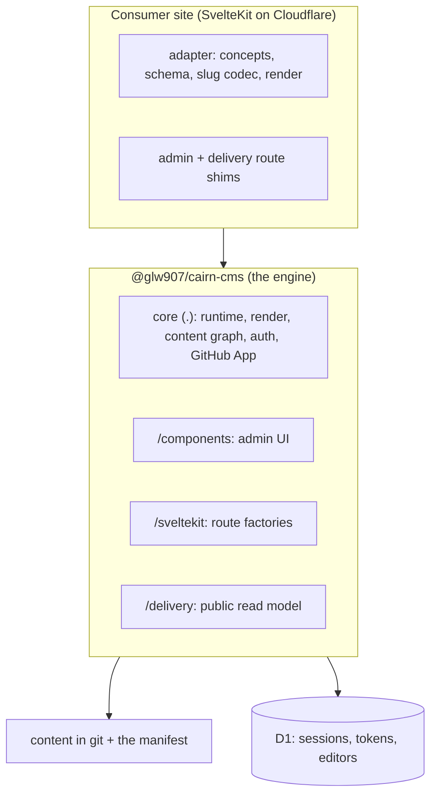
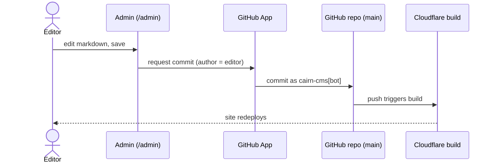
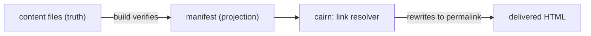

# Documentation Initiative Phase 3 Implementation Plan: the Explanation arm

> **For agentic workers:** REQUIRED SUB-SKILL: Use superpowers:subagent-driven-development (recommended) or superpowers:executing-plans to implement this plan task-by-task. Steps use checkbox (`- [ ]`) syntax for tracking.

**Goal:** Give an external adopter the understanding-oriented arm of the docs: four pages under `docs/explanation/` that explain how cairn works and why, each linking to the Phase 2 reference for the exact API surface, plus an index that flips the docs-index Explanation line.

**Architecture:** Three new explanation pages (architecture, security-model, content-model) plus one relocated-and-refreshed page (data-tiers, moved from `docs/data-architecture.md`) and an arm index. Each page carries the why and links the Phase 2 reference rather than restating a signature. The arm changes no engine code, so the gate is the docs gate (prose-guard clean, links resolve, claims cross-checked by hand), not the unit suite.

**Tech Stack:** Markdown, Mermaid (GitHub renders it natively), `prose-guard` (the writing-voice gate), `git`.

**Design spec:** `docs/superpowers/specs/2026-06-04-cairn-docs-phase-3-explanation-design.md`.

---

## Conventions for this plan

**The page gate, not the engine gate.** A page changes no engine code, so its verification is the docs gate, three checks: `prose-guard <page>` shows no blocking tell, every relative link in the page resolves to a real file, and the page's architecture and API claims are cross-checked by hand against the named `src/lib` source, the functional spec, and `examples/showcase`. There is no automated coverage gate in this arm, because explanation has no typed surface to enumerate (that was Phase 2's Reference gate). Do not run `npm run check` or `npm test`; this arm adds no test and changes no engine code.

**prose-guard is tiered.** The blocking hook checks em dashes, banned phrases and openers, and structural patterns on the text being written. The advisory lines (passive, tricolon, burstiness, anaphora) are sweep-only and non-blocking. The CLI `prose-guard <path>` exits 1 on any tell including advisory, so judge the gate by the absence of a blocking tell, not by the exit code. Draft clean on the first pass; do not chase the advisory lines.

**The link check.** To confirm a page's relative links resolve, run this from the repo root with the page path:

```bash
f=docs/explanation/<page>.md; dir=$(dirname "$f")
grep -oE '\]\((\.{1,2}/[^)]+)\)' "$f" | sed -E 's/^\]\(//; s/\)$//' | while read -r t; do
  p="${t%%#*}"; [ -z "$p" ] && continue
  [ -e "$dir/$p" ] || echo "DANGLING: $f -> $t"
done; echo "(no DANGLING line above means every relative link resolves)"
```

**Explain and link.** Each page carries the why. It links the Phase 2 reference pages under `docs/reference/` for an exact signature and never restates one. Where a detailed behavioral doc already exists (`render-sanitize-floor.md`), the page explains the reasoning and links the detail rather than absorbing it. Public explanation pages stay self-contained: they link the reference pages and each other, and they do not make the `docs/superpowers/` specs required reading (a sparse "design history" pointer is the most they carry into that tree).

**Diagrams.** Two to three Mermaid diagrams total across the arm. The anchors are the layered model and the commit/publish flow in `architecture.md` (this plan gives both verbatim in Task 2). A third in `content-model.md` is optional and given in Task 4. Prose carries the rest.

**Depth.** Each page explains how the design works and the reasoning behind it, and names the one rejected alternative where it clarifies the choice. No full decision ledger; the internal `ARCHITECTURE-CRITIQUE.md` stays internal history.

**Prose.** All authored prose follows the writing-voice standard, so draft clean on the first pass. No em dashes in prose; end the sentence or use a colon, comma, or parentheses. One idea per sentence. No "not X but Y" frame, no reflexive three-item lists, no setup-colon payoff, no participial or connector openers.

**The relocation's transient referrers.** Task 1 moves `docs/data-architecture.md` to `docs/explanation/data-tiers.md`. The live public referrers in `docs/README.md` and `SECURITY.md` are repointed later (Task 3 repoints `SECURITY.md`, Task 5 rewrites the `docs/README.md` lines), so a transient dangling link to the old path is expected between tasks, the same within-phase pattern Phase 2 used for forward links. The phase-end ritual confirms none remain. Leave the dated historical references under `docs/superpowers/` and the historical `docs/STATUS.md` entries as point-in-time records; do not rewrite history.

---

### Task 1: `data-tiers.md` (relocate and refresh)

**Files:**
- Rename: `docs/data-architecture.md` to `docs/explanation/data-tiers.md`
- Modify: `docs/explanation/data-tiers.md` (light refresh)

The page is already good. This task moves it into the arm and refreshes it lightly; it does not rewrite it.

- [ ] **Step 1: Move the file with history preserved**

Run:

```bash
mkdir -p docs/explanation
git mv docs/data-architecture.md docs/explanation/data-tiers.md
```

- [ ] **Step 2: Light refresh**

Read `docs/explanation/data-tiers.md` in full. Confirm each statement against the current engine and make only these touch-ups:
- Confirm the three tiers still match the engine: markdown content in git; content-derived build-read structure in git (the YAML site-config, the nav, and the content-graph manifest); runtime admin state in D1 (sessions, magic tokens, the editor allowlist). The existing body already covers these; correct any drift you find, otherwise leave the prose intact.
- In the "Related documents" section, the links point into `docs/superpowers/` specs. Keep them as design-history pointers (they are allowed as sparse pointers, not required reading). Verify each path still resolves from the new `docs/explanation/` location and fix any relative path the move broke.
- Do not add a diagram in this task. The diagram budget is spent in Task 2, with an optional third in Task 4.

- [ ] **Step 3: Verify**

Run:

```bash
prose-guard docs/explanation/data-tiers.md
f=docs/explanation/data-tiers.md; dir=$(dirname "$f")
grep -oE '\]\((\.{1,2}/[^)]+)\)' "$f" | sed -E 's/^\]\(//; s/\)$//' | while read -r t; do p="${t%%#*}"; [ -z "$p" ] && continue; [ -e "$dir/$p" ] || echo "DANGLING: $f -> $t"; done
```

Expected: no blocking prose tell, and no `DANGLING` line. The `docs/README.md` and `SECURITY.md` references to the old path are repointed in Tasks 5 and 3; a transient dangling link from those two files is expected until then.

- [ ] **Step 4: Commit**

```bash
git add docs/explanation/data-tiers.md
git commit -m "Relocate data-architecture to explanation/data-tiers"
```

---

### Task 2: `architecture.md`

**Page:** `docs/explanation/architecture.md`  **Model:** Opus (the synthesis page).

**Source material (read before writing):** `docs/internal/ARCHITECTURE.md` (the layered model, the commit flow, the adapter contract), `docs/creating-a-cairn-site.md` (the engine/site line and the extension seams; stale on auth and collections, so mine the structure, not the reverted specifics), `docs/superpowers/specs/2026-05-28-cairn-rebuild-functional-spec.md` (the locked design, noting its Carta/`renderPreview` drift), and the repo `CLAUDE.md` intro paragraph. Cross-link targets: `docs/reference/core.md`, `docs/reference/sveltekit.md`, `docs/reference/delivery.md`, `./security-model.md`, `./content-model.md`, `./data-tiers.md`.

- [ ] **Step 1: Read the source material**

Read the four source files above so the page is accurate against the current engine, not the reverted past.

- [ ] **Step 2: Write the page**

Create `docs/explanation/architecture.md` following the per-page rules. Sections:

1. **Intro.** One paragraph: what cairn is (an embedded, magic-link, GitHub-committing CMS for SvelteKit/Cloudflare sites), and that it is design-agnostic with each site supplying an adapter.
2. **The layered model.** The engine (the `@glw907/cairn-cms` package, with its subpath exports), the consumer site (a SvelteKit app on Cloudflare that supplies the adapter and the route shims), and the admin and delivery surfaces the engine provides. Open the section with this diagram:



3. **The engine/site line and the seams.** What the engine owns and what the site supplies. The seams are the adapter contract, the slug codec, the frontmatter schema, the `render` method, and the `CairnExtension` seam. Link `content-model.md` for the schema and concept detail and `core.md` for the seam signatures.
4. **The commit/publish flow.** An editor save commits to `main` through the GitHub App (committer `cairn-cms[bot]`, author the editor), and the push triggers the Cloudflare build, so commit-is-publish. Link `security-model.md` for the commit trust model. Include this diagram:



5. **The render-pipeline shape.** Author markdown runs through the unified pipeline, the component-registry dispatch, and the sanitize floor, emitting HTML a site delivers with `{@html}`. Keep this to an overview and link `security-model.md` for the sanitize floor. Do not document the directive grammar in depth here.
6. **Distribution and versioning.** The npm package, `0.x` with breaks between minors, the subpath exports, and a consumer pinning a version range. Link `core.md` and the reference index.

- [ ] **Step 3: Verify**

Run `prose-guard docs/explanation/architecture.md` (no blocking tell) and the link-check snippet for this page (no `DANGLING` line). Cross-check the layered model and the commit flow against `docs/internal/ARCHITECTURE.md` and the functional spec; the committer/author split and the subpath export list must match the engine.

- [ ] **Step 4: Log friction and commit**

Append any design friction this page surfaced to `docs/internal/docs-friction-log.md` under `## Findings` (perspective, the doc that surfaced it, a short note). If none, skip the friction file.

```bash
git add docs/explanation/architecture.md docs/internal/docs-friction-log.md
git commit -m "Add the architecture explanation page"
```

(If you added no friction entry, `git add docs/explanation/architecture.md` alone.)

---

### Task 3: `security-model.md` (and the SECURITY.md repoint)

**Page:** `docs/explanation/security-model.md`  **Model:** Opus (the threat-model framing).
**Also modify:** `SECURITY.md` (repoint the detail link).

**Source material (read before writing):** `docs/render-sanitize-floor.md` (the render floor, the keep/strip/rewrite detail this page links rather than restates), the functional spec's auth and behavior sections, the `cairn-auth-self-owned-d1-magic-link` and `cairn-auth-hardening-pass` design history, `src/lib` auth and GitHub App source (`appJwt`, `appCredentials`, `installationToken`, `commitFile`, the session and token handling). Cross-link targets: `docs/reference/core.md` (auth and GitHub App helpers), `../render-sanitize-floor.md`, `./data-tiers.md`, `./architecture.md`.

- [ ] **Step 1: Read the source material**

Read the source above so the auth, commit-trust, and render-safety claims match the engine.

- [ ] **Step 2: Write the page**

Create `docs/explanation/security-model.md` with four parts:

1. **Auth.** Self-owned magic-link login: single-use atomic D1 tokens, opaque D1 session rows, the `__Host-` cookie, owner and editor roles, the never-remove-the-last-owner rule, the per-email cooldown, the origin guard. State why magic-link suits the audience (an editor needs no GitHub account and no password). Name the one clarifying rejected alternative, KV, because single-use enforcement needs the atomicity D1 gives and KV's eventual consistency does not. Link `core.md` for the auth helper signatures.
2. **GitHub-App commit trust.** The bot committer and the editor author, the App's scoped permissions, and the PKCS#1-to-PKCS#8 key handling that Web Crypto needs. State why a GitHub App rather than a personal access token. Link `core.md` for `appJwt`, `installationToken`, and `commitFile`.
3. **Render safety.** The threat (author markdown can carry raw HTML, delivered with `{@html}`), the guarantee (the sanitize floor on a GitHub-lineage allowlist, extend-only, with the developer-only `unsafeDisableSanitize` escape). Link `../render-sanitize-floor.md` for the keep/strip/rewrite detail rather than restating it. State the documented residual plainly. A component `build()` that routes a directive attribute value into an `href`, `src`, or `style` sink is not sanitized. Note that this is a known limitation tracked for a render-hardening pass. If your read of the source shows the sink is broader than site-developer-controlled code, record that in the friction log as an escalation candidate.
4. **Origin and CSRF.** The origin check on form actions, and the https origin guard.

- [ ] **Step 3: Repoint SECURITY.md**

`SECURITY.md`'s security-posture section currently links `docs/data-architecture.md` and `docs/render-sanitize-floor.md`. Repoint it to the new explanation hub. Change the existing lines:

```markdown
[`docs/data-architecture.md`](./docs/data-architecture.md) for where auth state lives and
[`docs/render-sanitize-floor.md`](./docs/render-sanitize-floor.md) for the render floor.
```

to:

```markdown
[`docs/explanation/security-model.md`](./docs/explanation/security-model.md) for the auth,
commit, and render security model, and [`docs/explanation/data-tiers.md`](./docs/explanation/data-tiers.md)
for where auth state lives.
```

This removes the dangling `docs/data-architecture.md` reference the Task 1 move created in `SECURITY.md`, and routes a reader through the explanation hub (which itself links `render-sanitize-floor.md`).

- [ ] **Step 4: Verify**

Run `prose-guard docs/explanation/security-model.md` (no blocking tell), the link-check snippet for the page (no `DANGLING` line), and confirm the `SECURITY.md` links resolve:

```bash
for t in docs/explanation/security-model.md docs/explanation/data-tiers.md; do [ -f "$t" ] && echo "ok $t" || echo "MISSING $t"; done
prose-guard SECURITY.md
```

Expected: both `ok` lines, no blocking tell on either file. Cross-check the auth and commit claims against the functional spec and `src/lib`.

- [ ] **Step 5: Log friction and commit**

Append any friction (including the render-sink escalation note if your read warrants it) to `docs/internal/docs-friction-log.md` under `## Findings`. Then:

```bash
git add docs/explanation/security-model.md SECURITY.md docs/internal/docs-friction-log.md
git commit -m "Add the security-model explanation page and repoint SECURITY.md"
```

---

### Task 4: `content-model.md`

**Page:** `docs/explanation/content-model.md`  **Model:** Opus (the synthesis across several initiatives).

**Source material (read before writing):** the `cairn-content-model-fixed-concepts`, `cairn-url-identity-model`, `cairn-schema-source-of-truth-initiative`, and `cairn-content-graph-initiative` design history; `docs/superpowers/specs/2026-06-02-cairn-content-graph-design.md`; `src/lib` for the schema (`defineFields`), the id helpers, and the manifest and `cairn:` link helpers. Cross-link targets: `docs/reference/core.md` (schema, id, manifest, and link helpers), `./data-tiers.md`, `./architecture.md`.

- [ ] **Step 1: Read the source material**

Read the source above so the concept, URL, schema, and content-graph claims match the engine.

- [ ] **Step 2: Write the page**

Create `docs/explanation/content-model.md` with four parts:

1. **Fixed concepts, not generic collections.** Posts and Pages as first-class concepts, with multiplicity by distinct concept rather than an open-ended array. Name the clarifying rejected alternative, the open-ended `collections[]` array an earlier design carried and dropped. Link `core.md` for `defineAdapter`/`normalizeConcepts`.
2. **URL identity.** The id is the full stem, the slug is the date-stripped stem, the date is frontmatter-canonical, and `datePrefix` is per-concept. The URL policy lives in the YAML site config, and a site-level catch-all `byPermalink` route serves it. Note that this spreads one URL across three places, a complexity that earns the diagram. Link `core.md` for the id helpers and `permalink`.
3. **Schema as the source of truth.** One `defineFields` declaration drives the editor form, the validator, and the inferred frontmatter type, with Standard Schema conformance. Link `core.md` for `defineFields`.
4. **The content graph.** Files are the truth and the manifest is the build-verified projection. The `cairn:<concept>/<id>` token gives rot-proof internal links (not wikilinks), the editor offers a picker, and delete and rename stay safe through atomic content-plus-manifest commits with a build-fail backstop. State why the manifest lives in git and not D1, and link `./data-tiers.md` for the placement rule. Link `core.md` for the manifest and `cairn:` link helpers.

Optionally include this diagram in the content-graph section (the optional third diagram in the arm's budget):



- [ ] **Step 3: Verify**

Run `prose-guard docs/explanation/content-model.md` (no blocking tell) and the link-check snippet for the page (no `DANGLING` line). Cross-check the id model, the schema-as-truth claim, and the `cairn:` token shape against `src/lib` and the content-graph design spec.

- [ ] **Step 4: Log friction and commit**

Append any friction to `docs/internal/docs-friction-log.md` under `## Findings`. Then:

```bash
git add docs/explanation/content-model.md docs/internal/docs-friction-log.md
git commit -m "Add the content-model explanation page"
```

(If no friction entry, `git add docs/explanation/content-model.md` alone.)

---

### Task 5: The explanation index and the docs-index wiring

**Files:**
- Create: `docs/explanation/README.md`
- Modify: `docs/README.md` (flip the Explanation line; drop the relocated page from Current pages)
- Modify: `docs/superpowers/specs/2026-05-28-cairn-rebuild-functional-spec.md` (the reconciliation pointer)

- [ ] **Step 1: Write `docs/explanation/README.md`**

Create it with this shape, one line per page, linking all four:

```markdown
# Explanation

Understanding-oriented pages on how cairn works and why. Each page carries the design reasoning and
links the [reference](../reference/README.md) for the exact API surface.

- [Architecture](./architecture.md): the layered model, the engine/site line, the commit/publish flow, and distribution.
- [Where each kind of state lives](./data-tiers.md): the git-versus-D1 placement rule and its precedents.
- [Security model](./security-model.md): auth, the GitHub-App commit trust, render safety, and origin checks.
- [Content model](./content-model.md): fixed concepts, URL identity, schema as the source of truth, and the content graph.
```

- [ ] **Step 2: Flip the Explanation line and drop the relocated page in `docs/README.md`**

Replace these lines:

```markdown
- **Explanation** covers the architecture and the design rules.
  [`data-architecture.md`](./data-architecture.md) is the current data-tier writeup until the
  arm lands.
```

with:

```markdown
- **Explanation** covers the architecture and the design rules. See the
  [explanation index](./explanation/README.md).
```

Then, in the `## Current pages` list, remove this line (the page moved into the arm and the index now carries it):

```markdown
- [Where each kind of state lives](./data-architecture.md)
```

Leave the other Current pages entries, including `render-sanitize-floor.md`, in place.

- [ ] **Step 3: Add the functional-spec reconciliation pointer**

In `docs/superpowers/specs/2026-05-28-cairn-rebuild-functional-spec.md`, add a short note near the top (under the title, before the first section) marking the explanation arm as the current architecture statement. Use this text:

```markdown
> **Status (2026-06-04):** the current architecture statement for adopters is the explanation arm
> under `docs/explanation/` (architecture, data-tiers, security-model, content-model). This spec is
> the locked rebuild design record and carries known drift: it predates the Carta-to-CodeMirror
> editor swap (0.9.0) and the `renderPreview`-to-`render` adapter rename. Read it as design history,
> not as the current surface.
```

- [ ] **Step 4: Verify the whole arm**

Run:

```bash
prose-guard docs/explanation/README.md
prose-guard docs/README.md
for p in architecture data-tiers security-model content-model README; do test -f "docs/explanation/$p.md" || echo "MISSING docs/explanation/$p.md"; done
for f in docs/README.md docs/explanation/*.md; do
  dir=$(dirname "$f")
  grep -oE '\]\((\.{1,2}/[^)]+)\)' "$f" | sed -E 's/^\]\(//; s/\)$//' | while read -r t; do p="${t%%#*}"; [ -z "$p" ] && continue; [ -e "$dir/$p" ] || echo "DANGLING: $f -> $t"; done
done
echo "(no MISSING and no DANGLING line above means the arm is wired and resolves)"
```

Expected: no blocking tell on either README, no `MISSING` line, and no `DANGLING` line anywhere in the explanation arm or the flipped `docs/README.md`.

- [ ] **Step 5: Commit**

```bash
git add docs/explanation/README.md docs/README.md docs/superpowers/specs/2026-05-28-cairn-rebuild-functional-spec.md
git commit -m "Add the explanation index, flip the docs index, reconcile the functional spec"
```

---

## Task ordering

Link and reference dependencies fix the order: **1, 2, 3, 4, 5.** Task 1 lands `data-tiers.md` first so the later pages can link it. Tasks 2 through 4 are the three new pages; they cross-link each other, and a forward link to a not-yet-written sibling resolves once that task lands (the phase-end ritual confirms none dangle). Task 3 repoints `SECURITY.md` away from the old `data-architecture.md` path. Task 5 links all four pages and flips the docs index, so it runs last.

## Phase-end ritual

After all tasks commit, before declaring the phase done:

- [ ] Confirm every explanation page and the index exist: `for p in architecture data-tiers security-model content-model README; do test -f "docs/explanation/$p.md" || echo "MISSING $p"; done`.
- [ ] Run `prose-guard` across every authored page: `for f in docs/README.md SECURITY.md docs/explanation/*.md; do prose-guard "$f"; done`. No blocking tell on any (advisory lines are non-blocking).
- [ ] Confirm no dangling relative link across `docs/explanation/*.md`, the flipped `docs/README.md`, and the repointed `SECURITY.md` (the Task 5 Step 4 sweep, extended to `SECURITY.md`).
- [ ] Confirm the old path is fully retired from the live public docs: `grep -rn "data-architecture" docs/README.md SECURITY.md` returns nothing (historical references under `docs/superpowers/` and `docs/STATUS.md` dated entries stay as records).
- [ ] Confirm the Mermaid count: two diagrams in `architecture.md`, at most one more in `content-model.md`, two to three total across the arm.
- [ ] Append any remaining design friction this phase surfaced to `docs/internal/docs-friction-log.md`.
- [ ] Update `docs/STATUS.md` to record Phase 3 landed and name Phase 4 (Guides) as the next action, per the `cairn-pass` ritual. Refresh the `cairn-docs-initiative` memory.
- [ ] Leave the tree clean.

## Self-review notes (already applied)

- The page gate is the docs gate (prose-guard, links, a manual accuracy cross-check), not the unit suite, because the arm changes no engine code and adds no test. This matches Phase 2's page-task gate, minus the coverage check, which has no analog here (explanation has no typed surface to enumerate).
- The relocation leaves a transient dangling reference to `data-architecture.md` in `docs/README.md` and `SECURITY.md` between Task 1 and Tasks 3 and 5. This is the within-phase forward-reference pattern Phase 2 used; the phase-end ritual and the Task 5 grep confirm the old path is fully retired from the live public docs.
- `SECURITY.md` is repointed in Task 3, the task that creates its new target (`security-model.md`), so the link is never written ahead of its target landing.
- The functional-spec reconciliation is one pointer added in Task 5, after `architecture.md` exists, so the spec points at a real arm.
- The diagram budget is concrete: two diagrams are given verbatim in Task 2 and one optional diagram in Task 4, so the two-to-three total is met without guesswork.
- The three new pages run on Opus for the why framing and the rejected-alternative judgment. Task 1 (relocate and refresh) and Task 5 (index and wiring) are mechanical and run on Sonnet.
- The arm publishes nothing and carries no version bump. The three release-gated engine candidates the brainstorm surfaced live in `ROADMAP.md`, the friction log, and a project memory, separate from this docs phase.
