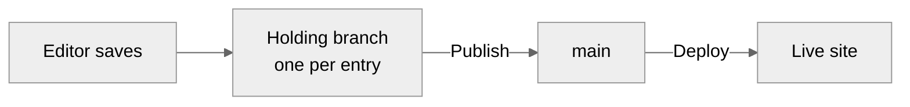

# Build your first cairn site

This tutorial builds a working cairn site from an empty directory: a public site rendering markdown content, an admin where editors write, and at the end, a deploy to Cloudflare. Everything is built by hand so you can see what every file does. (A `create-cairn-site` scaffolder that produces the same result in one command is planned; today, this page is the path.)

If you'd rather see a cairn site run before building one, the [showcase](../../examples/showcase/README.md) is this tutorial's finished result: clone the repo, `npm install` in `examples/showcase`, and `npm run dev`.

You'll need Node 22 or later and a free [Cloudflare](https://www.cloudflare.com/) account for the final milestone. Nothing else: the admin runs locally against a development backend, so you need no GitHub App, no database, and no email setup to run the editor locally. Those arrive when you take a site to production, and the closing milestone points at the guides that wire them.

## Milestone 0: What you will build

A small site with two kinds of content: posts (dated, listed newest-first) and pages (standing, like About). Editors sign in at `/admin` and write markdown in cairn's editor; the public site renders that markdown through one function you write. You'll save and publish an entry in milestone 8, in a real admin running on your machine. By milestone 10 the public site is live on a `workers.dev` URL.

Content lives as markdown files in a git repository. The admin edits those files through cairn's commit pipeline, and your site renders them with your own design. Everything you build here survives into a production site unchanged.

## Milestone 1: Create the project

Scaffold a fresh SvelteKit project with the current toolchain, `sv create`, then install cairn and its Cloudflare adapter:

```sh
npx sv create cairn-tutorial --template minimal --types ts --no-add-ons --install npm
cd cairn-tutorial
npm install @glw907/cairn-cms
npm install -D @sveltejs/adapter-cloudflare wrangler
```

Point the scaffolded `svelte.config.js` at the Cloudflare adapter:

```js
// svelte.config.js
import adapter from '@sveltejs/adapter-cloudflare';
import { vitePreprocess } from '@sveltejs/vite-plugin-svelte';

export default {
  preprocess: vitePreprocess(),
  kit: {
    adapter: adapter(),
  },
};
```

Then declare the three Cloudflare bindings the admin will need:

```jsonc
// wrangler.jsonc
{
  "name": "cairn-tutorial",
  "compatibility_date": "2026-05-28",
  "compatibility_flags": ["nodejs_compat"],
  "main": ".svelte-kit/cloudflare/_worker.js",
  "assets": { "directory": ".svelte-kit/cloudflare", "binding": "ASSETS" },
  // Email Sending binding for magic links (arbitrary recipients).
  "send_email": [{ "name": "EMAIL" }],
  // cairn-cms self-owned magic-link auth store (editor allowlist, sessions, tokens).
  "d1_databases": [
    {
      "binding": "AUTH_DB",
      "database_name": "cairn-tutorial-auth",
      "database_id": "00000000-0000-0000-0000-000000000000"
    }
  ],
  // R2 bucket backing the media library.
  "r2_buckets": [{ "binding": "MEDIA_BUCKET", "bucket_name": "cairn-tutorial-media" }],
  "vars": {
    // Canonical origin for magic-link confirmation links, never read from a request header.
    "PUBLIC_ORIGIN": "http://localhost:4173"
  }
}
```

The bindings in `wrangler.jsonc` are declared now and used later: D1 backs the admin's sessions, the email binding sends sign-in links, and R2 holds images. Locally, the development backend supplies doubles for the database and the bucket and replaces the email loop by signing you in directly, so declaring all three costs nothing today and saves a deploy-day surprise.

## Milestone 2: Define the adapter and schema

The adapter is your site's declaration: what kinds of content exist and what fields each carries, where commits go, and how markdown becomes HTML. It's one TypeScript file, and it's the most load-bearing file in a cairn site.

```ts
// src/lib/cairn.config.ts
import { defineAdapter, defineConcept, fieldset, fields, githubApp } from '@glw907/cairn-cms';
import type { SiteConfig } from '@glw907/cairn-cms';

// A minimal inline site config, standing in until Milestone 7 replaces it with the real,
// git-committed site.config.yaml (siteName, nav, and the rest the editor owns).
export const siteConfig: SiteConfig = { siteName: 'Cairn Tutorial' };

export const cairn = defineAdapter({
  content: {
    posts: defineConcept({
      dir: 'src/content/posts',
      label: 'Posts',
      summaryFields: ['description'],
      routing: 'feed',
      fields: fieldset({
        title: fields.text({ label: 'Title', required: true }),
        date: fields.date({ label: 'Date' }),
        tags: fields.multiselect({ label: 'Tags', creatable: true, taxonomy: true }),
        description: fields.textarea({ label: 'Description' }),
      }),
    }),
    pages: defineConcept({
      dir: 'src/content/pages',
      label: 'Pages',
      routing: 'page',
      fields: fieldset({
        title: fields.text({ label: 'Title', required: true }),
        description: fields.textarea({ label: 'Description' }),
      }),
    }),
  },
  backend: githubApp({ owner: 'your-username', repo: 'cairn-tutorial', branch: 'main', appId: '1', installationId: '1' }),
  email: { from: 'cms@example.com' },
  rendering: {
    // A placeholder: it returns the raw markdown untouched. Milestone 4 replaces this with the
    // real render pipeline.
    render: async ({ body }) => body,
  },
});
```

The concepts are a fixed set you declare, and each one's schema is typed, so a wrong field name or type fails at compile time rather than in an editor's face. The GitHub block names where production commits land; the development backend ignores it until then, so any owner and repo name work today.

## Milestone 3: Add content

Content is markdown files with frontmatter, one directory per concept.

```md
---
title: First Race
date: 2026-06-15
tags:
  - race-reports
description: Notes from the start line of my first race this season.
---

## How it went

The gun went off and I forgot every plan I'd made.

- Cold at the start, warm by the second lap
- Legs held up better than expected
- Next time: eat breakfast earlier
```

Save that as `src/content/posts/2026-06-15-first-race.md`.

```md
---
title: About
description: Who runs this site and why.
---

I write about racing and training. This site is where the notes live.
```

Save that as `src/content/pages/about.md`.

The filename is the entry's identity: the stem becomes the id, and for dated concepts the leading date is stripped to form the slug, while the entry's date comes from the `date` frontmatter field. You'll never rename these by hand once editors exist, because addresses are promises, but it's useful to have seen the shape once.

## Milestone 4: Configure rendering

Your site owns its look, and cairn asks for exactly one thing: a function from markdown to HTML. The editor's preview and your public pages both call it, which is why what editors see is what readers get.

`createRenderer` builds that function. Replace the placeholder from Milestone 2 with the real pipeline:

```ts
// src/lib/cairn.config.ts
import { defineAdapter, defineConcept, fieldset, fields, githubApp, createRenderer } from '@glw907/cairn-cms';
import type { SiteConfig } from '@glw907/cairn-cms';

export const siteConfig: SiteConfig = { siteName: 'Cairn Tutorial' };

const { renderMarkdown } = createRenderer();

export const cairn = defineAdapter({
  content: {
    posts: defineConcept({
      dir: 'src/content/posts',
      label: 'Posts',
      summaryFields: ['description'],
      routing: 'feed',
      fields: fieldset({
        title: fields.text({ label: 'Title', required: true }),
        date: fields.date({ label: 'Date' }),
        tags: fields.multiselect({ label: 'Tags', creatable: true, taxonomy: true }),
        description: fields.textarea({ label: 'Description' }),
      }),
    }),
    pages: defineConcept({
      dir: 'src/content/pages',
      label: 'Pages',
      routing: 'page',
      fields: fieldset({
        title: fields.text({ label: 'Title', required: true }),
        description: fields.textarea({ label: 'Description' }),
      }),
    }),
  },
  backend: githubApp({ owner: 'your-username', repo: 'cairn-tutorial', branch: 'main', appId: '1', installationId: '1' }),
  email: { from: 'cms@example.com' },
  rendering: {
    render: ({ body, resolve, resolveMedia }) => renderMarkdown(body, { resolve, resolveMedia }),
  },
});
```

**First payoff:** run the dev server and render an entry in a scratch route now, if you want to see it. Or wait one milestone: the delivery surface renders everything properly there.

## Milestone 5: Add a custom component

Markdown covers prose. For anything richer, cairn uses components: framed blocks editors insert through a guided form. Declaring one takes a schema (what the form asks) and a template (what renders).

<!-- snippet-check-skip: elides the adapter's other required groups (shown in full in the milestone-4 block above) to focus on the added component and its registry wiring -->
```ts
// src/lib/cairn.config.ts (the added component, registered on the renderer)
import { defineComponent, defineRegistry, fields, createRenderer } from '@glw907/cairn-cms';
import { h } from 'hastscript';

const callout = defineComponent({
  name: 'callout',
  label: 'Callout',
  description: 'A highlighted note.',
  build: (ctx) =>
    h('aside', { className: ['callout', `callout-${String(ctx.attributes.tone ?? 'note')}`] }, [
      h('p', { className: ['callout-title'] }, ctx.slot('title')),
      h('div', { className: ['callout-body'] }, ctx.slot('body')),
    ]),
  attributes: {
    tone: fields.select({ label: 'Tone', required: true, options: ['note', 'tip', 'warning'] }),
  },
  slots: [
    { name: 'title', label: 'Title', kind: 'inline', required: true },
    { name: 'body', label: 'Body', kind: 'markdown' },
  ],
});

const registry = defineRegistry({ components: [callout] });
const { renderMarkdown } = createRenderer(registry);
```

Add `components: registry` to the adapter's `rendering` block alongside `render`, so the editor's insert palette and the render pipeline both see it.

Editors never see this code. They see a "Callout" entry in the insert menu, a form asking for a title and a tone, and a live preview. The `:::callout` text it writes into their draft is yours to render however the site's design wants.

## Milestone 6: Wire the delivery surface

The public site reads the same content the admin edits. cairn gives you the pieces as data and a route factory: a concept index for listings, and `createPublicRoutes` for the entry pages.

One content layer builds the typed indexes every route reads:

```ts
// src/lib/content.ts
import { createSiteIndexes } from '@glw907/cairn-cms/delivery';
import { cairn, siteConfig } from './cairn.config.js';

const postsRaw = import.meta.glob('/src/content/posts/*.md', {
  query: '?raw',
  import: 'default',
  eager: true,
}) as Record<string, string>;
const pagesRaw = import.meta.glob('/src/content/pages/*.md', {
  query: '?raw',
  import: 'default',
  eager: true,
}) as Record<string, string>;

const indexes = createSiteIndexes(cairn, siteConfig, { posts: postsRaw, pages: pagesRaw });

export const site = indexes.site;
export const posts = indexes.posts;

export const ORIGIN = 'http://localhost:5173';
export const SITE_DESCRIPTION = 'A small cairn site.';
```

The public pages need a root layout and a home page:

```svelte
<!-- src/routes/+layout.svelte -->
<script lang="ts">
  let { children } = $props();
</script>

{@render children()}
```

```ts
// src/routes/(site)/+page.server.ts
import type { PageServerLoad } from './$types';
import { posts } from '$lib/content.js';

export const prerender = true;

export const load: PageServerLoad = () => ({ posts: posts.all() });
```

```svelte
<!-- src/routes/(site)/+page.svelte -->
<script lang="ts">
  import type { PageData } from './$types';

  let { data }: { data: PageData } = $props();
</script>

<h1>Posts</h1>

<ul>
  {#each data.posts as post (post.id)}
    <li>
      <a href={post.permalink}>{post.title}</a>
      {#if post.date}<time datetime={post.date}>{post.date}</time>{/if}
    </li>
  {/each}
</ul>
```

The `(site)` folder is a route group: it's invisible in the URL, and it keeps your public pages separate from `/admin`, which arrives in Milestone 8. Every entry, of either concept, renders through one catch-all, built on `createPublicRoutes`:

```ts
// src/routes/(site)/[...path]/+page.server.ts
import type { PageServerLoad, EntryGenerator } from './$types';
import { createPublicRoutes } from '@glw907/cairn-cms/delivery';
import { site, ORIGIN, SITE_DESCRIPTION } from '$lib/content.js';
import { cairn, siteConfig } from '$lib/cairn.config.js';

export const prerender = true;

const routes = createPublicRoutes({
  site,
  render: cairn.rendering.render,
  origin: ORIGIN,
  siteName: siteConfig.siteName,
  description: SITE_DESCRIPTION,
});

export const entries: EntryGenerator = () => routes.entries();

export const load: PageServerLoad = ({ url }) => routes.entryLoad({ url });
```

```svelte
<!-- src/routes/(site)/[...path]/+page.svelte -->
<script lang="ts">
  import type { PageData } from './$types';

  let { data }: { data: PageData } = $props();
</script>

<article>
  <h1>{data.entry.title}</h1>
  {@html data.html}
</article>
```

**Payoff:** `npm run dev`, open the listing, click through to your first post. That page just traveled the whole pipeline: markdown file, frontmatter schema, your render function, your design.

## Milestone 7: Add the nav menu

Site structure that editors shouldn't edit by accident (the nav, the site name) lives in a YAML config file, read at build time.

```yaml
# src/lib/site.config.yaml
siteName: Cairn Tutorial
menus:
  primary:
    - label: Home
      url: /
    - label: About
      url: /about
```

Replace the inline `siteConfig` stub from Milestone 2 with the parsed file:

<!-- snippet-check-skip: elides the adapter's other required groups (shown in full in the milestone-5 block above) to focus on the siteConfig upgrade -->
```ts
// src/lib/cairn.config.ts (replacing the Milestone 2 siteConfig stub)
import { parseSiteConfig } from '@glw907/cairn-cms';
import siteYaml from './site.config.yaml?raw';

export const siteConfig = parseSiteConfig(siteYaml);
```

Then read the menu once in the site layout:

```svelte
<!-- src/routes/(site)/+layout.svelte -->
<script lang="ts">
  import { extractMenu } from '@glw907/cairn-cms';
  import { siteConfig } from '$lib/cairn.config.js';

  let { children } = $props();

  const nav = extractMenu(siteConfig, 'primary', 2);
</script>

<header>
  <nav>
    {#each nav as item (item.url ?? item.label)}
      <a href={item.url}>{item.label}</a>
    {/each}
  </nav>
</header>

<main>
  {@render children()}
</main>
```

## Milestone 8: Run the admin locally

Everything so far was the site. The admin takes six small files and one build-config line, all of them mounting machinery cairn provides.

The `(site)` group and the bare root layout from Milestone 6 already do the one thing the admin needs from your side: they keep your site's own chrome from wrapping `/admin`, so nothing here has to move.

One composer builds the runtime once and wraps it in the single-mount facade:

```ts
// src/lib/cairn.server.ts
import { composeRuntime } from '@glw907/cairn-cms';
import { createCairnAdmin } from '@glw907/cairn-cms/sveltekit';
import { cairn, siteConfig } from './cairn.config.js';

export const runtime = composeRuntime({ adapter: cairn, siteConfig });
export const admin = createCairnAdmin(runtime);
```

The shared shell layout wraps every `/admin/**` route in cairn's chrome:

```ts
// src/routes/admin/+layout.server.ts
import { admin } from '$lib/cairn.server.js';

export const load = admin.shellLoad;
```

```svelte
<!-- src/routes/admin/+layout.svelte -->
<script lang="ts">
  import { CairnAdminShell } from '@glw907/cairn-cms/components';
  import type { AdminShellData } from '@glw907/cairn-cms/sveltekit';
  import type { Snippet } from 'svelte';

  let { data, children }: { data: { shell: AdminShellData }; children: Snippet } = $props();
</script>

<CairnAdminShell data={data.shell}>{@render children()}</CairnAdminShell>
```

The catch-all serves every admin view:

```ts
// src/routes/admin/[...path]/+page.server.ts
import { admin } from '$lib/cairn.server.js';

export const prerender = false;

export const load = admin.load;
export const actions = admin.actions;
```

```svelte
<!-- src/routes/admin/[...path]/+page.svelte -->
<script lang="ts">
  import { CairnAdmin } from '@glw907/cairn-cms/components';
  import type { AdminData } from '@glw907/cairn-cms/sveltekit';
  import { cairn } from '$lib/cairn.config.js';
  import type { ActionData } from './$types';

  let { data, form }: { data: AdminData; form: ActionData } = $props();
</script>

<CairnAdmin {data} {form} render={cairn.rendering.render} registry={cairn.rendering.components} icons={cairn.rendering.icons} />
```

`CairnAdminShell` and `CairnAdmin` ship as `.svelte` files, so tell Vite to bundle the package for the server instead of treating it as an external dependency:

```ts
// vite.config.ts
import { sveltekit } from '@sveltejs/kit/vite';
import { defineConfig } from 'vite';

export default defineConfig({
  plugins: [sveltekit()],
  ssr: { noExternal: ['@glw907/cairn-cms'] },
});
```

Last, wire the development backend. It stands in for the GitHub App and the magic-link auth loop, so `/admin` runs locally with no cloud accounts:

```ts
// src/hooks.server.ts
import { dev } from '$app/environment';
import { createAuthGuard } from '@glw907/cairn-cms/sveltekit';
import type { Handle } from '@sveltejs/kit';

let handle: Handle;
if (dev && process.env.CAIRN_DEV_BACKEND === '1') {
  const { devBackendHandle } = await import('@glw907/cairn-cms-dev');
  handle = devBackendHandle();
} else {
  handle = createAuthGuard();
}
export { handle };
```

`@glw907/cairn-cms-dev` is a separate package, and only a `devDependency`; install it before starting the server:

```sh
npm install -D @glw907/cairn-cms-dev
CAIRN_DEV_BACKEND=1 npm run dev
```

Open `/admin`, and the development backend signs you in without any email loop. Create a post, write a paragraph, and **save** it through the real pipeline. Then **publish** it and reload the public listing.

What just happened is the model the whole system runs on:



Every save is a commit on a holding branch named for the entry, private until published. Publish copies the entry to `main` with the editor as author, and in production, the push deploys the site. The development backend simulates the branches locally, which is why none of this needed GitHub today.

## Milestone 9: Confirm the internal link and regenerate the manifest

An internal link addresses an entry, not a URL, and cairn writes that address as `cairn:<concept>/<id>`. Add one to the post from Milestone 3:

```md
---
title: First Race
date: 2026-06-15
tags:
  - race-reports
description: Notes from the start line of my first race this season.
---

## How it went

The gun went off and I forgot every plan I'd made.

- Cold at the start, warm by the second lap
- Legs held up better than expected
- Next time: eat breakfast earlier

Read more on the [about page](cairn:pages/about).
```

Save that over `src/content/posts/2026-06-15-first-race.md`, then reload the post: the link resolves to `/about`, the live permalink for that entry, resolved by id rather than hard-coded.

The engine also keeps a committed manifest of your whole corpus, a build-time link graph the `cairnManifest()` Vite plugin verifies on every build. It doesn't regenerate on its own; you run it after any hand-edit to content outside the admin, which is exactly what you just did. Wire the plugin into your Vite config:

```ts
// vite.config.ts
import { sveltekit } from '@sveltejs/kit/vite';
import { defineConfig } from 'vite';
import { cairnManifest } from '@glw907/cairn-cms/vite';

export default defineConfig({
  plugins: [
    sveltekit(),
    cairnManifest({
      configModule: '/src/lib/cairn.config.ts',
      content: { posts: '/src/content/posts/*.md', pages: '/src/content/pages/*.md' },
      manifestPath: '/src/content/.cairn/index.json',
    }),
  ],
  ssr: { noExternal: ['@glw907/cairn-cms'] },
});
```

Add the regenerate script and run it:

```jsonc
// package.json (the "scripts" block)
{
  "scripts": {
    "cairn:manifest": "cairn-manifest"
  }
}
```

```sh
npm run cairn:manifest
```

The command writes `src/content/.cairn/index.json` and exits zero. From here on, run it any time you edit content by hand; the admin keeps the manifest current on its own whenever an editor publishes.

Because the link resolves by id, it survives a rename of the file. The manifest is how the editor's pickers know what exists without a per-request repo crawl; the public build reads its content from bundled imports, and the manifest additionally verifies the internal-link graph at build time.

## Milestone 10: Deploy

The public site is deployable now. The admin needs its production trio (the GitHub App, the D1 database, the email sender) before editors can sign in on the live site, and those are each a guide of their own rather than a tutorial detour.

```sh
npm run build
npx wrangler deploy
```

Wrangler prints your `*.workers.dev` URL when the deploy finishes. The public pages are already live; `/admin` deploys too, but no one can sign in until that trio exists, which the guides below wire up.

**Final payoff:** your site, on its `workers.dev` URL, rendering the content you wrote in milestone 3 and the post you published in milestone 8.

## Where to go next

Production admin: [set up the GitHub App](../guides/set-up-the-github-app.md), [configure auth and D1](../guides/configure-auth-and-d1.md), and [deploy to Cloudflare](../guides/deploy-to-cloudflare.md) finish what milestone 10 started. Your editors' own front door is [Welcome, editors](../guides/editor-welcome.md), and the [writing guide](../guides/write-in-the-editor.md) covers the editor at working depth. When something misbehaves, [troubleshooting](../guides/troubleshooting.md) maps symptoms to fixes. And [why cairn](../explanation/why-cairn.md) explains the reasoning behind everything you just built.
