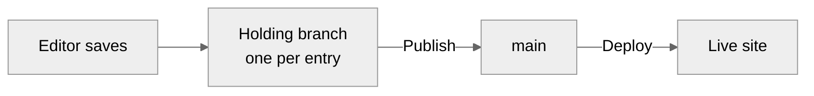

# Build your first cairn site

This tutorial builds a working cairn site from an empty directory: a public site rendering markdown content, an admin where editors write, and at the end, a deploy to Cloudflare. Everything is built by hand so you can see what every file does. If you want the running site faster and the understanding later, [`create-cairn-site`](../reference/create-cairn-site.md) scaffolds the same result in one command, and you can come back here to learn what it wrote.

You'll need Node 22 or later and a free [Cloudflare](https://www.cloudflare.com/) account for the final milestone. Nothing else: the admin runs locally against a development backend, so no GitHub App, no database, and no email setup stand between you and a working editor. Those arrive when you take a site to production, and the closing milestone points at the guides that wire them.

## Milestone 0: What you will build

A small site with two kinds of content: posts (dated, listed newest-first) and pages (standing, like About). Editors sign in at `/admin` and write markdown in cairn's editor; the public site renders that markdown through one function you write. By milestone 8 you'll save and publish an entry in a real admin running on your machine, and by milestone 10 the public site is live on a `workers.dev` URL.

The shape of what you're building, in one pass: content lives as markdown files in a git repository. The admin edits them through cairn's commit pipeline. Your site renders them with your own design. cairn sits between the two, and everything you build in this tutorial survives into a production site unchanged.

## Milestone 1: Create the project

<!-- SNIPPET-1: the project creation commands: npm create svelte/sv equivalent per the showcase's actual toolchain, the two installs (@glw907/cairn-cms and the adapter deps), and the wrangler.jsonc with the three bindings (AUTH_DB, EMAIL send binding, MEDIA_BUCKET) exactly as the showcase declares them, as a complete file with its path -->

The bindings in `wrangler.jsonc` are declared now and used later: D1 backs the admin's sessions, the email binding sends sign-in links, and R2 holds images. Locally, the development backend stands in for all three, so declaring them costs nothing today and saves a deploy-day surprise.

## Milestone 2: Define the adapter and schema

The adapter is your site's declaration: what kinds of content exist, what fields each carries, where commits go, and how markdown becomes HTML. It's one TypeScript file, and it's the most load-bearing file in a cairn site.

<!-- SNIPPET-2: a minimal complete cairn.config.ts for the tutorial site: two concepts (posts with date+tags+description, pages with description), the github target block, the render stub to be filled at M4—modeled on the showcase adapter but tutorial-minimal, complete file with path -->

Two things to notice before moving on. The concepts are a fixed set you declare, and each one's schema is typed: a wrong field name or type fails at compile time, not in an editor's face. And the GitHub block names where production commits land; the development backend ignores it until then, so any owner and repo name work today.

## Milestone 3: Add content

Content is markdown files with frontmatter, one directory per concept.

<!-- SNIPPET-3: two content files as complete examples with paths (content/posts/2026-06-15-first-race.md with date/tags/description frontmatter and a body with a heading+list; content/pages/about.md) -->

The filename is the entry's identity: the stem becomes the id, and for dated concepts the leading date is canonical. You'll never rename these by hand once editors exist, because addresses are promises, but it's useful to have seen the shape once.

## Milestone 4: Configure rendering

Your site owns its look, and cairn asks for exactly one thing: a function from markdown to HTML. The editor's preview and your public pages both call it, which is why what editors see is what readers get.

<!-- SNIPPET-4: the render function wired into the adapter using cairn's pipeline factory as the showcase does (the createRenderer/pipeline export with its actual name), complete file with path showing the adapter's render member filled in -->

**First payoff:** run the dev server and render an entry in a scratch route if you want to see it—or wait one milestone, because the delivery surface renders everything properly.

## Milestone 5: Add a custom component

Markdown covers prose. For anything richer, cairn uses components: framed blocks editors insert through a guided form. Declaring one takes a schema (what the form asks) and a template (what renders).

<!-- SNIPPET-5: one defineComponent declaration added to the adapter—a callout with title+tone, per the showcase's callout definition, complete file fragment with path -->

Editors never see this code. They see a "Callout" entry in the insert menu, a form asking for a title and a tone, and a live preview. The `:::callout` text it writes into their draft is yours to render however the site's design wants.

## Milestone 6: Wire the delivery surface

The public site reads the same content the admin edits. cairn's delivery factory turns your concepts into SvelteKit loads: listings, entries, and tags as data.

<!-- SNIPPET-6: the public routes using createContentRoutes (or the actual factory names) for a posts listing page and an entry page, complete files with paths, per the showcase's public routes -->

**Payoff:** `npm run dev`, open the listing, click through to your first post. That page just traveled the whole pipeline: markdown file, frontmatter schema, your render function, your design.

## Milestone 7: Add the nav menu

Site structure that editors shouldn't edit by accident (the nav, the site name) lives in a YAML config file, read at build time.

<!-- SNIPPET-7: the site.config.yaml with nav entries and siteName as the showcase declares it, complete file with path, plus the one-line read in a layout -->

## Milestone 8: Run the admin locally

Everything so far was the site. Now the admin: five files, all of them mounting machinery cairn provides.

<!-- SNIPPET-8: the five-file admin mount exactly as the showcase has it—routes/admin/[...path]/+page.svelte, +page.server.ts, +layout.svelte, +layout.server.ts, and the hooks or app.d.ts wiring—each a complete file with its path, plus the dev-backend dynamic import pattern (dev-gated) and the command to run it -->

Open `/admin`, and the development backend signs you in without any email loop. Create a post, write a paragraph, and **save**—your first payoff of the real kind. Then **publish** it and reload the public listing.

What just happened is the model the whole system runs on:

Every save is a commit on a holding branch named for the entry, private until published. Publish copies the entry to `main` with the editor as author, and in production, the push deploys the site. The development backend simulates the branches locally, which is why none of this needed GitHub today.

## Milestone 9: Confirm the internal link and regenerate the manifest

<!-- SNIPPET-9: the internal-link demonstration (a [[about]] link in a post resolving to the pages entry) and the manifest regeneration command as the current tooling has it, complete commands/output -->

Internal links address entries, not URLs, so they survive renames. The manifest is how the editor's pickers and the delivery surface know what exists without scanning the repo on every request.

## Milestone 10: Deploy

The public site is deployable now. The admin needs its production trio (the GitHub App, the D1 database, the email sender) before editors can sign in on the live site, and those are each a guide of their own rather than a tutorial detour.

<!-- SNIPPET-10: the deploy commands: the build, npx wrangler deploy, and what to expect (the workers.dev URL), with a note on which bindings must exist first per the deploy guide -->

**Final payoff:** your site, on its `workers.dev` URL, rendering the content you wrote in milestone 3 and the post you published in milestone 8.

## Where to go next

Production admin: [set up the GitHub App](../guides/set-up-the-github-app.md), [configure auth and D1](../guides/configure-auth-and-d1.md), and [deploy to Cloudflare](../guides/deploy-to-cloudflare.md) finish what milestone 10 started. Your editors' own front door is [Welcome, editors](../guides/editor-welcome.md), and the [writing guide](../guides/write-in-the-editor.md) covers the editor at working depth. When something misbehaves, [troubleshooting](../guides/troubleshooting.md) maps symptoms to fixes. And [why cairn](../explanation/why-cairn.md) explains the reasoning behind everything you just built.
